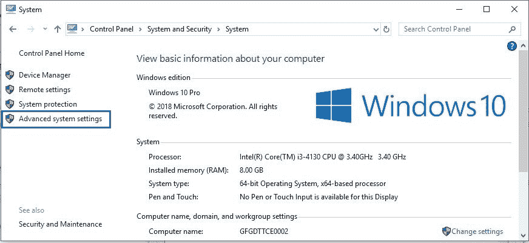
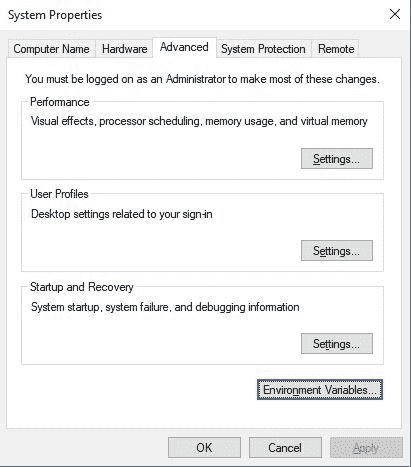
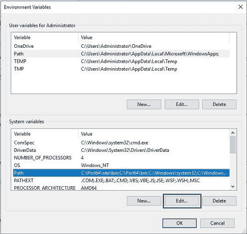
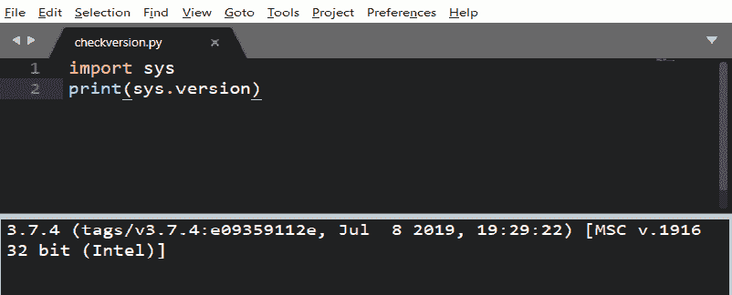
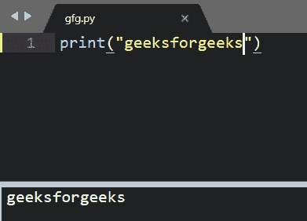

# 如何在Windows中为Python设置Sublime Text 3？

> 原文：[https://www.geeksforgeeks.org/how-to-setup-sublime-text-3-for-python-in-windows/](https://www.geeksforgeeks.org/how-to-setup-sublime-text-3-for-python-in-windows/)

由谷歌工程师编写的Sublime Text是一个用C++和Python开发的跨平台IDE。它对Python有基本的内置支持。Sublime Text是快速的，你可以根据需要定制这个编辑器来创建一个完整的Python开发环境。您可以安装调试、自动完成、代码检查等软件包。还有各种科学计算包，Django，Flask等等。

## 下载和安装

Sublime Text 3可以从其官方网站[sublimetext.com](https://www.sublimetext.com/3)下载。要在Windows上安装Sublime Text 3，请参考[如何在Windows中安装Sublime Text 3？](https://www.geeksforgeeks.org/how-to-install-sublime-text-3-in-windows/)

## 设置环境变量

### 步骤 1
点击**高级系统设置**链接。


### 步骤 2
点击**环境变量**。在系统变量部分，找到`PATH`环境变量并选中它。点击编辑。如果`PATH`环境变量不存在，点击新建。



### 步骤 3
在编辑系统变量（或新系统变量）窗口中，指定**路径环境变量**的值。单击确定。单击确定关闭所有剩余窗口。

## 在Sublime Text 3中工作

### 步骤 1
新建一个文件，用扩展名`.py`保存。例如，将其保存为`checkversion.py`。现在，转到**工具 -> 构建系统 -> Python**，然后键入您的`checkversion.py`。

这是Python的显示版本。这意味着Python已经成功安装并添加到环境变量中。

### 步骤 2
在你的Sublime Text上添加新的构建系统：**工具 -> 构建系统 -> 新的构建系统**，并确保新的构建系统具有以下命令：
```py
{
 "cmd":["C:/Users/<user>/AppData/Local/Programs/Python/Python37-32/python.exe", "-u", "$file"],
 "file_regex": "^[ ]File \"(...?)\", line ([0-9]*)",
 "selector": "source.python"
}
```
选择你的新构建系统版本**New Python3**，并重新运行`checkversion.py`，现在它应该使用**Python 3**。

全部完成…
现在创建任何文件并保存为`.py`扩展名。

现在，您可以使用`CTRL+SHIFT+B`运行您的Python代码，并从2个选项中进行选择。
