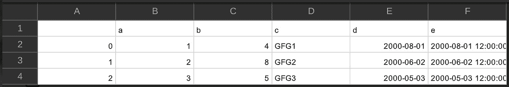
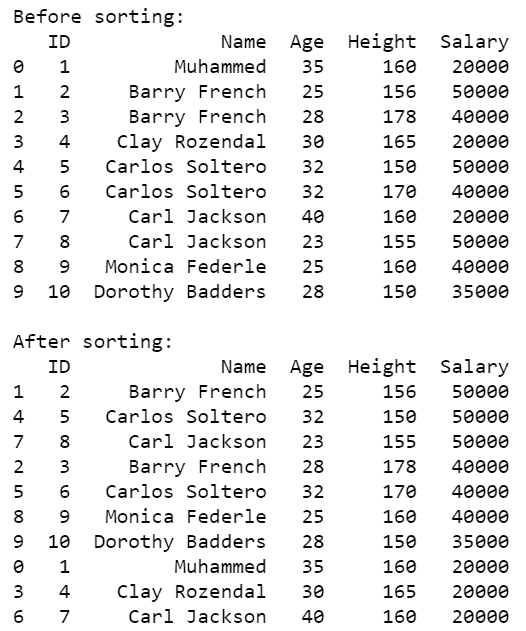
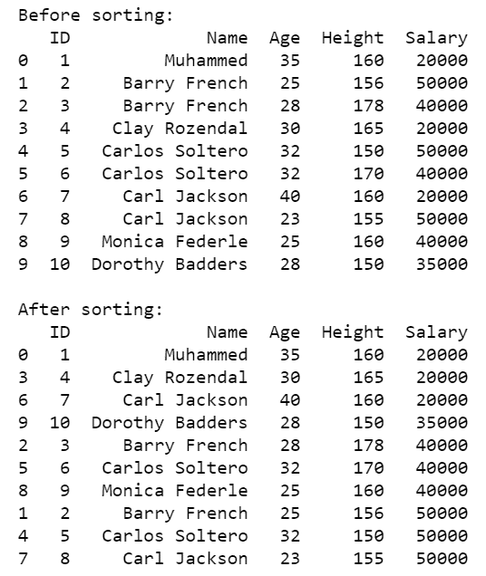
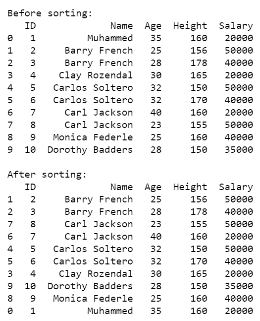
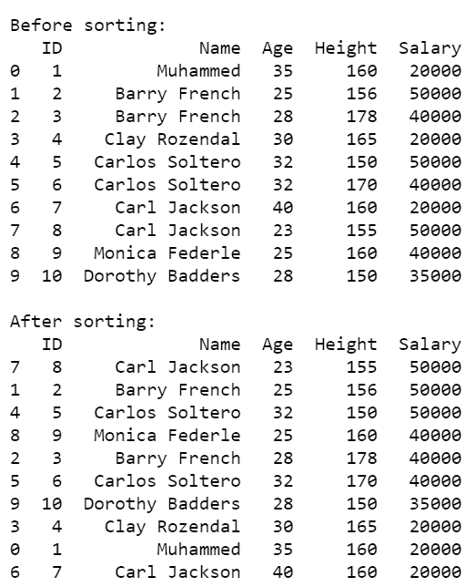
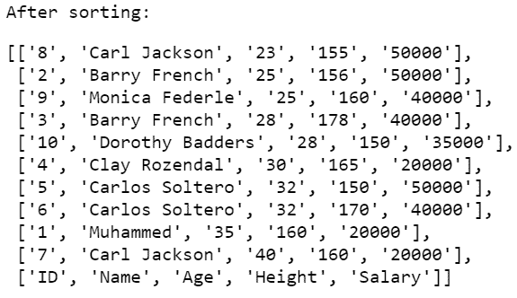
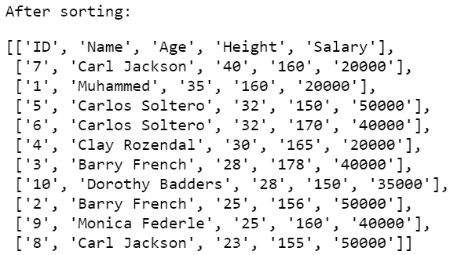

# 如何在 Python 中按列对 CSV 文件中的数据进行排序？

> 原文: [https://www.geeksforgeeks.org/how-to-sort-data-by-column-in-a-csv-file-in-python/](https://www.geeksforgeeks.org/how-to-sort-data-by-column-in-a-csv-file-in-python/)

在本文中，我们将讨论如何使用 Python 按列对 CSV 进行排序。

## 方法一: 使用 `sort_values()`

我们可以按照自己的要求取表头名称，轴可以是 0 也可以是 1，其中 0 表示“行”，“1”表示“列”。升序可以是真/假，如果是真，则按升序排列，如果是假，则按降序排列。

> **语法:** `DataFrame.sort_values(by, axis=0, ascending=True, inplace=False, kind='quicksort', na_position='last')`

**使用的 CSV 文件:**



以下是描述 CSV 数据集排序的各种方法。

### 例 1: 根据薪资对数据集进行降序排序

```python
# importing pandas package
import pandas as pandasForSortingCSV

# assign dataset
csvData = pandasForSortingCSV.read_csv("sample.csv")

# displaying unsorted data frame
print("\nBefore sorting:")
print(csvData)

# sort data frame
csvData.sort_values(["Salary"], 
                    axis=0,
                    ascending=[False], 
                    inplace=True)

# displaying sorted data frame
print("\nAfter sorting:")
print(csvData)
```

**输出:**



### 例 2: 根据薪资对数据集进行默认(升序)排序

```python
# importing pandas package
import pandas as pandasForSortingCSV

# assign dataset
csvData = pandasForSortingCSV.read_csv("sample.csv")

# displaying unsorted data frame
print("\nBefore sorting:")
print(csvData)

# sort data frame
csvData.sort_values(csvData.columns[4], 
                    axis=0,
                    inplace=True)

# displaying sorted data frame
print("\nAfter sorting:")
print(csvData)
```

**输出:**



### 例 3: 按照姓名、年龄和身高的升序对数据集进行排序

```python
# importing pandas package
import pandas as pandasForSortingCSV

# assign dataset
csvData = pandasForSortingCSV.read_csv("sample.csv")

# displaying unsorted data frame
print("\nBefore sorting:")
print(csvData)

# sort data frame
csvData.sort_values(["Name", "Age", "Height"], 
                    axis=0,
                    ascending=[True, True, True], 
                    inplace=True)

# displaying sorted data frame
print("\nAfter sorting:")
print(csvData)
```

**输出:**



### 例 4: 按照薪资降序、年龄升序对数据集进行排序

```python
# importing pandas package
import pandas as pandasForSortingCSV

# assign dataset
csvData = pandasForSortingCSV.read_csv("sample.csv")

# displaying unsorted data frame
print("\nBefore sorting:")
print(csvData)

# sort data frame
csvData.sort_values([csvData.columns[4], csvData.columns[2]],
                    axis=0,
                    ascending=[False, True],
                    inplace=True)

# displaying sorted data frame
print("\nAfter sorting:")
print(csvData)
```

**输出:**



## 方法二: 使用 `sorted()`

CSV 文件的另一种排序方式是通过在 CSV 模块对象上使用 `sorted()` 方法。但是，它只能基于一列对 CSV 文件进行排序。

**语法:**

> `sorted(iterable, key, reverse)`

以下是描述 CSV 数据集排序的各种方法。

### 例 1: 在年龄的基础上对数据集进行升序排序

```python
# import modules 
import csv, operator

# load csv file
data = csv.reader(open('sample.csv'), delimiter=',')

# sort data on the basis of age
data = sorted(data, key=operator.itemgetter(2))    

# displaying sorted data 
print('After sorting:')
display(data)
```

**输出:**



### 例 2: 根据年龄降序对数据集进行排序

```python
# import modules 
import csv, operator

# load csv file
data = csv.reader(open('sample.csv'), delimiter=',')

# sort data on the basis of age
data = sorted(data, key=operator.itemgetter(2), reverse=True)    

# displaying sorted data 
print('After sorting:')
display(data)
```

**输出:**

