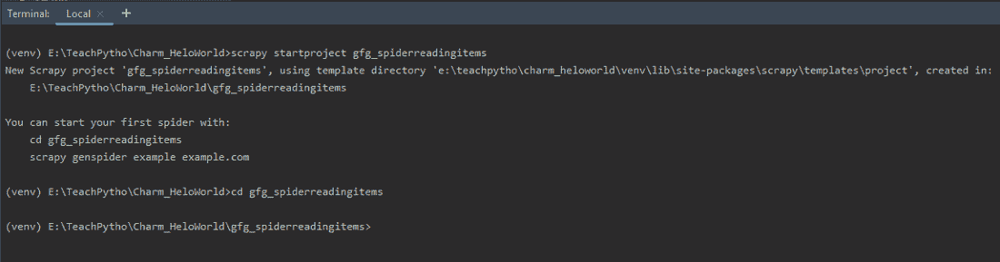
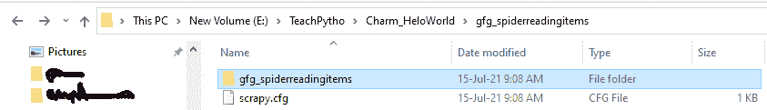
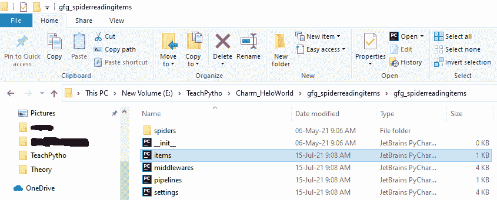
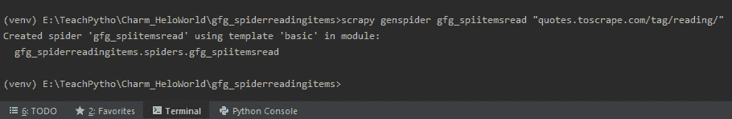
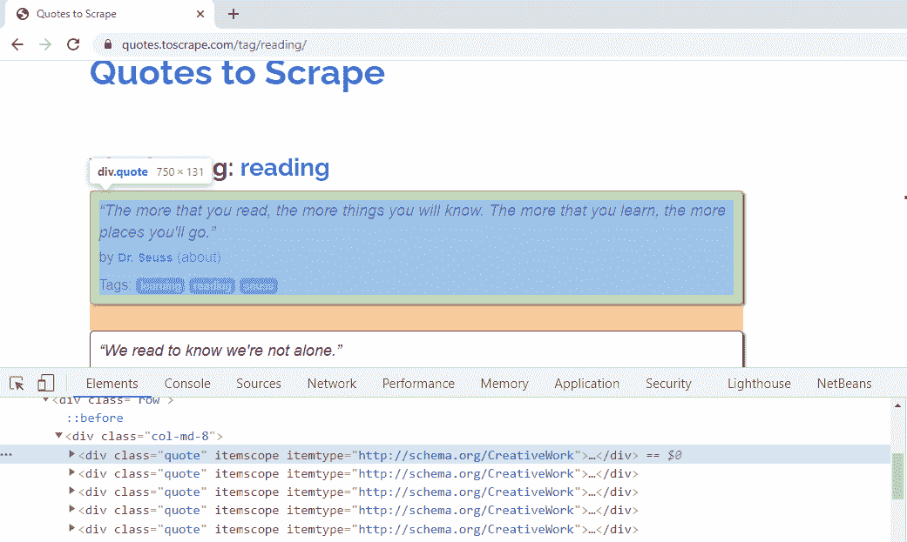
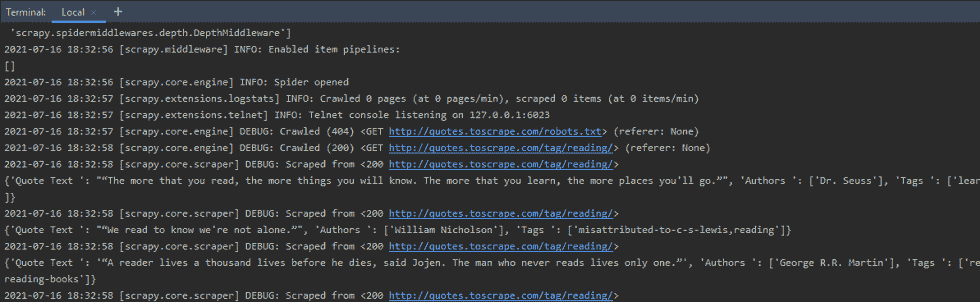
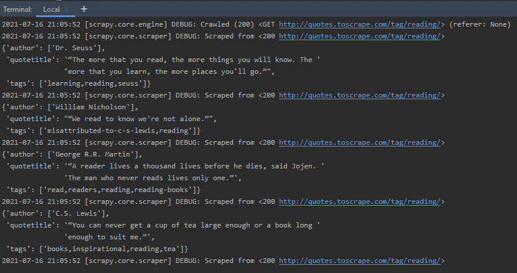

# 如何使用Scrapy Items？

> 原文：[https://www.geeksforgeeks.org/how-to-use-scrapy-items/](https://www.geeksforgeeks.org/how-to-use-scrapy-items/)

在本文中，我们将从网页 [https://quotes.toscrape.com/tag/reading/](https://quotes.toscrape.com/tag/reading/) 中使用Scrapy Items来抓取报价数据。抓取的主要目标是从非结构化资源中准备结构化数据。Scrapy Items是包装的字典数据结构。可以编写代码，使得提取的数据以“键值”对的格式作为项对象返回。在以下情况下，使用Items是有益的：

*   随着抓取数据量的增加，它们变得难以处理。
*   随着数据变得越来越复杂，它很容易出现错别字，有时可能会返回错误的数据。
*   由于项目对象可以进一步传递到Item Pipeline，因此对收集的数据进行格式化更容易。
*   清理数据很容易，如果我们把数据作为Items来清理的话。
*   验证数据，处理丢失的数据，用Items更容易。

通过`itemadapter`库，Scrapy支持各种项目类型。人们可以选择他们想要的项目类型。以下是支持的项目类型：

*   **字典**——条目可以以字典对象的形式编写。它们使用起来很方便。
*   **Item对象**——它们提供类似于API的字典，我们需要在其中声明项目所需的字段。它由声明Item类时使用的`Field`对象的键值对组成。在本教程中，我们将使用Item对象。
*   **Dataclass对象**——当您需要将抓取的值存储在JSON或CSV文件时，会用到它们。这里我们需要定义每个字段的数据类型。
*   **attrs**——`attrs`允许用字段名定义项目类，以便可以将抓取的数据导入到不同的文件格式中。它们的工作方式类似于Dataclass对象，只是需要安装`attrs`包。

## 安装Scrapy库

Scrapy库需要3.6及以上的Python版本。通过执行以下命令，在终端安装Scrapy库：

```
pip install scrapy
```

该命令将在项目环境中安装Scrapy库。现在，我们可以创建一个Scrapy项目，来编写Spider代码。

## 创建Scrapy项目

Scrapy有一个高效的命令行工具，也叫‘Scrapy工具’。命令根据其用途接受不同的参数和选项集。为了编写Spider代码，我们从创建一个Scrapy项目开始，在终端执行以下命令：

```
scrapy startproject <project_name>
```

**输出：**



创建Scrapy项目的简单“startproject”命令。

这将在您当前的目录中创建一个文件夹。它包含一个项目的配置文件`scrapy.cfg`。文件夹结构如下所示：



“gfg_spiderreadingitems”的文件夹结构。

`scrapy.cfg`是一个项目配置文件。包含此文件的文件夹是根目录。创建的文件夹的文件夹结构如下：



“gfg_spiderreadingitems”文件夹中的文件`items.py`。

该文件夹包含`items.py`、`middlewares.py`和其他设置文件，以及“spiders”文件夹。爬行代码将被写在一个Spider Python文件中。我们将修改`items.py`文件，来定义我们的数据项。保持`items.py`的内容不变。

## Spider代码提取数据

网页抓取的代码写在Spider代码文件中。为了创建Spider文件，我们将使用`genspider`命令。请注意，该命令是在存在`scrapy.cfg`文件的同一级别执行的。

我们正在 [https://quotes.toscrape.com/tag/reading/](https://quotes.toscrape.com/tag/reading/) 网页上抓取阅读报价。因此，我们将运行以下命令：

```
scrapy genspider spider_name URL_to_be_scraped
```



使用“genspider”命令创建Spider文件。

上面的命令将在“spiders”文件夹中创建一个Spider文件`gfg_spiitemsread.py`。Spider的名字也将是`gfg_spiitemsread`。相同的默认代码如下：

```python
# Import the required libraries
import scrapy

# Spider Class Created
class GfgSpiitemsreadSpider(scrapy.Spider):
    # Name of the spider
    name = 'gfg_spiitemsread'
    # The domain to be scraped
    allowed_domains = ['quotes.toscrape.com/tag/reading/']
    # The URLs from domain to scrape
    start_urls = ['http://quotes.toscrape.com/tag/reading//']

    # Spider default callback function
    def parse(self, response):
        pass
```

我们将从网页 [https://quotes.toscrape.com/tag/reading/](https://quotes.toscrape.com/tag/reading/) 中抓取报价标题、作者和标签。Scrapy为我们提供了选择器，可以根据需要“选择”网页的某些部分。选择器是CSS或XPath表达式，用于从HTML文档中提取数据。在本教程中，我们将使用XPath表达式来选择我们需要的细节。让我们理解Spider代码中编写选择器语法的步骤。

*   Spider类中负责处理接收到的响应的默认回调方法是`parse()`方法。我们将在这里编写负责数据提取的带有XPath表达式的选择器。
*   选择要提取的元素，在网页上单击鼠标右键，然后选择“检查”选项。这将允许我们查看它的CSS属性。
*   当我们右键单击第一个报价并选择检查时，我们可以看到它具有CSS“类”属性`quote`。同样，网页上所有的引号，都有CSS‘class’属性为`quote`。这可以从下面看出：



右键单击第一个引用，并检查其CSS“类”属性。

基于此，同样的，XPath表达式可以写成：

*   `quotes = response.xpath('//*[@class="quote"]')`。该语法将获取所有以`quote`作为CSS“类”属性的元素。
*   我们将获取所有报价的报价标题、作者和标签。因此，我们将编写XPath表达式来循环提取它们。对于报价标题，CSS“类”属性是`text`。因此，同样的XPath表达式应该是：`quote.xpath('.//*[@class="text"]/text()').extract_first()`。`text()`方法将提取报价标题的文本。`extract_first()`方法将给出第一个匹配值，带有CSS属性`text`。点运算符`.`开始时，表示从单引号中提取数据。
*   同样，CSS属性中，“类”和“itemprop”，对于author元素来说，就是`author`。我们可以在XPath表达式中使用其中的任何一个。语法应该是：`quote.xpath('.//*[@itemprop="author"]/text()').extract()`。这将提取作者姓名，其中CSS“itemprop”属性是`author`。
*   标签元素的CSS属性“类”和“itemprop”是`keywords`。我们可以在XPath表达式中使用其中的任何一个。因为有许多标签，所以对于任何报价来说，遍历它们都是复杂的。因此，我们将从每个引用中提取CSS属性`content`。相同的XPath表达式是：`quote.xpath('.//*[@itemprop="keywords"]/@content').extract()`。这将从`content`属性中提取报价的所有标签值。
*   我们使用`yield`语法来获取数据。我们可以使用`yield`语法收集数据，并将其转换为CSV、JSON和其他文件格式。
*   如果我们观察代码直到这里，它会爬行，并提取网页的数据。

代码如下：

```python
# Import the required library
import scrapy

# The Spider class
class GfgSpiitemsreadSpider(scrapy.Spider):
    # Name of the spider
    name = 'gfg_spiitemsread'

    # The domain allowed to scrape
    allowed_domains = ['quotes.toscrape.com/tag/reading']

    # The URL to be scraped
    start_urls = ['http://quotes.toscrape.com/tag/reading/']

    # Default callback function
    def parse(self, response):

        # Fetch all quotes tags
        quotes = response.xpath('//*[@class="quote"]')

        # Loop through the Quote selector elements
        # to get details of each
        for quote in quotes:

            # XPath expression to fetch text of the Quote title
            title = quote.xpath('.//*[@class="text"]/text()').extract_first()

            # XPath expression to fetch author of the Quote
            authors = quote.xpath('.//*[@itemprop="author"]/text()').extract()

            # XPath expression to fetch Tags of the Quote
            tags = quote.xpath('.//*[@itemprop="keywords"]/@content').extract()

            # Yield all elements
            yield {"Quote Text ": title, "Authors ": authors, "Tags ": tags}
```

`crawl`命令用于运行Spider。在`crawl`命令中提到Spider的名字。如果我们使用`crawl`命令运行上面的代码，那么终端的输出将是：

```
scrapy crawl filename
```

**输出：**



“yield”语句显示的抓取报价。

这里，`yield`语句返回Python字典对象中的数据。

### 理解Python字典和Scrapy Items

上面产生的数据是Python字典对象。使用它们的优势是：

*   当数据量较少时，它们方便且易于处理键值对结构。
*   当不需要进一步处理或格式化抓取的数据时，使用它们。
*   用字典，当你想抓的数据是完整而简单的。

为了使用Item对象，我们将在以下文件中进行更改：

*   `items.py`文件存在。
*   生成的当前Spider类，`gfg_spiitemsread.py`文件。

## 使用Items收集数据

现在，我们将学习为报价编写Scrapy Item的过程。为此，我们将遵循下面提到的步骤：

*   打开`items.py`文件。它与“spiders”文件夹处于同一级别。在文件中提到我们需要提取的字段，如下所示：

```python
# Define here the models for your scraped items
# Import the required library
import scrapy

# Define the fields for Scrapy item here in class
class GfgSpiderreadingitemsItem(scrapy.Item):

    # Item key for Title of Quote
    quotetitle = scrapy.Field()

    # Item key for Author of Quote
    author = scrapy.Field()

    # Item key for Tags of Quote
    tags = scrapy.Field()
```

正如所看到的，在上面的文件中，我们定义了一个叫做`GfgSpiderreadingitemsItem`的Scrapy Item。这个类是我们的蓝图，对于所有的元素，我们都会抓取。它将包含三个字段，即引用标题、作者姓名和标签。我们现在可以只添加我们在课堂上提到的字段。

`Field()`类是内置字典类的别名。它允许在一个位置定义所有字段元数据。它不提供任何额外的属性。

现在修改Spider文件，将值存储在项目文件的类对象中，而不是直接产生它们。请注意，您需要导入Item类模块，如下面的代码所示。

```python
# Import the required library
import scrapy

# Import the Item class with fields mentioned in the items.py file
from ..items import GfgSpiderreadingitemsItem

class GfgSpiitemsreadSpider(scrapy.Spider):
    name = 'gfg_spiitemsread'
    allowed_domains = ['quotes.toscrape.com/tag/reading']
    start_urls = ['http://quotes.toscrape.com/tag/reading/']

    def parse(self, response):

        # Write XPath expression to loop through all quotes
        quotes = response.xpath('//*[@class="quote"]')

        # Loop through all quotes
        for quote in quotes:

            # Create an object of Item class
            item = GfgSpiderreadingitemsItem()

            # XPath expression to fetch text of the Quote title
            # Store the title in the class attribute in key-value pair
            item['quotetitle'] = quote.xpath(
                './/*[@class="text"]/text()').extract_first()

            # XPath expression to fetch author of the Quote
            # Store the author in the class attribute in key-value pair
            item['author'] = quote.xpath(
                './/*[@itemprop="author"]/text()').extract()

            # XPath expression to fetch tags of the Quote title
            # Store the tags in the class attribute in key-value pair
            item['tags'] = quote.xpath(
                './/*[@itemprop="keywords"]/@content').extract()

            # Yield the item object
            yield item
```

如上所述，在Item类中提到的键现在可以被XPath表达式用来收集抓取的数据。确保你在两个地方都提到了确切的键名。例如，当`author`是`items.py`文件中定义的键时，使用`item['author']`。

在终端产生的项目如下所示：



使用Scrapy Items从网页提取的数据。