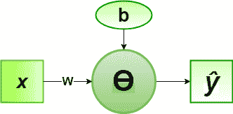

# 非逻辑门感知器算法的实现

> 原文：[https://www.geeksforgeeks.org/implementation-of-perceptron-algorithm-for-not-logic-gate/](https://www.geeksforgeeks.org/implementation-of-perceptron-algorithm-for-not-logic-gate/)

在机器学习领域，感知器是一种用于二进制分类器的监督学习算法。感知器模型实现以下功能：

![\[ \begin{array}{c} \hat{y}=\Theta\left(w_{1} x_{1}+w_{2} x_{2}+\ldots+w_{n} x_{n}+b\right) \\ =\Theta(\mathbf{w} \cdot \mathbf{x}+b) \\ \text { where } \Theta(v)=\left\{\begin{array}{cc} 1 & \text { if } v \geqslant 0 \\ 0 & \text { otherwise } \end{array}\right. \end{array} \]](img/7a525c5fa0f2cf3118ef7158b4d5b176.png "Rendered by QuickLaTeX.com")

对于权重向量`w`和偏差参数`b`的特定选择，模型预测相应输入向量`x`的输出`y`。

**NOT** 逻辑函数真值表只有 1 位二进制输入(0 或 1)，即输入向量`x`和相应的输出`y`：

| `x` | `y` |
| --- | --- |
| Zero | one |
| one | Zero |

现在对于输入向量`x`的相应权重向量`w`，关联的感知器函数可以定义为：

![\[ $\boldsymbol{\hat{y}} = \Theta\left(w x+b\right)$ \]](img/3986c5a42999f8832393a49c462c1a40.png "Rendered by QuickLaTeX.com")


为实现，考虑的权重参数为`w = -1`，偏差参数为`b = 0.5`。

## Python 实现

```py
# importing Python library
import numpy as np

# define Unit Step Function
def unitStep(v):
    if v >= 0:
        return 1
    else:
        return 0

# design Perceptron Model
def perceptronModel(x, w, b):
    v = np.dot(w, x) + b
    y = unitStep(v)
    return y

# NOT Logic Function
# w = -1, b = 0.5
def NOT_logicFunction(x):
    w = -1
    b = 0.5
    return perceptronModel(x, w, b)

# testing the Perceptron Model
test1 = np.array(1)
test2 = np.array(0)

print("NOT({}) = {}".format(1, NOT_logicFunction(test1)))
print("NOT({}) = {}".format(0, NOT_logicFunction(test2)))
```

## Output

```py
NOT(1) = 0
NOT(0) = 1
```

这里，根据真值表，每个测试输入的模型预测输出(`y`)与非逻辑门常规输出(`y`)精确匹配。
由此验证了非逻辑门的感知器算法是正确实现的。