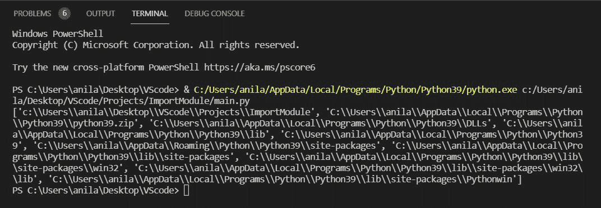
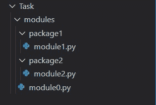
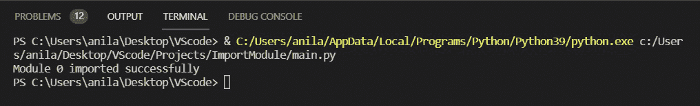
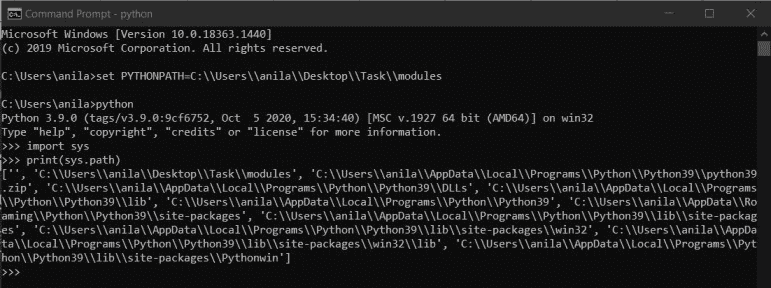
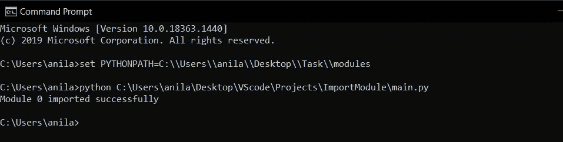

# 从 Python 中的另一个文件夹导入模块

> 原文：[https://www.geeksforgeeks.org/import-modules-from-another-folder-in-python/](https://www.geeksforgeeks.org/import-modules-from-another-folder-in-python/)

在本文中，我们将看到如何从另一个文件夹中导入模块。在处理大型项目时，我们可能会遇到一种情况，即我们想要从不同的目录中导入模块。这里我们将看到从不同的文件夹中导入模块的不同方法。

## 有两种方式可以做到：

*   使用系统路径
*   使用 `PYTHONPATH`。

## 创建一个演示模块：

**文件名：** `module0.py`

```py
def run():
    print("Module 0 imported successfully")
```

### 方法一：使用系统路径

`sys.path`：它是 Python `sys` 模块中的一个内置变量。它包含一个目录列表，解释器将在其中搜索所需的模块。

```py
import sys

# Prints the list of directories that the 
# interpreter will search for the required module. 
print(sys.path)
```

**输出：**



在这种方法中，在 `sys.path` 中插入或追加包含模块的目录的路径。

> **语法：**
> 
> `sys.path.insert(0, path)`
> 
> `sys.path.append(path)`

**示例：** 假设我们需要从 `C:\Users\anila\Desktop\Task\modules` 导入以下模块，而主程序位于 `C:\Users\anila\Desktop\VS Code\Project\Import Module\main.py`。



将路径插入/追加到 `sys.path` 中，并导入 `module0` 并调用其 `run` 函数。

```py
import sys

# Insert the path of modules folder 
sys.path.insert(0, "C:\\Users\\anila\\Desktop\\Task\\modules")

# Import the module0 directly since 
# the current path is of modules.
import module0

# Prints "Module0 imported successfully"
module0.run()
```

**输出：**



### 方法二：使用 `PYTHONPATH`

`PYTHONPATH`：这是一个环境变量，您可以设置它来添加其他目录，Python 将在这些目录中查找模块和包。

打开终端或命令提示符，输入以下命令：

```py
Syntax: set PYTHONPATH=path_to_module_folder
```

添加目录到 `PYTHONPATH` 中，然后导入 `module0` 并调用其 `run` 函数。



**下面是实现：**

```py
# Import the module0 directly since 
# the current path is of modules.
import module0

# Prints "Module0 imported successfully"
module0.run()
```

**输出：**

