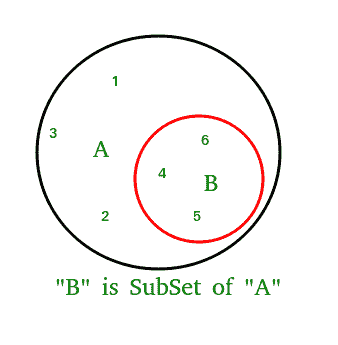

# Python中的issubset()

> 原文：[https://www.geeksforgeeks.org/issubset-in-python/](https://www.geeksforgeeks.org/issubset-in-python/)

Python集合的`issubset()`方法，如果一个集合A的所有元素都存在于作为参数传递的另一个集合B中，则返回`True`，如果并非所有元素都存在，则返回`False`。

## Python集合`issubset()`语法

```py
A.issubset(B)
checks whether A is a subset of B or not.
```

## Python集合`issubset()`返回值

```py
returns true if A is a subset of B otherwise false.
```



## Python集合`issubset()`示例

### 示例1：`issubset()`是如何工作的

```py
# Python program to demonstrate working of
# issubset().

A = {4, 1, 3, 5}
B = {6, 0, 4, 1, 5, 0, 3, 5}

# Returns True
print(A.issubset(B))

# Returns False
# B is not subset of A
print(B.issubset(A))
```

**输出：**

```py
True
False
```

### 示例2：使用`issubset()`处理三个集合

```py
# Another Python program to demonstrate working
# of issubset().
A = {1, 2, 3}
B = {1, 2, 3, 4, 5}
C = {1, 2, 4, 5}

# Returns True
print(A.issubset(B))

# Returns False
# B is not subset of A
print(B.issubset(A))

# Returns False
print(A.issubset(C))

# Returns True
print(C.issubset(B))
```

**输出：**

```py
True
False
False
True
```