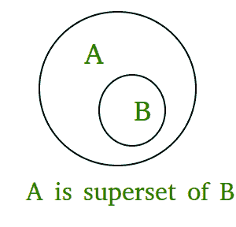

# Python中的issuperset()

> 原文：[https://www.geeksforgeeks.org/issuperset-in-python/](https://www.geeksforgeeks.org/issuperset-in-python/)

Python set `issuperset()`方法如果集合A的所有元素都占据集合B，则返回True，集合B作为参数传递，如果集合B的所有元素都不在集合A中，则返回false，这意味着如果A是集合B的超集，则返回True；否则就是假的。

## Python `issuperset()`语法

```py
A.issuperset(B)
checks whether A is a superset of B or not.
```

## Python `issuperset()`返回值

```py
True if A is a superset of B; otherwise false.
```



## Python `issuperset()`示例

### 示例1：使用两套

```py
# Python program to demonstrate working of
# issuperset().

A = {4, 1, 3, 5}
B = {6, 0, 4, 1, 5, 0, 3, 5}

print("A.issuperset(B) : ", A.issuperset(B))

# B is superset of A
print("B.issuperset(A) : ", B.issuperset(A))
```

**输出：**

```py
A.issuperset(B) :  False
B.issuperset(A) :  True
```

### 示例2：三组`issuperset()`的工作

```py
# Python program to demonstrate working
# of issuperset().

A = {1, 2, 3}
B = {1, 2, 3, 4, 5}
C = {1, 2, 4, 5}

print("A.issuperset(B) : ", A.issuperset(B))
print("B.issuperset(A) : ", B.issuperset(A))
print("A.issuperset(C) : ", A.issuperset(C))
print("C.issuperset(B) : ", C.issuperset(B))
```

**输出：**

```py
A.issuperset(B) :  False
B.issuperset(A) :  True
A.issuperset(C) :  False
C.issuperset(B) :  False
```