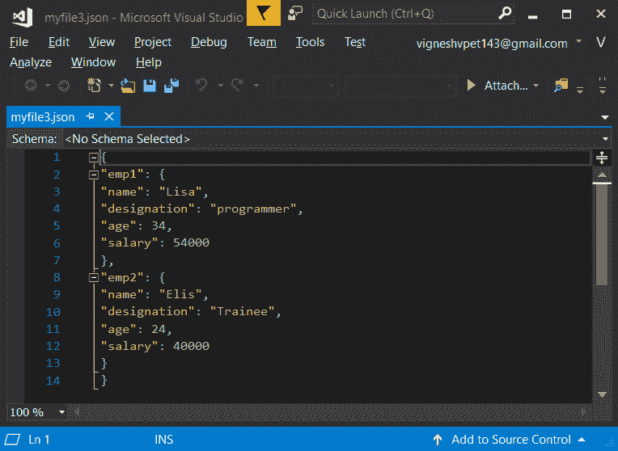
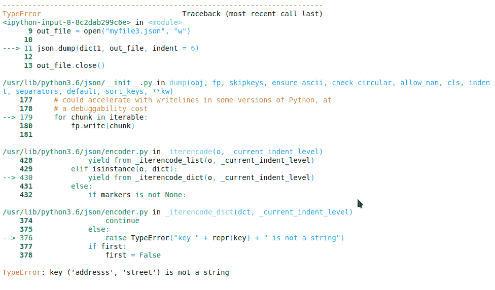
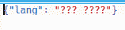
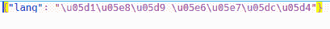
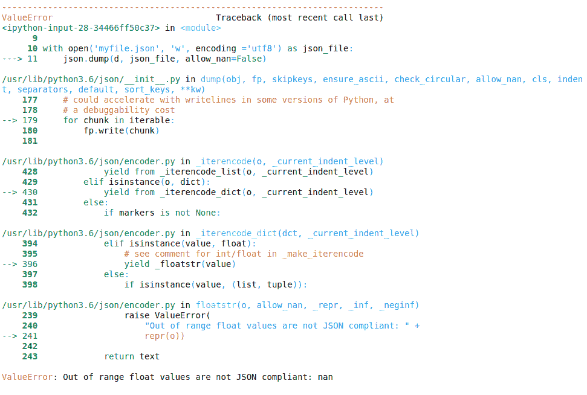
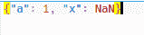

# Python 中的 `json.dump()`

> 原文: [https://www.geeksforgeeks.org/json-dump-in-python/](https://www.geeksforgeeks.org/json-dump-in-python/)

JSON 的完整形式是 JavaScript 对象符号。这意味着由编程语言中的文本组成的脚本(可执行)文件用于存储和传输数据。Python 通过一个名为`json`的内置包支持 JSON。为了使用这个特性，我们在 Python 脚本中导入`json`包。JSON 中的文本是通过引用字符串完成的，该字符串包含`{ }`内键值映射中的值。它类似于 Python 中的字典。

## `json.dump()`

Python 模块中的`json`模块提供了一个名为`dump()`的方法，将 Python 对象转换成合适的 json 对象。这是`dumps()`方法的一个小变种。

## `dump()` 和 `dumps()` 之间的区别

| **`dumps()`** | **`dump()`** |
| --- | --- |
| 当 Python 对象必须存储在文件中时，使用`dump()`方法。 | `dumps()`用于要求对象为字符串格式的情况，并用于解析、打印等。 |
| `dump()`需要 json 文件名，输出必须作为参数存储在其中。 | `dumps()`不需要传递任何这样的文件名。 |
| 此方法在内存中写入，然后单独执行写入磁盘的命令 | 此方法直接写入 json 文件 |
| 更快的方法 | 慢了两倍 |

## `dump()` 及其参数

> **语法:** `json.dump(obj, fp, skipkeys=False, ensure_ascii=True, check_circular=True, allow_nan=True, cls=None, indent=None, separators=None, default=None, sort_keys=False, **kw)`

**参数:**

*   `indent`：它提高了 json 文件的可读性。可以传递给此参数的可能值是简单的双引号(`""`)、任何整数值。简单的双引号使每个键值对出现在新行中。

**示例:**

```python
import json

# python object(dictionary) to be dumped
dict1 = {
    "emp1": {
        "name": "Lisa",
        "designation": "programmer",
        "age": "34",
        "salary": "54000"
    },
    "emp2": {
        "name": "Elis",
        "designation": "Trainee",
        "age": "24",
        "salary": "40000"
    },
}

# the json file where the output must be stored
out_file = open("myfile.json", "w")

json.dump(dict1, out_file, indent=6)

out_file.close()
```

**输出:**



*   `skipkeys`：如果键不是标准允许的类型，如`int`、`float`、`string`、`None`或`bool`，则在转储它们时会产生错误。如果此参数设置为**true**，则可以避免该错误。

**示例:**

```python
import json

# python object(dictionary) to be dumped
dict1 = {
    ('addresss', 'street'): 'Brigade road',
}

# the json file where the output must be stored
out_file = open("myfile.json", "w")

json.dump(dict1, out_file, indent=6)

out_file.close()
```

**输出:**

如果`skipkeys`未设置为`true`，则将生成以下错误:



*   `separators`：该参数取一个或两个值。第一个值指定将一个键值对与另一个键值对分开的符号。下一个指定将值与其键分开的符号。
*   `sort_keys`：该参数取布尔值。如果设置为真，这些键将按升序设置，否则它们将显示在 Python 对象中。
*   `ensure_ascii`：此参数也仅采用布尔值。如果未设置为`true`，非 ASCII 字符将按原样转储到输出文件中。默认值为**true**。

请参见下面的两个代码以了解不同之处。

**例 1:**

```python
# dictionary to be dumped
d = {'lang': '你好 世界'}

with open('myfile.json', 'w', encoding='utf8') as json_file:
    json.dump(d, json_file, ensure_ascii=False)
```

**输出:**



**例 2:** 如果设置为`true`，那么 json 文件的内容为:

```python
import json

# dictionary to be dumped
d = {'lang': '你好 世界'}

with open('myfile.json', 'w', encoding='utf8') as json_file:
    json.dump(d, json_file, ensure_ascii=True)
```

**输出:**



*   `allow_nan`：它有助于序列化浮点值的范围。

**例 1:**

```python
import json

# dictionary to be dumped
d = {
    'a': 1,
    'x': float('nan')
}

with open('myfile.json', 'w', encoding='utf8') as json_file:
    json.dump(d, json_file, allow_nan=False)
```

**输出:**



**例 2:** 如果设置为`true`，则不会产生错误。json 文件中的内容将是:

```python
import json

# dictionary to be dumped
d = {
    'a': 1,
    'x': float('nan')
}

with open('myfile.json', 'w', encoding='utf8') as json_file:
    json.dump(d, json_file, allow_nan=True)
```

**输出:**

