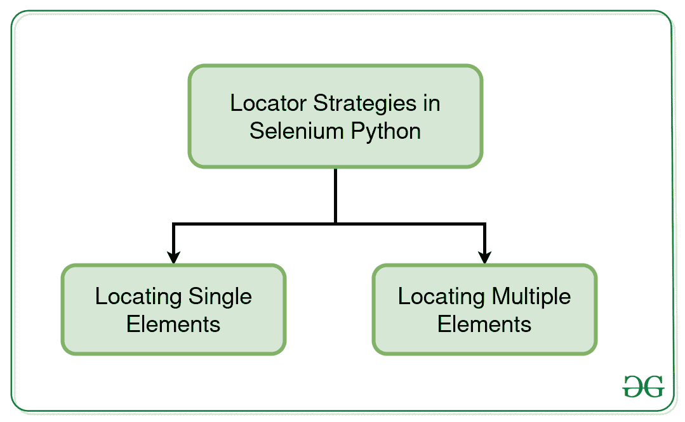

# 定位器策略–Selenium Python

> 原文: [https://www.geeksforgeeks.org/locator-strategies-selenium-python/](https://www.geeksforgeeks.org/locator-strategies-selenium-python/)

`Selenium` `Python` 中的定位器策略是用于从页面中定位元素并对其执行操作的方法。`Selenium` 的 `Python` 模块是为使用 `Python` 执行自动化测试而构建的。`Selenium Python` 绑定提供了一个简单的应用编程接口，可以使用 `Selenium WebDriver` 编写功能/验收测试。安装 `Selenium` 并使用 `get()` 方法查看–[导航链接](https://www.geeksforgeeks.org/navigating-links-using-get-method-selenium-python/)后，您可能想玩更多 `Selenium Python`。使用 `geeksforgeeks` 等 `Selenium` 打开页面后，您可能希望自动单击某些按钮或自动填写表单或任何此类自动任务。本文围绕两个策略展开——定位单个元素和定位多个元素。

## 定位单个元素的定位策略

`Selenium Python` 遵循不同的元素定位策略。一个人可以用 8 种不同的方法定位一个元素。以下是 `Python` 中 `Selenium` 的定位策略列表–

| 定位器 | 描述 |
| --- | --- |
| [`find_element_by_id`](https://www.geeksforgeeks.org/find_element_by_id-driver-method-selenium-python/) | 将返回 `id` 属性值与定位器匹配的第一个元素。 |
| [`find_element_by_name`](https://www.geeksforgeeks.org/find_element_by_name-driver-method-selenium-python/?ref=rp) | 将返回 `name` 属性值与定位器匹配的第一个元素。 |
| [`find_element_by_xpath`](https://www.geeksforgeeks.org/find_element_by_xpath-driver-method-selenium-python/?ref=rp) | 将返回 `xpath` 语法与定位器匹配的第一个元素。 |
| [`find_element_by_link_text`](https://www.geeksforgeeks.org/find_element_by_link_text-driver-method-selenium-python/?ref=rp) | 将返回链接文本值与定位器匹配的第一个元素。 |
| [`find_element_by_partial_link_text`](https://www.geeksforgeeks.org/find_element_by_partial_link_text-driver-method-selenium-python/?ref=rp) | 将返回第一个具有与定位器匹配的部分链接文本值的元素。 |
| [`find_element_by_tag_name`](https://www.geeksforgeeks.org/find_element_by_tag_name-driver-method-selenium-python/?ref=rp) | 将返回具有给定标签名的第一个元素。 |
| [`find_element_by_class_name`](https://www.geeksforgeeks.org/find_element_by_class_name-driver-method-selenium-python/?ref=rp) | 将返回具有匹配类属性名的第一个元素。 |
| [`find_element_by_css_selector`](https://www.geeksforgeeks.org/find_element_by_css_selector-driver-method-selenium-python/?ref=rp) | 将返回具有匹配 `CSS` 选择器的第一个元素。 |

## 定位多个元素的定位器策略

`Selenium Python` 遵循不同的元素定位策略。人们可以用 8 种不同的方法定位多个元素。以下是 `Python` 中 `Selenium` 的定位策略列表–

| 定位器 | 描述 |
| --- | --- |
| [`find_elements_by_name`](https://www.geeksforgeeks.org/find_elements_by_name-driver-method-selenium-python/?ref=rp) | 将返回 `name` 属性值与定位器匹配的所有元素。 |
| [`find_elements_by_xpath`](https://www.geeksforgeeks.org/find_elements_by_xpath-driver-method-selenium-python/?ref=rp) | 将返回 `xpath` 语法与定位器匹配的所有元素。 |
| [`find_elements_by_link_text`](https://www.geeksforgeeks.org/find_elements_by_link_text-driver-method-selenium-python/?ref=rp) | 将返回链接文本值与定位器匹配的所有元素。 |
| [`find_elements_by_partial_link_text`](https://www.geeksforgeeks.org/find_elements_by_partial_link_text-driver-method-selenium-python/?ref=rp) | 将返回部分链接文本值与定位器匹配的所有元素。 |
| [`find_elements_by_tag_name`](https://www.geeksforgeeks.org/find_elements_by_tag_name-driver-method-selenium-python/?ref=rp) | 将返回具有给定标签名的所有元素。 |
| [`find_elements_by_class_name`](https://www.geeksforgeeks.org/find_elements_by_class_name-driver-method-selenium-python/?ref=rp) | 将返回具有匹配类属性名的所有元素。 |
| [`find_elements_by_css_selector`](https://www.geeksforgeeks.org/find_elements_by_css_selector-driver-method-selenium-python/?ref=rp) | 将返回所有具有匹配 `CSS` 选择器的元素。 |