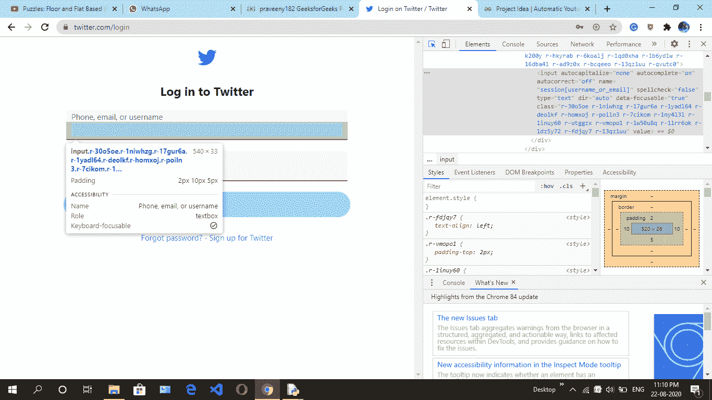
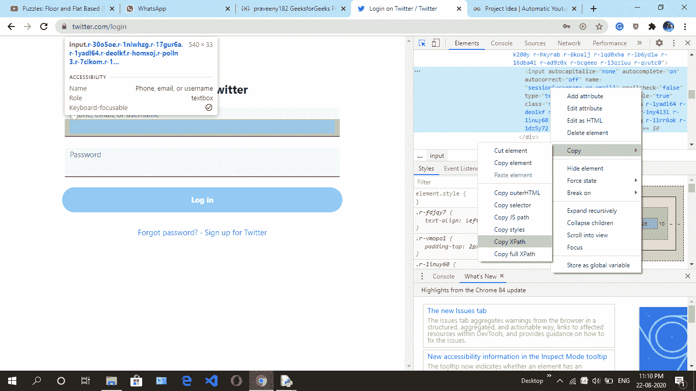
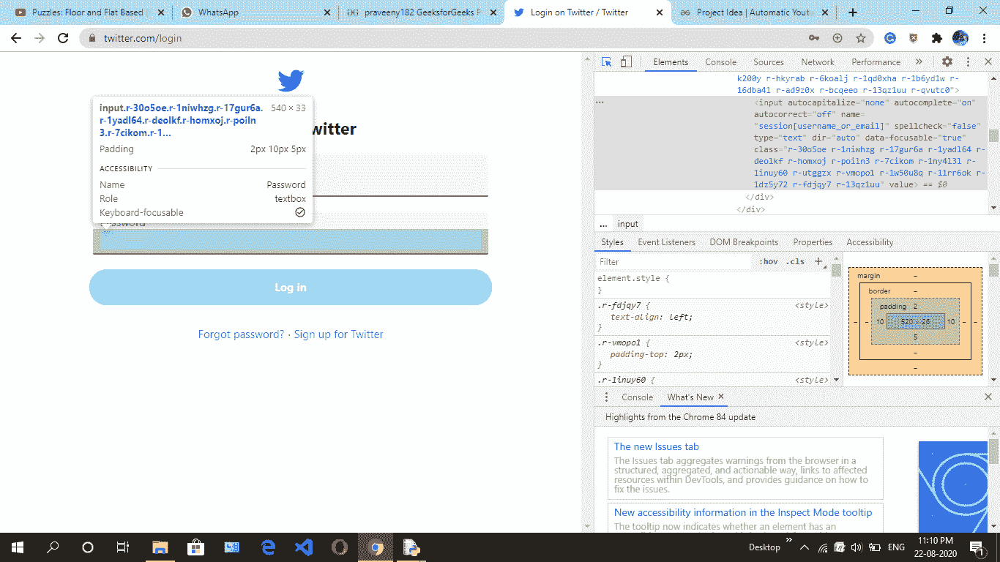

# 使用Python Selenium登录Twitter

> 原文：[https://www.geeksforgeeks.org/login-twitter-using-python-selenium/](https://www.geeksforgeeks.org/login-twitter-using-python-selenium/)

## 项目描述
在这里，我们将学习一个简单的如何通过 `Selenium` 登录 `Twitter` 的方法。`Selenium` 是一个免费工具，可以在不同的浏览器上自动试用。

## 要求
*   `Selenium` – [Selenium Python介绍及安装](https://www.geeksforgeeks.org/selenium-python-introduction-and-installation/)

## 步骤
*   首先，使用这个[链接](https://twitter.com/login)去推特网站。
*   然后通过快捷键 `Ctrl + Shift + I` 或进入浏览器设置并手动点击调查细节来点击调查元素。
*   然后导航到填写 **Phone, email, or username** 的框，复制其 `x_path`。



*   然后导航到 **Password** 框，复制其 `x_path`。



*   然后导航到登录按钮，复制其 `x_path`。



## 实现
您可以替换用户名和密码，以便帐户成功登录。这里的代码仅供演示。

```py
from selenium import webdriver
from selenium.webdriver.common.keys import Keys
import time

# create instance of Chrome webdriver
driver = webdriver.Chrome()
driver.get("https://twitter.com/login")

# find the element where we have to
# enter the xpath
# fill the number or mail
driver.find_element_by_xpath('//*[@id ="react-root"]/div/div/div[2]/main/div/div/div[1]/form/div/div[1]/label/div/div[2]/div/input').send_keys('XXXXXX0418')

# find the element where we have to
# enter the xpath
# fill the password
driver.find_element_by_xpath('//*[@id ="react-root"]/div/div/div[2]/main/div/div/div[1]/form/div/div[2]/label/div/div[2]/div/input').send_keys('PrXXXXXXXXX9')

# find the element log in
# request using xpath
# clicking on that element
driver.find_element_by_xpath('//*[@id ="react-root"]/div/div/div[2]/main/div/div/div[1]/form/div/div[3]/div/div').click()
```

## 输出
你将在浏览器（`Selenium` 已自动打开）的情况下登录 `Twitter`。