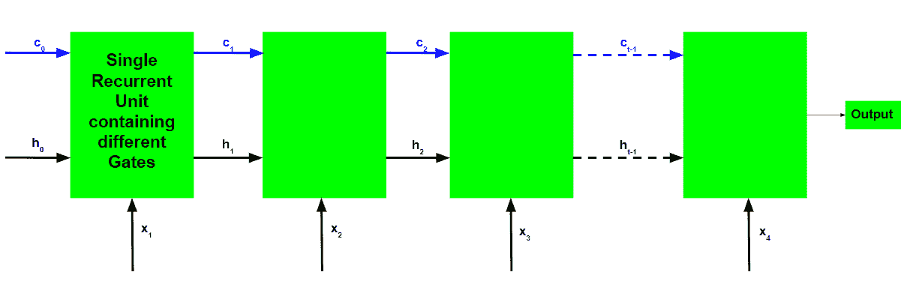
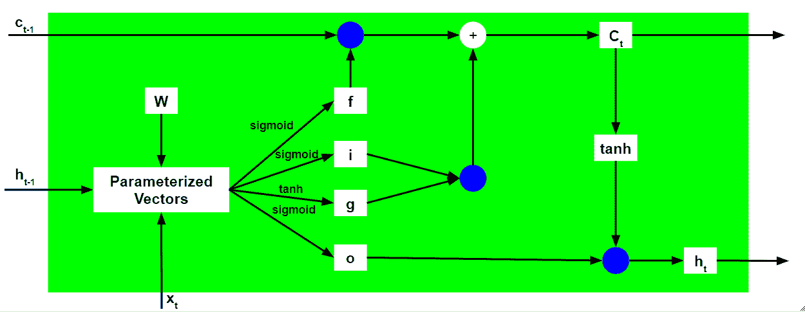
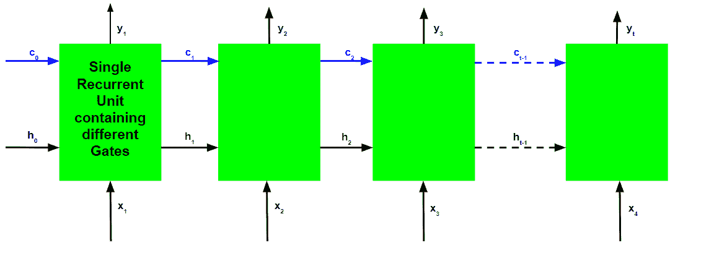

# 长短期记忆网络解释

> 原文: [https://www.geeksforgeeks.org/long-short-term-memory-networks-explanation/](https://www.geeksforgeeks.org/long-short-term-memory-networks-explanation/)

## 先决条件：递归神经网络

为了解决深度递归神经网络中梯度消失和爆炸的问题，开发了许多变体。其中最著名的是**长短期记忆网络**（LSTM）。在概念上，一个LSTM循环单元试图“记住”网络迄今为止看到的所有过去的知识，并“忘记”不相关的数据。这是通过为不同的目的引入称为“门”的不同激活功能层来实现的。每个LSTM循环单元还维护一个称为**内部细胞状态**的向量，该向量从概念上描述了被前一个LSTM循环单元选择保留的信息。长短期记忆网络由四个不同的门组成，用于不同的目的，如下所述：

1.  **忘记门（f）**：决定忘记之前的数据到什么程度。
2.  **输入门（i）**：它决定要写入内部单元状态的信息范围。
3.  **输入调制门（g）**：它通常被认为是输入门的一个子部分，许多关于LSTM的文献甚至没有提到它，并假设它在输入门内。它通过给信息增加非线性，并使信息**为零均值**，来调制输入门将要写入内部状态单元的信息。这样做是为了减少学习时间，因为零均值输入具有更快的收敛速度。尽管该门的作用不如其他门重要，并且通常被视为提供技巧的概念，但是将该门包括在LSTM单元的结构中是良好的做法。
4.  **输出门（o）**：它决定从当前内部单元状态产生什么输出（下一个隐藏状态）。

长短期记忆网络的基本工作流程类似于递归神经网络的工作流程，唯一的区别是内部细胞状态也随着隐藏状态向前传递。

## LSTM循环机组的工作

1.  取输入当前输入、前一隐藏状态和前一内部单元格状态。
2.  按照以下步骤计算四个不同门的值：
    *   对于每个门，计算当前输入和先前隐藏状态的参数化向量，方法是将相关向量与每个门的相应权重逐元素相乘。
    *   在参数化向量上对每个门元素应用各自的激活函数。下面给出的是具有激活功能的闸门列表，适用于闸门。
3.  计算当前内部细胞状态，首先计算输入门和输入调制门的元素方向乘法向量，然后计算忘记门和前一内部细胞状态的元素方向乘法向量，最后将两个向量相加。

`c_t = i⊙g + f⊙c_{t-1}`

4.  计算当前隐藏状态，首先取当前内部单元状态向量的元素方向双曲正切，然后与输出门进行元素方向乘法。

上述工作说明如下：

请注意，蓝色圆圈表示元素式乘法。权重矩阵`W`包含当前输入向量和每个门的先前隐藏状态的不同权重。

就像递归神经网络一样，LSTM网络也在每个时间步长生成一个输出，该输出用于使用梯度下降来训练网络。

递归神经网络和长短期记忆网络的反向传播算法之间的唯一主要区别与算法的数学有关。

设`\overline{y}_{t}`为各时间步的预测输出，`y_{t}`为各时间步的实际输出。那么每个时间步长的误差由下式给出：

`E_{t} = -y_{t}log(\overline{y}_{t})`

因此，总误差由所有时间步长的误差总和给出。

`E = \sum _{t} E_{t}`
`\Rightarrow E = \sum _{t} -y_{t}log(\overline{y}_{t})`

类似地，值`\frac{\partial E}{\partial W}`可以计算为每个时间步长的梯度之和。

`\frac{\partial E}{\partial W} = \sum _{t} \frac{\partial E_{t}}{\partial W}`

使用链式法则，并利用`\overline{y}_{t}`是`h_{t}`的函数并且确实是`c_{t}`的函数的事实，出现以下表达式：

`\frac{\partial E_{t}}{\partial W} = \frac{\partial E_{t}}{\partial \overline{y}_{t}}\frac{\partial \overline{y}_{t}}{\partial h_{t}}\frac{\partial h_{t}}{\partial c_{t}}\frac{\partial c_{t}}{\partial c_{t-1}}\frac{\partial c_{t-1}}{\partial c_{t-2}}.......\frac{\partial c_{0}}{\partial W}`

因此，总误差梯度由下式给出：

`\frac{\partial E}{\partial W} = \sum _{t} \frac{\partial E_{t}}{\partial \overline{y}_{t}}\frac{\partial \overline{y}_{t}}{\partial h_{t}}\frac{\partial h_{t}}{\partial c_{t}}\frac{\partial c_{t}}{\partial c_{t-1}}\frac{\partial c_{t-1}}{\partial c_{t-2}}.......\frac{\partial c_{0}}{\partial W}`

请注意，对于LSTM反向传播，梯度方程包含`\partial c_{t}`链，而对于基本递归神经网络，梯度方程包含`\partial h_{t}`链。

## LSTM如何解决渐变消失和爆炸的问题？

回忆一下`c_{t}`的表达。

`c_{t} = i\odot g + f\odot c_{t-1}`

梯度的值由从`\frac{\partial c_{t}}{\partial c_{t-1}}`开始的导数链控制。使用表达式`c_{t}`扩展该值：

`\frac{\partial c_{t}}{\partial c_{t-1}} = \frac{\partial c_{t}}{\partial f}\frac{\partial f}{\partial h_{t-1}}\frac{\partial h_{t-1}}{\partial c_{t-1}} + \frac{\partial c_{t}}{\partial i}\frac{\partial i}{\partial h_{t-1}}\frac{\partial h_{t-1}}{\partial c_{t-1}} + \frac{\partial c_{t}}{\partial g}\frac{\partial g}{\partial h_{t-1}}\frac{\partial h_{t-1}}{\partial c_{t-1}} + \frac{\partial c_{t}}{\partial c_{t-1}}`

对于基本RNN，术语`\frac{\partial h_{t}}{\partial h_{t-1}}`在一定时间后开始取大于1或小于1的值，但总是在相同的范围内。这是渐变消失和爆炸问题的根本原因。在LSTM，术语`\frac{\partial c_{t}}{\partial c_{t-1}}`没有固定的模式，可以在任何时间步长取任何正值。因此，不能保证对于无限多的时间步长，该项将收敛到0或完全发散。如果梯度开始向零收敛，则可以相应地调整门的权重，使其更接近1。因为在训练阶段，网络只调整这些权重，所以它学习什么时候让梯度收敛到零，什么时候保持它。