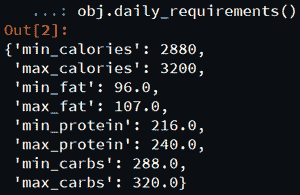
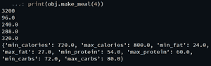
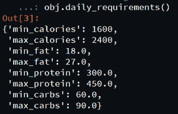

# 使用 Python 中的健身工具模块进行宏营养分析

> 原文: [https://www.geeksforgeeks.org/macronutrient-analysis-using-fitness-tools-module-in-python/](https://www.geeksforgeeks.org/macronutrient-analysis-using-fitness-tools-module-in-python/)

良好的饮食是平衡生活方式不可或缺的一部分。它定义了人类的幸福。营养素分为两类，即大量营养素和微量营养素。常量营养素是身体需要大量的营养。大量营养素提供热量或能量另一方面微量营养素是身体需要的较小剂量的营养素，如钙、钾、钠、铁、锌等。

在本文中，我们将编写 python 脚本，从给定的数据中获取宏营养信息。

我们将使用健身工具模块来计算常量营养素化合物。这个包的目标是自动化这些计算，这样你就可以花更多的时间来完成你的营养计划。

## 安装

```py
pip install fitness-tools
```

## 模块说明

`make_meal()` 类方法根据您的输入并通过函数传递 int，返回一顿饭的推荐卡路里和大量营养素的字典。

### 语法

```py
fitness_tools.meals.meal_maker.MakeMeal(weight, goal=None, body_type=None, activity_level=None, min_calories=None, max_calories=None, fat_percent=None, protein_percent=None, carbohydrate_percent=None)
```

### 参数

*   `weight`: 输入你当前的体重。
*   `goal`: 选择一个目标，‘减重’‘维持’‘增重’或‘无’。
*   `body_type`: 选择体型:“内形态”、“外形态”、“中形态”或“无”。
*   `activity_level`: 选择活动水平，“久坐”、“中等”、“非常”、“T2”或“无”。
*   `min_cal`: 输入所需的每磅最小卡路里，默认为无。
*   `max_cal`: 输入所需的每磅最大卡路里，默认为无。
*   `fat_percent`: 输入所需的热量百分比，脂肪默认为无。
*   `protein_percent`: 从蛋白质默认值输入所需的卡路里百分比至无。
*   `carbohydrate_percent`: 输入碳水化合物所需的卡路里百分比默认为无。

以下是实现使用 `fitness_tools` 模块进行宏营养分析的一些程序:

## 例 1

用 `daily_requirements()` 法获取常量营养素。

### Python 3

```py
# Import required modules
from fitness_tools.meals.meal_maker import MakeMeal

# Create object
obj = MakeMeal(160, goal='weight_gain', activity_level='moderate',
               body_type='mesomorph')

# Call required method
obj.daily_requirements()
```

### 输出



## 例 2

### Python 3

```py
# Import required module
from fitness_tools.meals.meal_maker import MakeMeal

# Create object
obj = MakeMeal(160, goal='weight_gain', activity_level='moderate',
               body_type='mesomorph')

# Traverse each object
print(obj.daily_max_calories())
print(obj.daily_min_fat())
print(obj.daily_max_protein())
print(obj.daily_min_carbs())
print(obj.daily_max_carbs())

# Return calories and macronutrients
# for one meal.
print(obj.make_meal(4))
```

### 输出



## 例 3

手动获取宏量营养素百分比和热量范围。

### Python 3

```py
# Import required module
from fitness_tools.meals.meal_maker import MakeMeal

# Create object
obj = MakeMeal(160, min_cal=10, max_cal=15, fat_percent=0.1,
               protein_percent=0.75, carb_percent=0.15)

# returns calories, fat, protein,
# and carbs in grams for one day
obj.daily_requirements()
```

### 输出



**注意:** `fat_percent()`、`protein_percent()`、和 `carbohydrate_percent()` 之和必须等于 1。