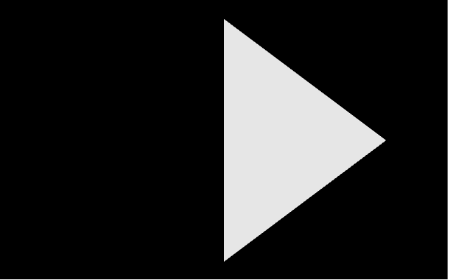
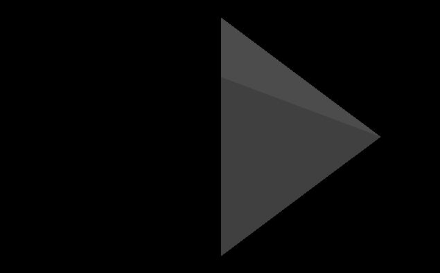
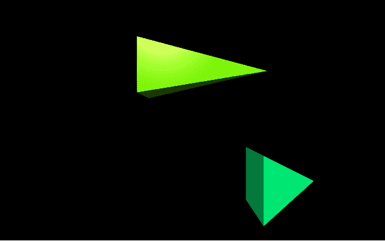
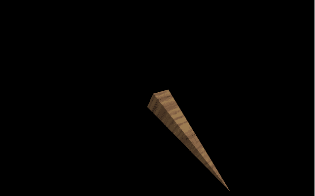

# 用 VPython 制作金字塔

> 原文：[https://www.geeksforgeeks.org/making-a-pyramid-with-vpython/](https://www.geeksforgeeks.org/making-a-pyramid-with-vpython/)

`VPython` 可以轻松创建可导航的 3D 显示和动画，即使对于编程经验有限的人来说也是如此。因为它基于 Python，所以它也可以为有经验的程序员和研究人员提供很多东西。`VPython` 允许用户在三维空间中创建球体和圆锥体等对象，并在窗口中显示这些对象。这使得创建简单的可视化变得容易，允许程序员将更多的精力放在程序的计算方面。`VPython` 的简单性使它成为简单物理的图解工具，尤其是在教育环境中。

## 安装

```py
pip install vpython
```

一个 `pyramid()` 是三维空间中的一个几何物体，它有一个矩形的底部和倾斜的侧面，在顶部的一个点上相交。我们可以使用 `pyramid()` 方法在 `VPython` 中生成一个金字塔。

## pyramid()

> **语法：** `pyramid(参数)`
>
> **参数：**
>
> *   `pos`：是金字塔底部中心的位置。指定包含 3 个值的向量，例如 `pos = vector(0, 0, 0)`
> *   `axis`：是金字塔的对齐轴。指定包含 3 个值的向量，例如 `axis = vector(1, 2, 1)`
> *   `up`：是金字塔的方位。指定一个包含 3 个值的向量，例如 `up = vector(0, 1, 0)`
> *   `color`：是金字塔的颜色。指定一个包含 3 个值的向量，例如 `color = vector(1, 1, 1)` 将给出白色
> *   `opacity`：是金字塔的不透明度。分配一个浮动值，其中 1 是最不透明的，0 是最不透明的，例如 `opacity = 0.5`
> *   `shininess`：是金字塔的光亮。指定一个浮动值，其中 1 是最闪亮的，0 是最不闪亮的，例如 `shininess = 0.6`
> *   `emissive`：是金字塔的发射率。指定一个布尔值，其中 `True` 是发射性的，`False` 不是发射性的，例如 `emissive = False`
> *   `texture`：是金字塔的纹理。从纹理类中指定所需的纹理，例如 `texture = textures.stucco`
> *   `length`：是金字塔在 x 轴上的长度。分配一个浮点值，默认长度为 1，示例 `length = 10`
> *   `height`：是金字塔在 y 轴上的高度。指定一个浮动值，默认长度为 1，例如 `height = 8`
> *   `width`：是金字塔在 z 轴上的宽度。分配一个浮点值，默认长度为 1，示例 `width = 4`
> *   `size`：是金字塔的大小。指定一个包含 3 个值的向量，分别代表长度、高度和宽度，例如 `size = vector(1, 1, 1)`
>
> 所有参数都是可选的。

### 示例 1

一个没有参数的金字塔，所有的参数都会有默认值。

```py
# import the module
from vpython import *
pyramid()
```

**输出：**


### 示例 2

使用颜色、不透明度、光泽和发射率参数的金字塔。

```py
# import the module
from vpython import *
pyramid(color = vector(0.5, 0.5, 0.5),
        opacity = 0.5,
        shininess = 1,
        emissive = False)
```

**输出：**


### 示例 3

显示两个金字塔以可视化属性位置和大小。

```py
# import the module
from vpython import *

# the first pyramid
pyramid(pos = vector(-2, 2, 0),
        size = vector(5, 2, 2),
        color = vector(0.5, 1, 0))

# the second pyramid
pyramid(pos = vector(1, -1, 5),
        color = vector(0, 1, 0.5))
```

**输出：**


### 示例 4

使用纹理、轴和向上参数的圆柱体。

```py
# import the module
from vpython import *
pyramid(texture = textures.wood,
        axis = vector(-1, 4, 3),
        up = vector(1, 2, 2))
```

**输出：**
