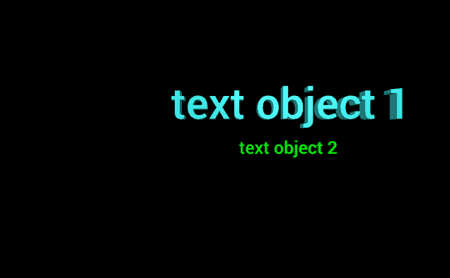

# 用 VPython 制作文本对象

> 原文：[https://www.geeksforgeeks.org/making-a-text-object-with-vpython/](https://www.geeksforgeeks.org/making-a-text-object-with-vpython/)

**VPython** 可以轻松创建可导航的 3D 显示和动画，即使对于编程经验有限的用户也是如此。因为它基于 Python，所以它也可以为有经验的程序员和研究人员提供很多东西。VPython 允许用户在 3D 空间中创建球体和圆锥体等对象，并在窗口中显示这些对象。这使得创建简单的可视化变得容易，允许程序员将更多的精力放在程序的计算方面。VPython 的简单性使其成为简单物理的说明工具，尤其是在教育环境中。

**安装：**

```bash
pip install vpython
```

一个 `text` 对象用于显示 3D 文本数据。我们可以使用 `text()` 方法在 VPython 中生成一个文本对象。

## `text()` 方法

> **语法：** `text(参数)`
> **参数：**
> *   `pos`：是文字对象的位置。指定包含 3 个值的向量，例如 `pos = vector(0, 0, 0)`
> *   `align`：是文本对象的对齐方式。指定一个带有“center”、“right”和“left”选项的字符串，默认为“left”
> *   `height`：是大写字母的高度。指定一个浮动值，默认值为 1，例如 `height = 18`
> *   `length`：是显示文本的长度。指定一个浮点值，例如 `length = 4`
> *   `depth`：是显示文本的深度。指定一个浮动值，默认值为 0.2 * `height`，示例 `depth = 2`
> *   `axis`：是文本对象的对齐轴。指定包含 3 个值的向量，例如 `axis = vector(1, 2, 1)`
> *   `up`：是文字对象的方位。指定一个包含 3 个值的向量，例如 `up = vector(0, 1, 0)`
> *   `font`：是文字的字体。为字符串赋值“sans serif”或“serif”
> *   `color`：是文字的颜色。指定一个包含 3 个值的向量，例如 `color = vector(1, 1, 1)` 将给出白色
> *   `background`：是标签背景的颜色。指定一个包含 3 个值的向量，例如 `color = vector(1, 1, 1)` 将使背景颜色为白色
> *   `billboard`：决定文字对象是否始终面向你。指定一个布尔值，其中 `True` 是“是”，而 `False` 是“否”
> *   `opacity`：是文本对象的不透明度。分配一个浮动值，其中 1 是最不透明的，0 是最不透明的，例如 `opacity = 0.5`
> *   `shininess`：是文字对象的亮色。指定一个浮动值，其中 1 是最闪亮的，0 是最不闪亮的，例如 `shininess = 0.6`
> *   `emissive`：是文字对象的发射率。指定一个布尔值，其中 `True` 是发射性的，`False` 不是发射性的，例如 `emissive = False`
> *   `text`：是要显示的文本。分配文本时也可以包含 HTML 样式。
> *   `descender`：是 y 等小写字母上下降符的高度，赋一个浮点值，默认值为 0.3 * `height`，例如 `descender = 8`
> *   `top_left`, `top_right`, `bottom_right`, `bottom_left`：它们是显示文本的边界框
> *   `start`, `end`：它们是基线上最左边和最右边的位置
> *   `vertical_spacing`：是多行文字中从一条基线到下一条基线的垂直距离
>
> 所有参数都是可选的。

### 示例 1：一个只有文本参数的文本对象，其他所有参数都会有默认值。

```python
# import the module
from vpython import *
text(text = "text")
```

**输出：**


### 示例 2：使用颜色、不透明度、光泽和发射率参数的文本对象。

```python
# import the module
from vpython import *
text(text = "text",
     color = vector(0, 0, 1),
     opacity = 0.5,
     shininess = 1,
     emissive = False)
```

**输出：**


### 示例 3：显示两个文本对象，以可视化位置、高度和深度属性。

```python
# import the module
from vpython import *

# the first text object
text(text = "text object 1",
     pos = vector(-5, 2, 0),
     height = 3,
     depth = 1,
     color = vector(0.5, 1, 1))

# the second text object
text(text = "text object 2",
     pos = vector(1, -1, 5),
     color = vector(0, 1, 0))
```

**输出：**



### 示例 4：使用参数 `axis` 和 `up` 的圆柱体。

```python
# import the module
from vpython import *
text(text = "text",
     color = vector(1, 0.5, 0),
     axis = vector(-1, 4, 0),
     up = vector(1, 2, 2))
```

**输出：**

