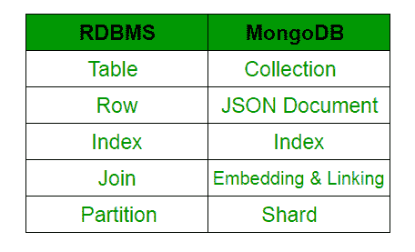
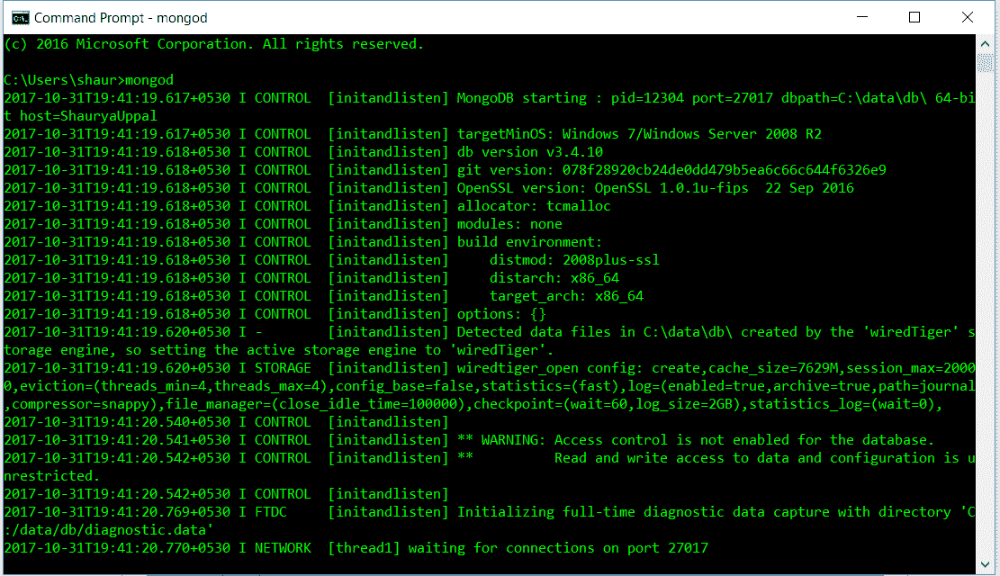

# MongoDB 和 Python

> 原文: [https://www.geeksforgeeks.org/mongodb-and-python/](https://www.geeksforgeeks.org/mongodb-and-python/)

先决条件: [MongoDB:简介](https://www.geeksforgeeks.org/mongodb-an-introduction/)

MongoDB 是一个跨平台、面向文档的数据库，致力于集合和文档的概念。MongoDB 提供了高速度、高可用性和高扩展性。
人们脑海中浮现的下一个问题是“为什么是 MongoDB”？

## 选择 MongoDB 的理由

1.  支持分层数据结构(详见[文档](https://docs.mongodb.com/manual/tutorial/model-tree-structures/))
2.  它支持关联数组，如 Python 中的字典。
3.  内置 python 驱动程序，将 Python 应用程序与数据库连接起来。示例- `PyMongo`
4.  它是为大数据设计的。
5.  MongoDB 的部署非常容易。

## MongoDB 与 RDBMS



## MongoDB 和 PyMongo 安装指南

1.  首先从命令提示符启动 MongoDB，使用：
    **方法 1:**

    ```py
    mongod
    ```

    或
    **方法 2:**

    ```py
    net start MongoDB
    ```

    
    见端口号默认设置为 `27017`(上图最后一行)。
    Python 有一个针对 MongoDB 的原生库。可用库的名称是 `PyMongo`。要导入该库，请执行以下命令:

    ```py
    from pymongo import MongoClient
    ```

2.  **创建连接：** 导入模块后的第一件事是创建一个 `MongoClient`。

    ```py
    from pymongo import MongoClient
    client = MongoClient()
    ```

    之后，连接到默认主机和端口。到主机和端口的连接是显式完成的。以下命令用于连接运行在端口号 `27017` 上的本地主机上的 MongoDB 客户端。

    ```py
    client = MongoClient('host', port_number)
    # 例如: client = MongoClient('localhost', 27017)
    ```

    也可以使用以下命令完成:

    ```py
    client = MongoClient("mongodb://localhost:27017/")
    ```

3.  **访问数据库对象：** 要创建数据库或切换到现有数据库，我们使用：
    **方法 1：字典风格**

    ```py
    mydatabase = client['name_of_the_database']
    ```

    **方法 2：**

    ```py
    mydatabase = client.name_of_the_database
    ```

    如果没有以前创建的同名数据库，MongoDB 将为用户隐式创建一个。
    注意:数据库名称不允许使用任何破折号(`-`)。像 `my-Table` 这样的名称会引发错误。因此，允许在名称中使用下划线。

4.  **访问集合：** 集合等同于 RDBMS 中的表。我们在 `PyMongo` 中访问集合的方式与在 RDBMS 中访问表的方式相同。要访问表，假设表名为 `myTable`，数据库名为 `mydatabase`。
    **方法 1:**

    ```py
    mycollection = mydatabase['myTable']
    ```

    **方法 2:**

    ```py
    mycollection = mydatabase.myTable
    ```

    > MongoDB 以字典的形式存储数据库，如图所示:

    ```py
    record = {
        title: 'MongoDB and Python', 
        description: 'MongoDB is no SQL database', 
        tags: ['mongodb', 'database', 'NoSQL'], 
        viewers: 104 
    }
    ```

    `_id` 是一个特殊的键，如果程序员忘记显式添加，它会自动添加。`_id` 是 `12` 字节的十六进制数，确保每个插入文档的唯一性。
    

5.  **向集合中插入数据：**
    使用的方法:

    ```py
    insert_one() 或 insert_many()
    ```

    我们通常在集合中使用 `insert_one()` 方法插入文档。比方说，我们希望将名为 `record` 的数据输入到 `mydatabase` 的 `myTable` 中。

    ```py
    rec = myTable.insert_one(record)
    ```

    当需要实现时，整个代码看起来就像这样。

    ```py
    # importing module
    from pymongo import MongoClient

    # creation of MongoClient
    client=MongoClient()

    # Connect with the portnumber and host
    client = MongoClient("mongodb://localhost:27017/")

    # Access database
    mydatabase = client['name_of_the_database']

    # Access collection of the database
    mycollection=mydatabase['myTable']

    # dictionary to be added in the database
    rec={
        title: 'MongoDB and Python', 
        description: 'MongoDB is no SQL database', 
        tags: ['mongodb', 'database', 'NoSQL'], 
        viewers: 104 
    }

    # inserting the data in the database
    rec = mydatabase.myTable.insert(record)
    ```

6.  **MongoDB 中的查询：** 有一定的查询功能，用来过滤数据库中的数据。两个最常用的函数是:
    1.  `find()`
        `find()` 用于获取多个文档作为查询结果。

        ```py
        for i in mydatabase.myTable.find({title: 'MongoDB and Python'}):
            print(i)
        ```

        这将输出 `mydatabase` 的 `myTable` 中所有标题为 `MongoDB and Python` 的文档。

    2.  `count()`
        `count()` 用于获取作为参数传递的文档数量。

        ```py
        print(mydatabase.myTable.count({title: 'MongoDB and Python'}))
        ```

        这将输出 `mydatabase` 的 `myTable` 中的文档数量，其标题为 `MongoDB and Python`。

    这两个查询函数可以相加，给出如下所示的最过滤的结果。

        ```py
        print(mydatabase.myTable.find({title: 'MongoDB and Python'}).count())
        ```

    3.  **要打印数据库 `mydatabase` 的 `myTable` 中的所有文档/条目：** 使用以下代码:

        ```py
        from pymongo import MongoClient

        try:
            conn = MongoClient()
            print("Connected successfully!!!")
        except:   
            print("Could not connect to MongoDB")

        # database name: mydatabase
        db = conn.mydatabase

        # Created or Switched to collection names: myTable
        collection = db.myTable

        # To find() all the entries inside collection name 'myTable'
        cursor = collection.find()
        for record in cursor:
            print(record)
        ```

本文由 **沙尔亚·乌帕尔**供稿。

如果你喜欢 GeeksforGeeks 并想投稿，你也可以用 [contribute.geeksforgeeks.org](http://contribute.geeksforgeeks.org) 写一篇文章或者把你的文章邮寄到 `contribute@geeksforgeeks.org`。看到你的文章出现在极客博客主页上，帮助其他极客。

如果你发现任何不正确的地方，或者你想分享更多关于上面讨论的话题的信息，请写评论。