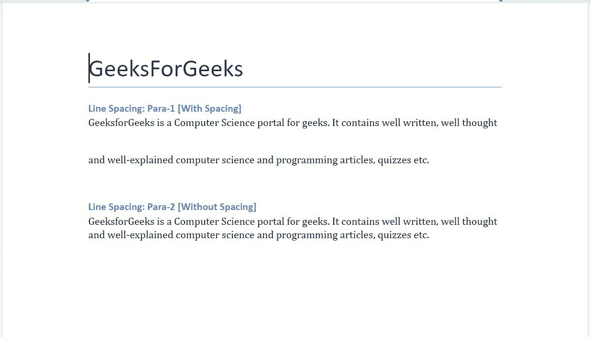
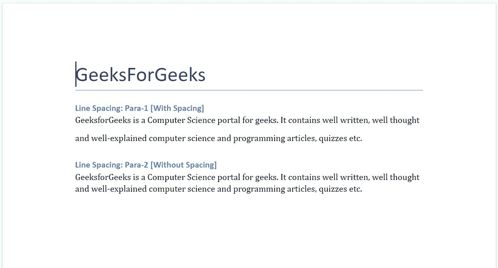
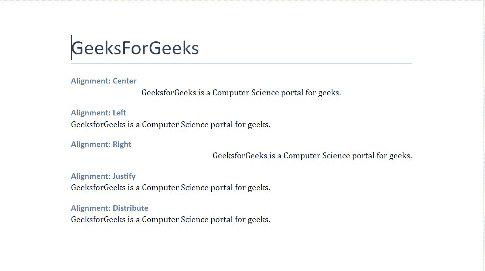
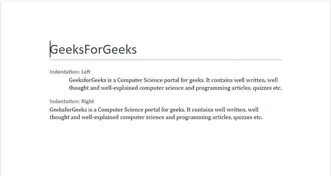
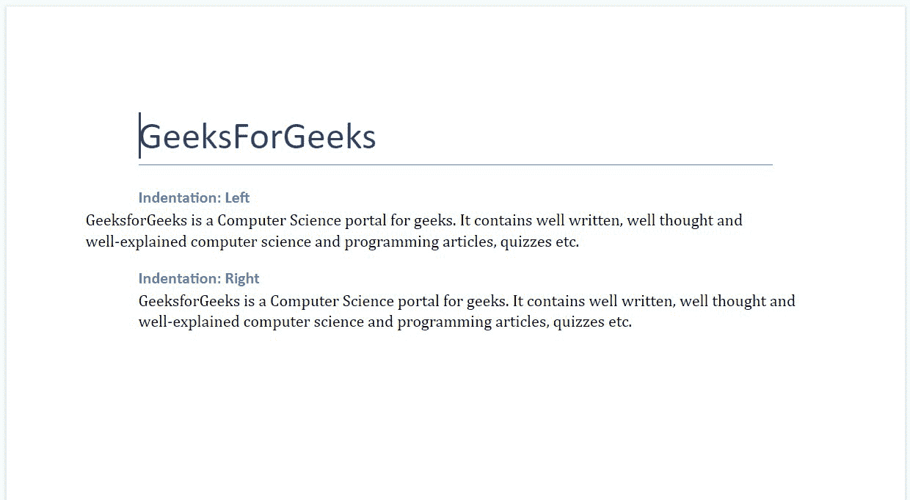
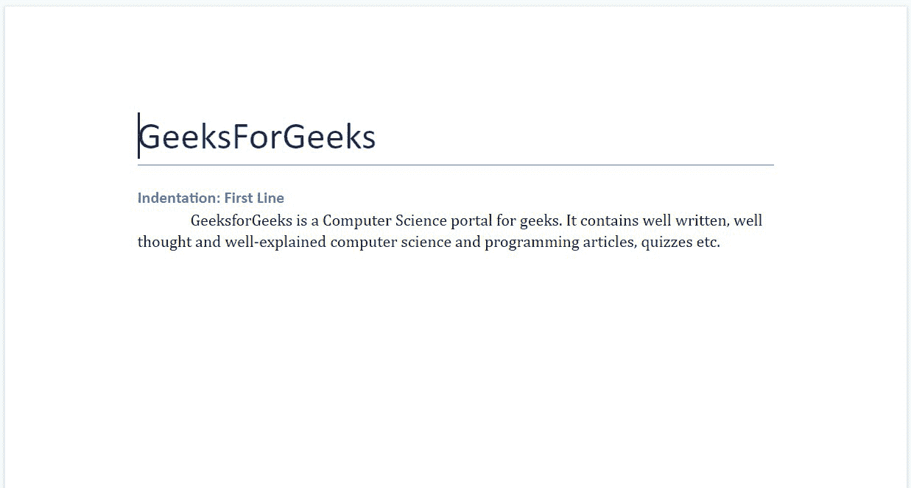
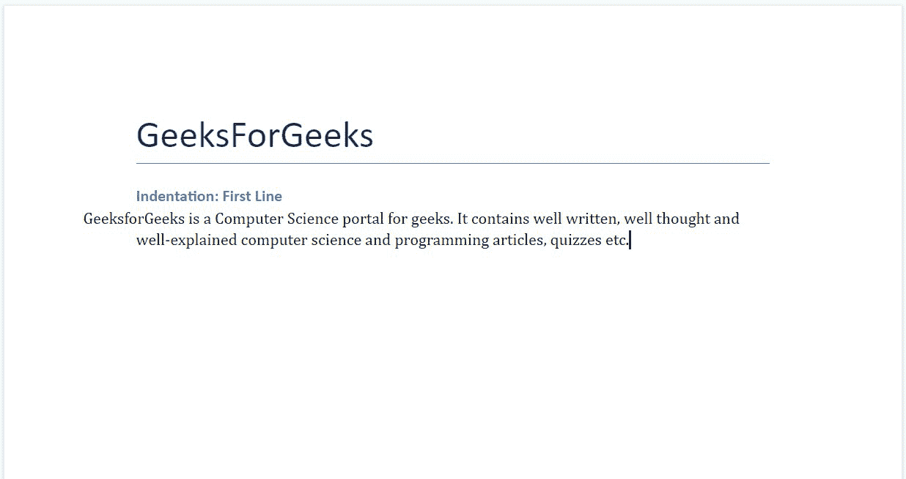

# Python 中的段落格式.docx 模块

> 原文: [https://www.geeksforgeeks.org/paragraph-formatting-in-python-docx-module/](https://www.geeksforgeeks.org/paragraph-formatting-in-python-docx-module/)

**先决条件:** [`python-docx` 模块](https://www.geeksforgeeks.org/python-working-with-docx-module/)

Word 文档包含包装在三个对象级别中的格式化文本。最低级别的 `run` 对象、中等级别的 `paragraph` 对象和最高级别的 `document` 对象。因此，我们不能使用普通的文本编辑器来处理这些文档。但是，我们可以使用 `python-docx` 模块在 python 中操作这些 word 文档。安装该模块的 Pip 命令是:

```py
pip install python-docx
```

Python `docx` 模块允许用户通过操作现有文档或创建一个新的空文档并对其进行操作来操作文档。这是一个强大的工具，因为它可以帮助您在很大程度上操作文档。

## 行距

为了设置段落中文本之间的行距，我们使用 `paragraph_format` 和 `line_spacing`。用于设置段落中各行之间的间距。

> **语法:** `paragraph_format.line_spacing = 长度`
>
> **参数: `长度`** 是行间留的空间长度。它以长度作为输入。它可以用绝对距离值或线高的相对距离值来定义。如果输入以磅、英寸或厘米为单位，则认为它们是绝对值，如果输入以浮点数为单位，则认为它们是相对值。

### 例 1: 用绝对距离值设置行距。

```py
# Import docx NOT python-docx
import docx
from docx.shared import Inches

# Create an instance of a word document
doc = docx.Document()

# Add a Title to the document
doc.add_heading('GeeksForGeeks', 0)

# Adding paragraph with spacing
doc.add_heading('Line Spacing: Para-1 [With Spacing]', 3)
para = doc.add_paragraph('GeeksforGeeks is a Computer Science portal for geeks. It contains well written, well thought and well-explained computer science and programming articles, quizzes etc.')
# Adding line space of 0.5 inches in the paragraph
para.paragraph_format.line_spacing = Inches(0.5)

# Adding paragraph without spacing
doc.add_heading('Line Spacing: Para-2 [Without Spacing]', 3)
doc.add_paragraph('GeeksforGeeks is a Computer Science portal for geeks. It contains well written, well thought and well-explained computer science and programming articles, quizzes etc.')

# Now save the document to a location
doc.save('gfg.docx')
```

**输出:**



### 例 2: 用相对值设置行距。

```py
# Import docx NOT python-docx
import docx

# Create an instance of a word document
doc = docx.Document()

# Add a Title to the document
doc.add_heading('GeeksForGeeks', 0)

# Adding paragraph with spacing
doc.add_heading('Line Spacing: Para-1 [With Spacing]', 3)
para = doc.add_paragraph('GeeksforGeeks is a Computer Science portal for geeks. It contains well written, well thought and well-explained computer science and programming articles, quizzes etc.')
# Adding line space in the paragraph
para.paragraph_format.line_spacing = 1.75

# Adding paragraph without spacing
doc.add_heading('Line Spacing: Para-2 [Without Spacing]', 3)
doc.add_paragraph('GeeksforGeeks is a Computer Science portal for geeks. It contains well written, well thought and well-explained computer science and programming articles, quizzes etc.')

# Now save the document to a location
doc.save('gfg.docx')
```

**输出:**



## 段落间距

为了对 Word 文档中的段落应用段落间距，我们使用 `paragraph_format` 和 `space_before` 和 `space_after`。它分别指定段落前后要留出的空间。它只能取正值作为输入，如果我们给任何负值它都会给出 `ValueError`。

| 序号 | 属性 | 描述 |
| :--- | :--- | :--- |
| 1. | `space_before` | 它在 word 文档的段落前添加空格。 |
| 2. | `space_after` | 它在 word 文档的段落后添加空格。 |

### 示例 3: 在 Word 文档中添加有间距和无间距的段落。

```py
# Import docx NOT python-docx
import docx
from docx.shared import Inches

# Create an instance of a word document
doc = docx.Document()

# Add a Title to the document
doc.add_heading('GeeksForGeeks', 0)

# Adding paragraph with spacing
doc.add_heading('Paragraph Spacing: Para-1 [With Spacing]', 3)
para = doc.add_paragraph('GeeksforGeeks is a Computer Science portal for geeks.')
# Adding space before and after of the paragraph
para.paragraph_format.space_before = Inches(0.25)
para.paragraph_format.space_after = Inches(0.25)

# Adding paragraph without spacing
doc.add_heading('Paragraph Spacing: Para-2 [Without Spacing]', 3)
doc.add_paragraph('GeeksforGeeks is a Computer Science portal for geeks.')

# Now save the document to a location
doc.save('gfg.docx')
```

**输出:**


## 水平线向

要设置文本中的水平对齐，我们将使用 `paragraph_format.alignment` 方法。它与 `WD_PARAGRAPH_ALIGNMENT` 一起使用来设置段落的对齐方式。在使用之前，您必须从 `docx.enum.text` 导入 `WD_ALIGN_PARAGRAPH`:

```py
from docx.enum.text import WD_ALIGN_PARAGRAPH
```

> **语法:** `para.paragraph_format.alignment = WD_ALIGN_PARAGRAPH.[对齐]`
>
> **参数:**
>
> **`对齐`:** 用于设置对齐。您可以将对齐方式设置为左对齐、居中对齐、右对齐或完全对齐。

**各种比对描述如下:**

| 序号 | 对齐名称 | 描述 |
| :--- | :--- | :--- |
| 1. | `CENTER` | 它将对齐设置为居中。 |
| 2. | `LEFT` | 它将对齐方式设置为向左。 |
| 3. | `RIGHT` | 它将对齐方式设置为向右。 |
| 4. | `JUSTIFY` | 它将对齐方式设置为对齐。 |
| 5. | `DISTRIBUTE` | 它以填充段落整个宽度的方式设置字符。 |

### 示例 1: 添加不同水平对齐的段落。

```py
# Import docx NOT python-docx
import docx
from docx.enum.text import WD_ALIGN_PARAGRAPH

# Create an instance of a word document
doc = docx.Document()

# Add a Title to the document
doc.add_heading('GeeksForGeeks', 0)

# Adding paragraph with alignment Center
doc.add_heading('Alignment: Center', 3)
para = doc.add_paragraph('GeeksforGeeks is a Computer Science portal for geeks.')
para.paragraph_format.alignment = WD_ALIGN_PARAGRAPH.CENTER

# Adding paragraph with alignment Left
doc.add_heading('Alignment: Left', 3)
para = doc.add_paragraph('GeeksforGeeks is a Computer Science portal for geeks.')
para.paragraph_format.alignment = WD_ALIGN_PARAGRAPH.LEFT

# Adding paragraph with alignment Right
doc.add_heading('Alignment: Right', 3)
para = doc.add_paragraph('GeeksforGeeks is a Computer Science portal for geeks.')
para.paragraph_format.alignment = WD_ALIGN_PARAGRAPH.RIGHT

# Adding paragraph with alignment Justify
doc.add_heading('Alignment: Justify', 3)
para = doc.add_paragraph('GeeksforGeeks is a Computer Science portal for geeks.')
para.paragraph_format.alignment = WD_ALIGN_PARAGRAPH.JUSTIFY

# Adding paragraph with alignment Distribute
doc.add_heading('Alignment: Distribute', 3)
para = doc.add_paragraph('GeeksforGeeks is a Computer Science portal for geeks.')
para.paragraph_format.alignment = WD_ALIGN_PARAGRAPH.DISTRIBUTE

# Now save the document to a location
doc.save('gfg.docx')
```

**输出:**



## 缺口

要在文本中设置缩进，我们将使用 `paragraph_format` 方法。为了应用缩进，我们使用 `left_indent` 和 `right_indent` 和 `paragraph_format` 并设置缩进值。您必须用长度值指定缩进，即英寸、磅或厘米。您也可以给一个负值作为缩进，这将导致段落与指定值的边距重叠。

| 序号 | 缩进 | 描述 |
| :--- | :--- | :--- |
| 1. | `left_indent` | 它设置 word 文件中段落的左缩进。 |
| 2. | `right_indent` | 它设置 word 文件中段落的右缩进。 |

> **语法:**
>
> *   **左缩进:** `paragraph_format.left_indent = 大小`
> *   **右缩进:** `paragraph_format.right_indent = 大小`
>
> **参数:**
>
> **`大小`:** 这是我们希望段落缩进的值。它可以是英寸、磅或厘米等。

### 例 2: 设置段落的左右缩进。

```py
# Import docx NOT python-docx
import docx
from docx.shared import Inches

# Create an instance of a word document
doc = docx.Document()

# Add a Title to the document
doc.add_heading('GeeksForGeeks', 0)

# Adding paragraph with left Indentation
doc.add_heading('Indentation: Left', 3)
para = doc.add_paragraph('GeeksforGeeks is a Computer Science portal \
for geeks. It contains well written, well thought and well-explained \
computer science and programming articles, quizzes etc.')
para.paragraph_format.left_indent = Inches(0.5)

# Adding paragraph with right Indentation
doc.add_heading('Indentation: Right', 3)
para = doc.add_paragraph('GeeksforGeeks is a Computer Science portal\
for geeks. It contains well written, well thought and well-explained\
computer science and programming articles, quizzes etc.')
para.paragraph_format.right_indent = Inches(0.5)

# Now save the document to a location
doc.save('gfg.docx')
```

**输出:**



### 示例 3: 为段落的左右缩进设置负值。

## 蟒蛇 3

```py
# Import docx NOT python-docx
import docx
from docx.shared import Inches

# Create an instance of a word document
doc = docx.Document()

# Add a Title to the document
doc.add_heading('GeeksForGeeks', 0)

# Adding paragraph with negative left Indentation
doc.add_heading('Indentation: Left', 3)
para = doc.add_paragraph('GeeksforGeeks is a Computer Science portal \
for geeks. It contains well written, well thought and well-explained\
computer science and programming articles, quizzes etc.')
para.paragraph_format.left_indent = Inches(-0.5)

# Adding paragraph with negative right Indentation
doc.add_heading('Indentation: Right', 3)
para = doc.add_paragraph('GeeksforGeeks is a Computer Science portal\
for geeks. It contains well written, well thought and well-explained\
computer science and programming articles, quizzes etc.')
para.paragraph_format.right_indent = Inches(-0.5)

# Now save the document to a location
doc.save('gfg.docx')
```

**输出:**



也可以使用`para.paragraph_format`和`.first_line_indent`属性只为段落的第一行设置缩进。它指定第一行和其他行之间的缩进长度。

> **语法:** `para.paragraph_format.first_line_indent = `长度
>
> **参数:**
>
> `长度`: 是第一行要留压痕的长度。正值将导致行缩进，而负值将导致悬挂缩进。

### 示例 4: 给出正缩进值作为第一行缩进的输入。

## 蟒蛇 3

```py
# Import docx NOT python-docx
import docx
from docx.shared import Inches

# Create an instance of a word document
doc = docx.Document()

# Add a Title to the document
doc.add_heading('GeeksForGeeks', 0)

# Adding paragraph with only first line Indented
doc.add_heading('Indentation: First Line', 3)
para = doc.add_paragraph('GeeksforGeeks is a Computer Science\
portal for geeks. It contains well written, well thought and \
well-explained computer science and programming articles, quizzes etc.')

# Causing First Line Indentation
para.paragraph_format.first_line_indent = Inches(0.5)

# Now save the document to a location
doc.save('gfg.docx')
```

**输出:**



### 示例 5: 给出负缩进值作为第一行缩进的输入。

## 蟒蛇 3

```py
# Import docx NOT python-docx
import docx
from docx.shared import Inches

# Create an instance of a word document
doc = docx.Document()

# Add a Title to the document
doc.add_heading('GeeksForGeeks', 0)

# Adding paragraph with only first line Indented
doc.add_heading('Indentation: First Line', 3)
para = doc.add_paragraph('GeeksforGeeks is a Computer Science portal for geeks. It contains well written, well thought and well-explained computer science and programming articles, quizzes etc.')

# Causing First Line Indentation
para.paragraph_format.first_line_indent = Inches(-0.5)

# Now save the document to a location
doc.save('gfg.docx')
```

**输出:**

