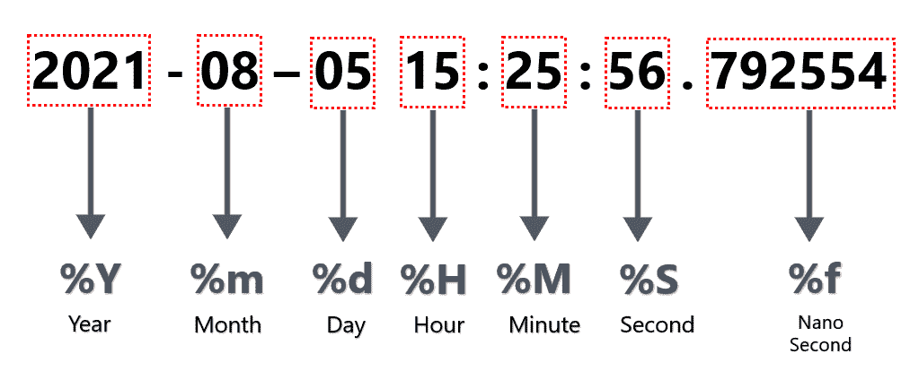

# 解析 Python 中包含纳秒的日期时间字符串

> 原文：[https://www.geeksforgeeks.org/parsing-datetime-strings-containing-nanoseconds-in-python/](https://www.geeksforgeeks.org/parsing-datetime-strings-containing-nanoseconds-in-python/)

大多数应用需要高达秒的精度，但也有一些关键应用需要纳秒精度，尤其是那些可以执行极快计算的应用。它有助于为应用程序提供与时间空间相关的某些因素的见解。让我们看看如何解析包含纳秒的日期时间字符串。Python 有一个指令列表，可以用来将字符串解析为日期时间对象。让我们看一下我们将在代码中使用的一些方法。

| **指令** | **描述** | **例** |
| --- | --- | --- |
| `%Y` | 年 | Two thousand and twenty-one |
| `%m` | 月号 | seven |
| `%d` | 月份日期 | five |
| `%H` | 24 小时格式 | Sixteen |
| `%M` | 分钟 | Fifty-one |
| `%f` | 微秒 | Two hundred and thirty-four thousand five hundred and sixty-seven |

#### 日期时间对象的图像演示：



让我们以默认的 Python 时间戳格式：“2021-08-05 15:25:56.792554”为例进行研究。

### 方法一：使用 `datetime` 模块

在这个例子中，我们会看到纳秒值为 `792554`。`%f` 指令是用来解析纳秒的。使用 `strftime()` 方法，通过将 `%f` 指令转换为日期时间对象的字符串值来交叉验证同样的事情。

```python
from datetime import datetime

# Parse the default python timestamp format
dt_obj = datetime.strptime("2021-08-05 15:25:56.792554",
                           "%Y-%m-%d %H:%M:%S.%f")

# Verify the value for nano seconds
nano_secs = dt_obj.strftime("%f")

# Print the value of nano seconds
print(nano_secs)
```

**输出**

```
792554
```

### 方法二：使用 `pandas` 库

这里我们将使用 `pandas.to_datetime()` 方法来解析包含纳秒的 datetime 字符串。

> **语法：**
>
> `pandas.to_datetime(arg, errors='raise', dayfirst=False, yearfirst=False, utc=None, box=True, format=None, exact=True, unit=None, infer_datetime_format=False, origin='unix', cache=False)`
>
> **参数：**
>
> `arg`：要转换为日期时间对象的整数、字符串、浮点、列表或字典对象。
> `dayfirst`：布尔值，如果为 True，则排名第一。
> `yearfirst`：布尔值，如果为 True，则放置 year first。
> `utc`：布尔值，如果为真，则返回以 utc 为单位的时间。
> `format`：字符串输入告诉日、月、年的位置。

```python
import pandas as pd

# Parse the timestamp string by
# providing the format of timestamp string
dt_obj = pd.to_datetime("2021-08-05 15:25:56.792554", 
                        format="%Y-%m-%d %H:%M:%S.%f")

# Verify the value for nano seconds
nano_secs = dt_obj.strftime("%f")

# Print the value of nano seconds
print(nano_secs)
```

**输出：**

```
792554
```

除了我们使用了 `pandas` 库而不是 `datetime` 模块之外，上面的例子与前面的例子相似。当我们使用 `pandas` 数据帧时，这可以证明是很方便的。这个库的一个优点是我们可能不需要手动提供格式。参数 `infer_datetime_format` 在 `pandas.to_datetime()` 方法中可以自动处理，如果提供为 `True`。在某些情况下，可以将解析速度提高 ~5-10x。下面是同样的例子。

```python
import pandas as pd

# Parse the timestamp string by
# providing infer_datetime_format as True
dt_obj = pd.to_datetime("2021-08-05 15:25:56.792554", 
                        infer_datetime_format=True)

# Verify the value for nano seconds
nano_secs = dt_obj.strftime("%f")

# Print the value of nano seconds
print(nano_secs)
```

**输出：**

```
792554
```