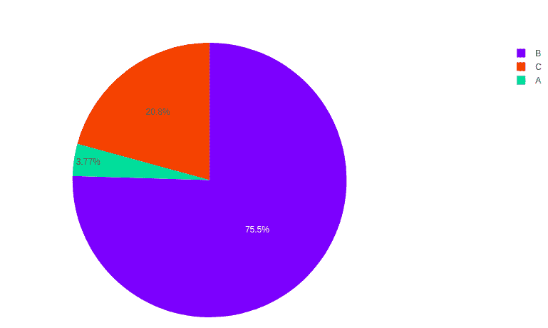
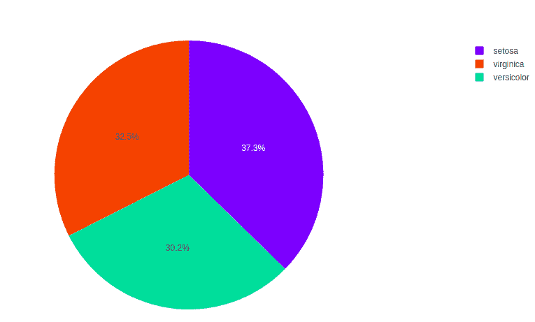
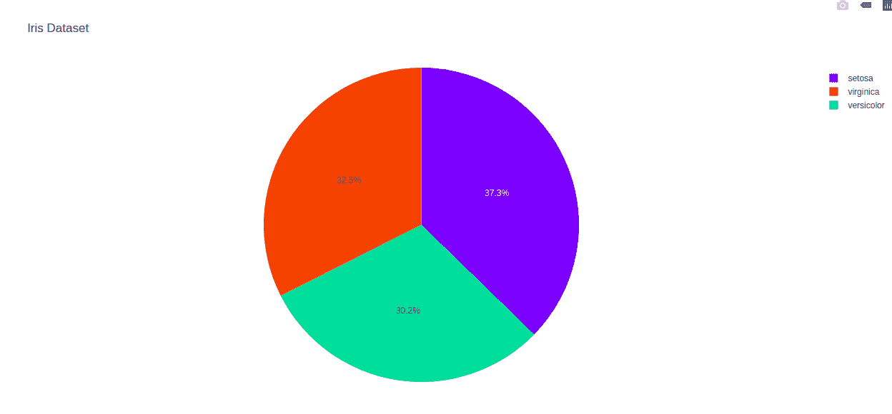
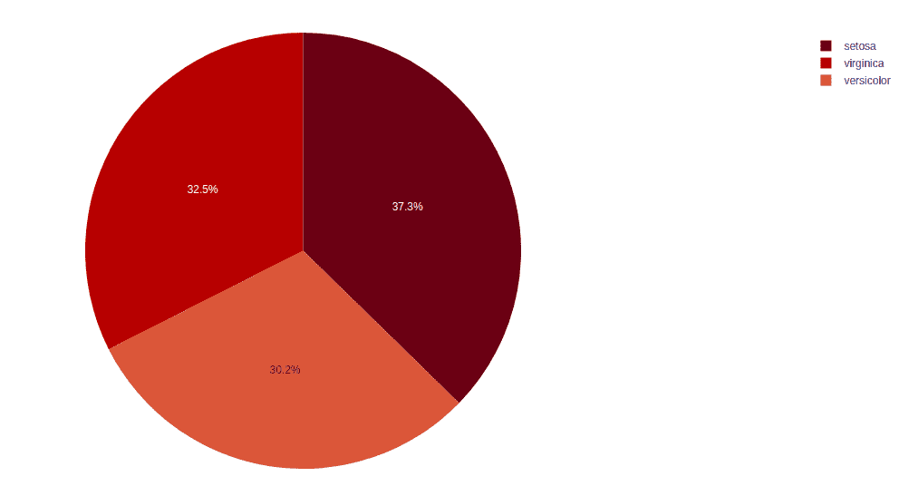

# 使用 Python 中的 Plotly 绘制饼图

> 原文：[https://www.geeksforgeeks.org/pie-plot-using-plotly-in-python/](https://www.geeksforgeeks.org/pie-plot-using-plotly-in-python/)

`Plotly` 是一个 Python 库，用来设计图形，尤其是交互图形。它可以绘制各种图形和图表，如直方图、条形图、箱线图、展开图等。它主要用于数据分析以及财务分析。`plotly` 是一个交互式可视化库。

## 饼图

一个**饼图**是一个圆形的分析图，分为区域来表示数值百分比。在 `px.pie` 中，由饼图的扇区预期的用来设定值的数据。所有扇区都按名称分类。饼图通常用于显示与下一个对应的饼图切片的百分比。饼图有助于理解，因为它的不同部分和颜色编码。

> **语法：** `plotly.express.pie(data_frame=None, names=None, values=None, color=None, color_discrete_sequence=None, color_discrete_map={}, hover_name=None, hover_data=None, custom_data=None, labels={}, title=None, template=None, width=None, height=None, opacity=None, hole=None)`

**参数：**

| 名字 | 价值 | 描述 |
| --- | --- | --- |
| `data_frame` | 数据框或类似数组或字典 | 需要传递此参数才能使用列名（而不是关键字名）。类数组和字典在内部被转换成熊猫数据帧。可选：如果缺少，则使用其他参数在头罩下构造一个数据帧 |
| `names` | 字符串、整数、序列或类似数组 | 数据框中的列名，熊猫系列或类似数组的对象。此列或 `array_like` 中的值用作扇区的标签。 |
| `values` | 字符串、整数、序列或类似数组 | 数据框中的列名，熊猫系列或类似数组的对象。来自该列或 `array_like` 的值用于设置与扇区相关联的值。 |
| `color` | 字符串、整数、序列或类似数组 | 数据框中的列名，熊猫系列或类似数组的对象。此列或 `array_like` 中的值用于为标记指定颜色。 |

**示例：**

```py
import plotly.express as px
import numpy

# Random Data
random_x = [100, 2000, 550]
names = ['A', 'B', 'C']

fig = px.pie(values=random_x, names=names)
fig.show()
```

**输出：**



## 分组数据

`names` 参数的相同值组合在一起。重复标签将行或列直观地分组在一起，使数据更容易理解。让我们看看下面给出的一个例子。

**示例：** 虹膜数据集包含许多行，但只有 3 个物种，因此数据根据物种进行分组。

```py
import plotly.express as px

# Loading the iris dataset
df = px.data.iris()

fig = px.pie(df, values="sepal_width", names="species")
fig.show()
```

**输出：**



## 自定义饼图

饼图可以使用 `px.pie` 自定义，使用它的一些参数，如 `hover_data` 和 `labels`。让我们看看下面的例子，以便更好地理解。

**示例：**

```py
import plotly.express as px

# Loading the iris dataset
df = px.data.iris()

fig = px.pie(df, values="sepal_width", names="species",
             title='Iris Dataset', hover_data=['sepal_length'])
fig.show()
```

**输出：**



## 设置颜色

饼图的颜色可以在绘图模块中更改。不同的颜色有助于区分数据，这有助于更有效地理解数据。

**示例：**

```py
import plotly.express as px

# Loading the iris dataset
df = px.data.iris()

fig = px.pie(df, values="sepal_width",
             names="species",
             color_discrete_sequence=px.colors.sequential.RdBu)
fig.show()
```

**输出：**

