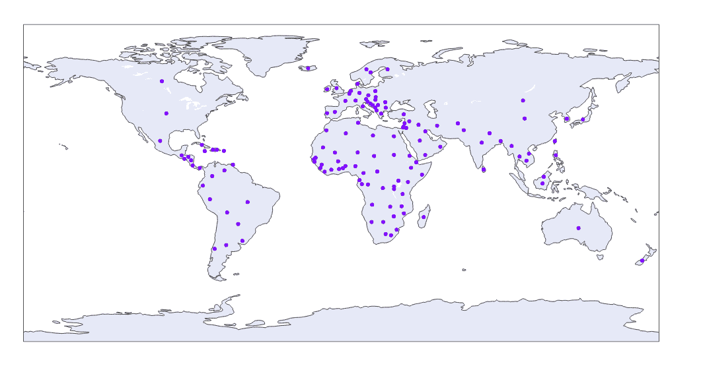
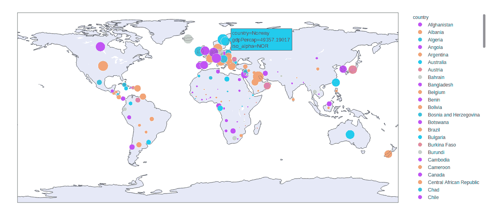

# Python 中的 `plotly.express.scatter_geo()` 函数

> 原文: [https://www.geeksforgeeks.org/plotly-express-scatter_geo-function-in-python/](https://www.geeksforgeeks.org/plotly-express-scatter_geo-function-in-python/)

Python 的 Plotly 库对于数据可视化和简单容易地理解数据非常有用。Plotly graph 对象是易于使用的高级绘图界面。

## `plotly.express.scatter_geo()` 函数

该功能用于在地图上绘制地理数据。

> **语法:** `plotly.express.scatter_geo(data_frame=None, lat=None, lon=None, locations=None, locationmode=None, color=None, text=None, hover_name=None, hover_data=None, custom_data=None, size=None, title=None, template=None, width=None, height=None)`
>
> **参数:**
>
> `data_frame`: 列名需要传递 DataFrame 或类似数组或 dict。
>
> `lat`: 此参数用于根据地图上的纬度定位标记。
>
> `lon`: 此参数用于根据地图上的经度定位标记。
>
> `locations`: 此参数根据位置模式进行解释，并映射到经度/纬度。
>
> `locationmode`: 此参数确定用于将位置中的条目与地图上的区域进行匹配的位置集。
>
> `color`: 该参数为标记指定颜色。
>
> `size`: 该参数用于分配标记尺寸。它或者是 `data_frame` 中某列的名称，或者是 pandas Series 或 array_like 对象。
>
> `title`: 该参数设置图的标题。
>
> `width`: 该参数设置图形的宽度。
>
> `height`: 该参数设置图形的高度。

### 例 1:

```py
import plotly.express as px

df = px.data.gapminder().query("year == 2007")

plot = px.scatter_geo(df, locations="iso_alpha")
plot.show()
```

**输出:**



### 示例 2: 使用大小和颜色参数

```py
import plotly.express as px

df = px.data.gapminder().query("year == 2007")

plot = px.scatter_geo(df, locations="iso_alpha",
                      size="gdpPercap",
                      color = "country")
plot.show()
```

**输出:**

