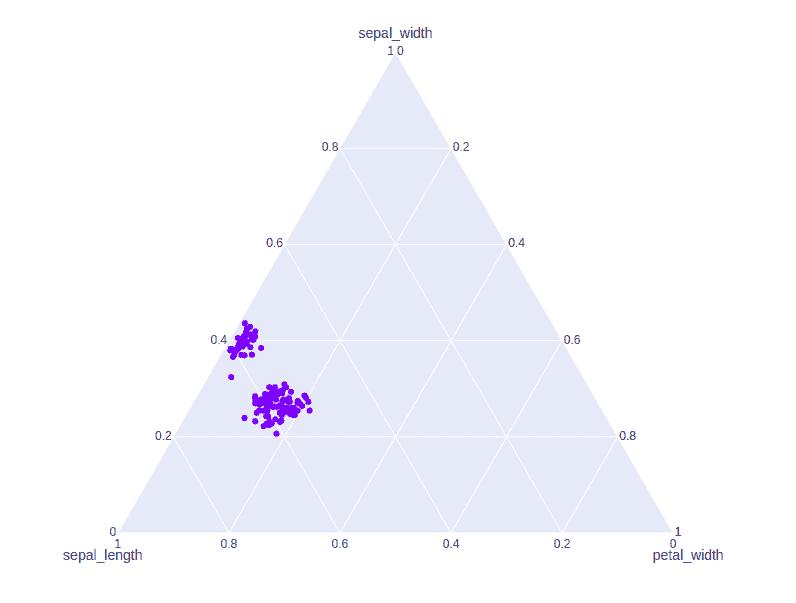
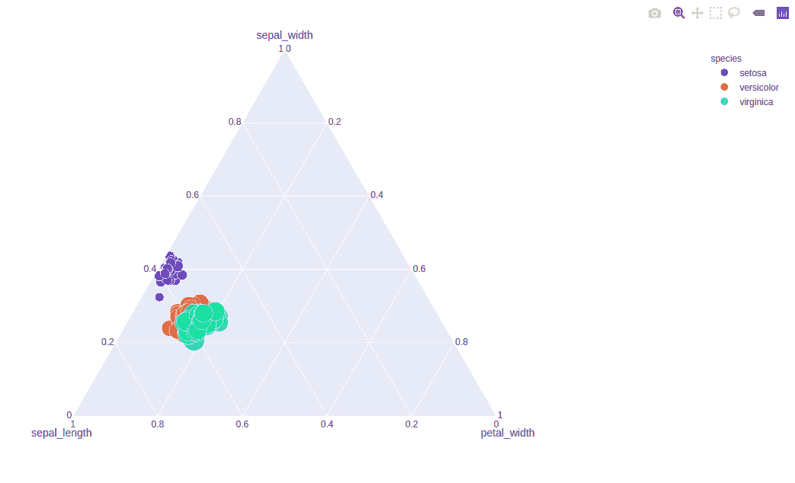
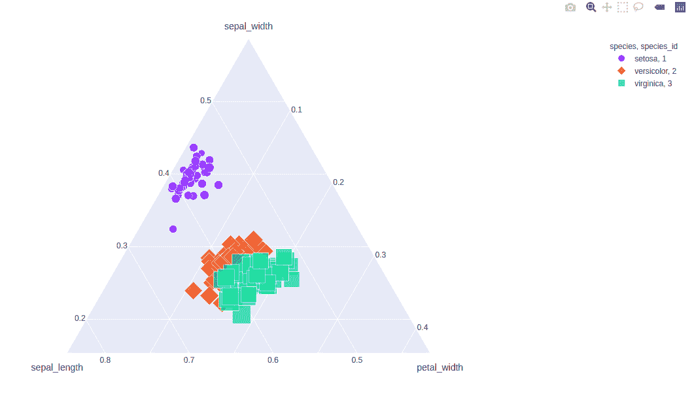

# Python 中的 `plotly.express.scatter_ternary()` 函数

> 原文：[https://www.geeksforgeeks.org/plotly-express-scatter_ternary-function-in-python/](https://www.geeksforgeeks.org/plotly-express-scatter_ternary-function-in-python/)

Python 的 Plotly 库对于数据可视化和简单容易地理解数据非常有用。Plotly graph 对象是易于使用的高级绘图界面。

## `plotly.express.scatter_ternary()` 函数

此方法用于创建三元图。三元图用来描绘等边三角形上三个变量的比值。

> **语法：**`plotly.express.scatter_ternary(data_frame=None, a=None, b=None, c=None, color=None, symbol=None, size=None, text=None, hover_name=None, hover_data=None, size_max=None, title=None, template=None, width=None, height=None)`
>
> **参数：**
>
> `data_frame`：列名需要传递 DataFrame 或类似数组或 dict。
>
> `a`、`b`、`c`：这些参数要么是 `data_frame` 中某列的名称，要么是 pandas Series 或 array_like 对象。这些分别用于在三元坐标中沿 a、b 和 c 轴定位标记。
>
> `color`：该参数为标记指定颜色。
>
> `symbol`：此参数用于将符号分配给标记。它或者是 `data_frame` 中某列的名称，或者是 pandas Series 或 array_like 对象。
>
> `size`：该参数用于分配标记尺寸。它或者是 `data_frame` 中某列的名称，或者是 pandas Series 或 array_like 对象。
>
> `hover_name`：此列或类似数组的值以粗体显示在悬停工具提示中。
>
> `hover_data`：此参数用于在悬停工具提示或元组中以 bool 或格式字符串作为第一个元素出现，列表状数据作为第二个元素出现在悬停中这些列的值作为额外数据出现在悬停工具提示中。
>
> `title`：图的标题。
>
> `width`：设置图形的宽度。
>
> `height`：设置人物的高度。

**例 1：**

```py
import plotly.express as px

df = px.data.iris()

plot = px.scatter_ternary(df, a = 'sepal_width',
                          b = 'sepal_length', 
                          c = 'petal_width')
plot.show()
```

**输出：**



**示例 2：** 使用大小和颜色参数

```py
import plotly.express as px

df = px.data.iris()

plot = px.scatter_ternary(df, a = 'sepal_width', 
                          b = 'sepal_length',
                          c='petal_width',
                          color = 'species',
                          size = 'petal_length')
plot.show()
```

**输出：**



**示例 3：** 使用符号参数

```py
import plotly.express as px

df = px.data.iris()

plot = px.scatter_ternary(df, a = 'sepal_width',
                          b = 'sepal_length', 
                          c = 'petal_width', 
                          color = 'species',
                          size = 'petal_length',
                          symbol = 'species_id')
plot.show()
```

**输出：**

