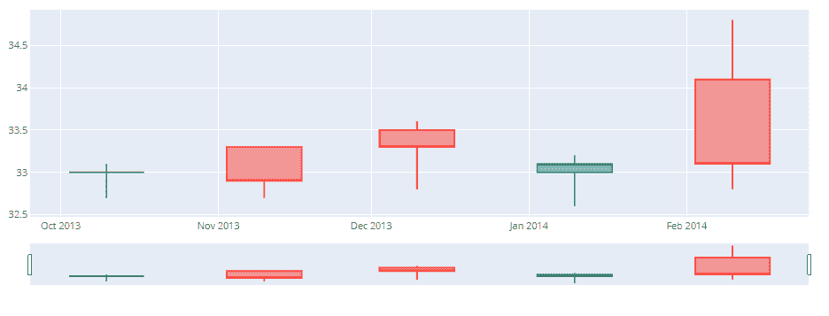
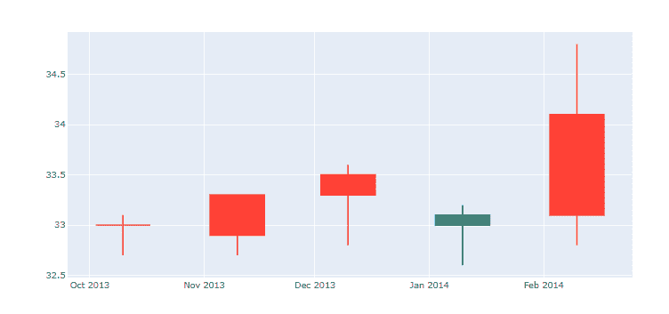

# Python中`plotly.figure_factory.create_candlestick()`函数

> 原文：[https://www.geeksforgeeks.org/plotly-figure_factory-create_candlestick-function-in-python/](https://www.geeksforgeeks.org/plotly-figure_factory-create_candlestick-function-in-python/)

Python的Plotly库对于数据可视化和简单容易地理解数据非常有用。

## `plotly.figure_factory.create_candlestick`

烛台图是一种描述给定x坐标（最有可能是时间）的OHLC的金融图表。方框代表开放值和关闭值之间的价差，线条代表低值和高值之间的价差。

> **语法：**`plotly.figure_factory.create_candlestick(open, high, low, close, dates=None, direction='both', **kwargs)`
>
> **参数**
>
> `open`：用于开数值
>
> `high`：用于高值
>
> `low`：用于低值
>
> `close`：用于关闭值
>
> `dates`：用于日期时间对象列表。默认值：`None`
>
> `direction`：既可增也可减。当`direction`为`'increasing'`时，返回的数字由收盘值大于对应开盘值的所有烛台组成，当`direction`为`'decreasing'`时，返回的数字由收盘值小于或等于对应开盘值的所有烛台组成。当`direction`为`'both'`时，增加和减少的烛台都会返回。默认值：`'both'`
>
> `**kwargs` – 它描述了OHLC散射轨迹的其他属性，例如颜色或图例名称。有关有效`kwargs`的更多信息，请调用`help(plotly.graph_objects.Scatter)`

**示例1**：带日期时间对象

## Python 3

```py
import plotly.graph_objects as go
from datetime import datetime

open_data = [33.0, 33.3, 33.5, 33.0, 34.1]
high_data = [33.1, 33.3, 33.6, 33.2, 34.8]
low_data = [32.7, 32.7, 32.8, 32.6, 32.8]
close_data = [33.0, 32.9, 33.3, 33.1, 33.1]
dates = [datetime(year=2013, month=10, day=10),
         datetime(year=2013, month=11, day=10),
         datetime(year=2013, month=12, day=10),
         datetime(year=2014, month=1, day=10),
         datetime(year=2014, month=2, day=10)]

fig = go.Figure(data=[go.Candlestick(x=dates,
                       open=open_data, high=high_data,
                       low=low_data, close=close_data)])

fig.show()
```

**输出：**



**示例2：** 带有日期时间对象的烛台图表

## Python 3

```py
from plotly.figure_factory import create_candlestick
from datetime import datetime
# Add data
open_data = [33.0, 33.3, 33.5, 33.0, 34.1]
high_data = [33.1, 33.3, 33.6, 33.2, 34.8]
low_data = [32.7, 32.7, 32.8, 32.6, 32.8]
close_data = [33.0, 32.9, 33.3, 33.1, 33.1]
dates = [datetime(year=2013, month=10, day=10),
         datetime(year=2013, month=11, day=10),
         datetime(year=2013, month=12, day=10),
         datetime(year=2014, month=1, day=10),
         datetime(year=2014, month=2, day=10)]
# Create ohlc
fig = create_candlestick(open_data, high_data,
    low_data, close_data, dates=dates)
fig.show()
```

**输出：**

