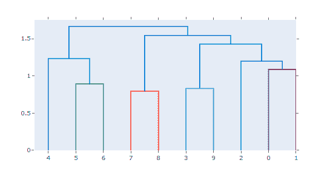
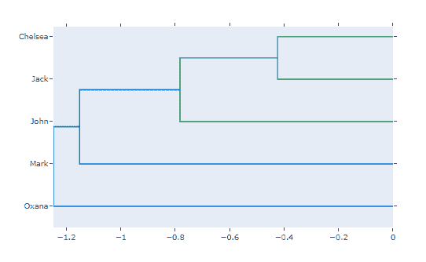

# Python 中的 `plotly.figure_factory.create_dendrogram()` 函数

> 原文: [https://www.geeksforgeeks.org/plotly-figure_factory-create_dendrogram-function-in-python/](https://www.geeksforgeeks.org/plotly-figure_factory-create_dendrogram-function-in-python/)

Python 的 Plotly 库对于数据可视化和简单容易地理解数据非常有用。

## `plotly.figure_factory.create_dendrogram`

树形图是表示一棵树的图表。名为 `create_dendrogram` 的图形工厂对数据执行分层聚类，并表示生成的树。树深度轴上的值对应于聚类之间的距离。

> **语法:** `plotly.figure_factory.create_dendrogram(X, orientation='bottom', labels=None, colorscale=None, distfun=None, linkagefun=<function <lambda>>, hovertext=None, color_threshold=None)`
>
> **参数:**
>
> **`X` (`ndarray`)** – 它将观测矩阵描述为数组的数组
>
> **`orientation` (`str`)** – 在这里，我们使用“顶部”、“右侧”、“底部”或“左侧”
>
> **`labels` (`list`)** – 描述轴类别标签(观察标签)的列表
>
> **`colorscale` (`list`)** – 它描述了树形图树的可选色标
>
> **`distfun` (`function`)** – 它描述了从观测值计算成对距离的函数
>
> **`linkagefun` (`function`)** – 它描述了根据两两距离计算连接矩阵的函数
>
> **`hovertext` (`list[list]`)** – 它描述了树图聚类的组成轨迹的悬停文本列表
>
> **`color_threshold` (`double`)** – 它描述将进行聚类分离的值

**实施例 1:** 简单的底部定向树形图

```py
from plotly.figure_factory import create_dendrogram
import numpy as np

X = np.random.rand(10,10)
fig = create_dendrogram(X)
fig.show()
```

**输出:**



**示例 2:** 放在热图左侧的树形图

```py
from plotly.figure_factory import create_dendrogram
import numpy as np

X = np.random.rand(5,5)
names = ['Jack', 'Oxana', 'John', 'Chelsea', 'Mark']

dendro = create_dendrogram(X, orientation='right', labels=names)
dendro.update_layout({'width':700, 'height':500})
dendro.show()
```

**输出:**

