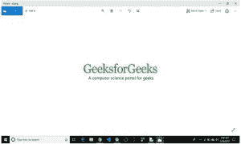
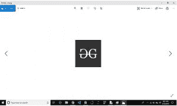

# Python PIL ImageGrab.grabclipboard() 方法

> 原文: [https://www.geeksforgeeks.org/pyhton-pil-imagegrab-grabclipboard-method/](https://www.geeksforgeeks.org/pyhton-pil-imagegrab-grabclipboard-method/)

PIL 是 Python Imaging Library，它为 Python 解释器提供了图像编辑功能。`ImageGrab` 模块可用于将屏幕或剪贴板的内容复制到 PIL 图像内存中。

`PIL.ImageGrab.grabclipboard()` 方法获取剪贴板图像的快照（如果有）。

## 语法

`PIL.ImageGrab.grabclipboard()`

## 参数

无参数。

## 返回值

在窗口中，图像、文件名列表，如果剪贴板不包含图像数据或文件名，则返回 `None`。

**注意：** 本模块仅适用于 Windows 和 Mac OS。

```py
# Importing Image and ImageGrab module from PIL package 
from PIL import Image, ImageGrab

# using the grabclipboard method
im = ImageGrab.grabclipboard()

im.show()
```

**输出：**


**更改剪贴板上的图像后**

```py
# Importing Image and ImageGrab module from PIL package 
from PIL import Image, ImageGrab

# using the grabclipboard method
im = ImageGrab.grabclipboard()

im.show()
```

**输出：**
