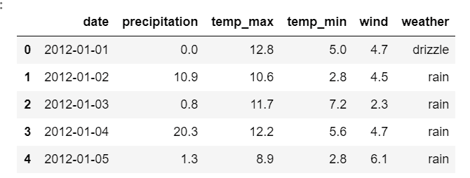
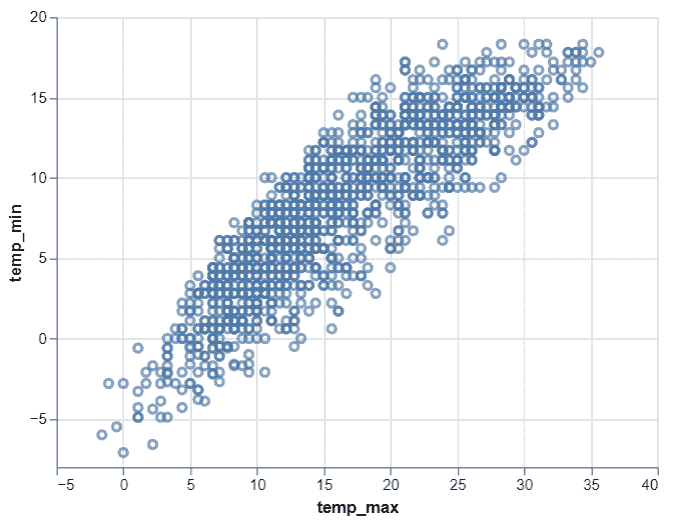

# 蟒蛇牛郎星–散点图

> 原文:[https://www.geeksforgeeks.org/python-altair-scatter-plot/](https://www.geeksforgeeks.org/python-altair-scatter-plot/)

在本文中，我们将使用 `python` 学习一个带有 `altair` 的简单散点图。`altair` 是 `python` 中最新的交互式数据可视化库之一。`altair` 基于 `vega` 和 `vega-lite`——一种交互图形的语法。这里我们将导入 `altair` 库使用。然后我们将从 `vega_datasets` 加载西雅图天气数据。

## 逐步方法:

*   导入模块。

```py
# import required modules
import altair as alt
from vega_datasets import data
```

*   分配数据集并将其转换为数据框。

```py
# assign dataset
seattle_weather = data.seattle_weather()
```

*   显示数据集。

```py
# display dataset
seattle_weather.head(5)
```

**输出:**



*   现在让我们使用 `altair` 库制作散点图。为此，我们使用 `altair` 中的 `Chart()` 功能加载数据，然后使用 `mark_point()` 功能进行散点图。然后我们使用美学 x 轴和 y 轴来 `encode()` 功能。因此，我们得到两个变量的简单散点图，如下所示:

```py
# depict scatter plot
alt.Chart(seattle_weather).mark_point().encode(
    x='temp_max',
    y='temp_min'
)
```

**输出:**



**以下是基于上述方法的完整程序:**

```py
# import required modules
import altair as alt
from vega_datasets import data

# assign dataset
seattle_weather = data.seattle_weather()

# display dataset
seattle_weather.head(5)

# depict scatter plot
alt.Chart(seattle_weather).mark_point().encode(
    x='temp_max',
    y='temp_min'
)
```

**输出:**

