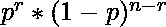
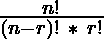
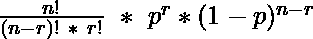
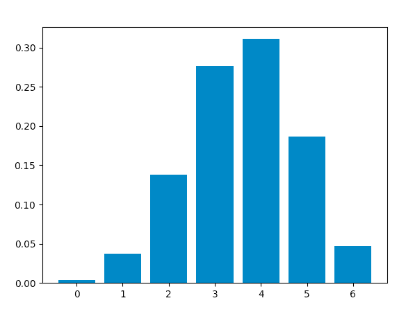
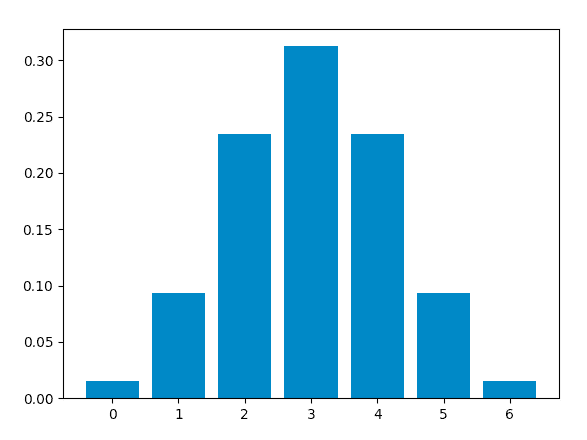

# Python–二项分布

> 原文:[https://www.geeksforgeeks.org/python-binomial-distribution/](https://www.geeksforgeeks.org/python-binomial-distribution/)

**二项式分布**是一种概率分布，总结了一个变量在给定的一组参数下取两个独立值之一的可能性。该分布是通过进行多次**伯努利**试验获得的。

假设伯努利试验满足以下每个标准:

*   只有两种可能的结果。
*   每个结果都有固定的发生概率。成功的概率为 `p`，失败的概率为 `1-p`。
*   每个试验都完全独立于所有其他试验。

二项式随机变量代表伯努利实验在 `n` 次连续独立试验中的成功次数。

获得 `r` 次成功和 `n-r` 次失败的概率为:

<center></center>

获得 `r` 次成功的方法数为:

<center></center>

因此，**概率质量函数(pmf)**，即获得 `r` 次成功和 `n-r` 次失败的总概率为:

<center></center>

一个说明该分布的例子:

考虑一个随机实验，投掷一枚有偏见的硬币 `6` 次，得到一个人头的概率是 `0.6`。如果“获得头部”被认为是“成功”，那么二项式分布表将包含 `r` 的每个可能值的 `r` 次成功的概率。

<figure class="table">

| r | Zero | one | Two | three | four | five | six |
| --- | --- | --- | --- | --- | --- | --- | --- |
| P(r) | 0.004096 | 0.036864 | 0.138240 | 0.276480 | 0.311040 | 0.186624 | 0.046656 |

</figure>

该分布的平均值等于 `np`，方差为 `np(1-p)`。

## 使用 Python 获取分布

现在，我们将使用 Python 分析分布(使用 `SciPy`)并绘制图形(使用 `Matplotlib`)。

### 所需模块

*   `SciPy`:
    `SciPy` 是一个开源 Python 库，用于数学、工程、科学和技术计算。

### 安装

```py
pip install scipy
```

*   `Matplotlib`:
    `Matplotlib` 是一个用于绘制静态和交互式图形及可视化的综合 Python 库。

### 安装

```py
pip install matplotlib
```

`scipy.stats` 模块包含各种统计计算和测试功能。`scipy.stats.binom` 模块的 `stats()` 函数可用于使用 `n` 和 `p` 的值计算二项式分布。

> **语法**: `scipy.stats.binom.stats(n, p)`

它返回一个元组，包含按此顺序分布的平均值和方差。

`scipy.stats.binom.pmf()` 函数用于获得 `r`、`n` 和 `p` 某个值的概率质量函数，我们可以通过传递 `r`(0 到 `n`)的所有可能值来获得分布。

> **语法**: `scipy.stats.binom.pmf(r, n, p)`

### 计算分配表

### 进场

*   定义 `n` 和 `p`。
*   定义从 0 到 `n` 的 `r` 的值列表。
*   得到**均值**和**方差**。
*   对于每个 `r`，计算 `pmf` 并存储在列表中。

### 代码

```py
from scipy.stats import binom
# setting the values
# of n and p
n = 6
p = 0.6
# defining the list of r values
r_values = list(range(n + 1))
# obtaining the mean and variance 
mean, var = binom.stats(n, p)
# list of pmf values
dist = [binom.pmf(r, n, p) for r in r_values ]
# printing the table
print("r\tp(r)")
for i in range(n + 1):
    print(str(r_values[i]) + "\t" + str(dist[i]))
# printing mean and variance
print("mean = "+str(mean))
print("variance = "+str(var))
```

### 输出

```py
r    p(r)
0    0.004096000000000002
1    0.03686400000000005
2    0.13824000000000003
3    0.2764800000000001
4    0.31104
5    0.18662400000000007
6    0.04665599999999999
mean = 3.5999999999999996
variance = 1.44
```

### 代码

使用 `matplotlib.pyplot.bar()` 函数绘制曲线图，绘制竖线。

```py
from scipy.stats import binom
import matplotlib.pyplot as plt
# setting the values
# of n and p
n = 6
p = 0.6
# defining list of r values
r_values = list(range(n + 1))
# list of pmf values
dist = [binom.pmf(r, n, p) for r in r_values ]
# plotting the graph 
plt.bar(r_values, dist)
plt.show()
```

### 输出

<center> [](https://media.geeksforgeeks.org/wp-content/uploads/20200615171408/Screenshot20200615at51319PM.png)</center>

当成功和失败的可能性相等时，二项分布是一个**正态**分布。因此，将 `p` 的值更改为 `0.5`，我们得到这个图形，它与正态分布图相同:

<center>[](https://media.geeksforgeeks.org/wp-content/uploads/20200615171521/Screenshot20200615at51453PM.png)</center>