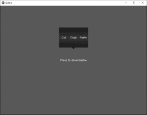

# Python | kivy 中的泡泡

> 原文: [https://www.geeksforgeeks.org/python-bubble-in-kivy/](https://www.geeksforgeeks.org/python-bubble-in-kivy/)

Kivy 是 Python 中独立于平台的 GUI 工具。因为它可以在安卓、IOS、linux 和 Windows 等平台上运行。它基本上是用来开发安卓应用程序的，但并不意味着它不能在桌面应用程序上使用。

> 👉🏽 [Kivy 教程–通过示例学习 Kivy](https://www.geeksforgeeks.org/kivy-tutorial/)。

### 气泡:

气泡小部件是一种菜单或小弹出窗口的形式，其中菜单选项垂直或水平堆叠。气泡包含一个指向您选择的方向的箭头。

要选择箭头使用的方向:

> `Bubble(arrow_pos= 'top_mid')`

默认情况下，气泡的方向是水平的，但您可以通过以下命令更改它:

> `orientation= 'vertical'`

要向气泡中添加项目:

> `bubble = Bubble(orientation= 'vertical')`
> `bubble.add_widget(your_widget_instance)`

要删除项目:

> `bubble.remove_widget(widget)`
> 或
> `bubble.clear_widgets()`

```py
Basic Approach :
1) import kivy
2) import kivyApp
3) import Button
4) import Floatlayout(according to need)
5) import Bubble
6) import object property
7) Create Layout class:
8) Create App class
9) create .kv file (name same as the app class):
        1) createBubble
10) return Layout/widget/Class(according to requirement)
11) Run an instance of the class
```

## 方法的实施:

### `#.py` 代码:

```py
# Program to Show how to create a switch
# import kivy module
import kivy

# base Class of your App inherits from the App class.
# app:always refers to the instance of your application
from kivy.app import App

# this restrict the kivy version i.e
# below this kivy version you cannot
# use the app or software
kivy.require('1.9.0')

# module consists the floatlayout
# to work with FloatLayout first
# you have to import it
from kivy.uix.floatlayout import FloatLayout

# The Button is a Label with associated
# actions that are triggered
# when the button is pressed
from kivy.uix.button import Button

# The Bubble widget is a form of menu or a
# small popup where the menu options
# are stacked either vertically or horizontally.
from kivy.uix.bubble import Bubble

# ObjectProperty is a specialized sub-class of the
# Property class, so it has the same
# initialisation parameters as it:
# By default, a Property always takes a default value[.]
from kivy.properties import ObjectProperty

# Create the Bubble class
# on which the .kv file is
class Cut_copy_paste(Bubble):
    pass

# Create the Layout Class
class BubbleDemo(FloatLayout):

    def __init__(self, **kwargs):
        super(BubbleDemo, self).__init__(**kwargs)
        self.but_bubble = Button(text ='Press to show bubble')
        self.but_bubble.bind(on_release = self.show_bubble)
        self.add_widget(self.but_bubble)
        self.bubb = Cut_copy_paste()

# Defining the function to show the bubble
    def show_bubble(self, *l):
        self.add_widget(self.bubb)

# Create the App class
class BubbleApp(App):
    def build(self):
        return BubbleDemo()

# run the App
if __name__ == '__main__':
    BubbleApp().run()
```

### `.kv` 文件:

```py
# .kv file of the bubble

# Creating bubble
<Cut_copy_paste>:
    size_hint: (None, None)
    size: (160, 120)
    pos_hint: {'center_x': .5, 'y': .6}
    BubbleButton:
        text: 'Cut'
    BubbleButton:
        text: 'Copy'
    BubbleButton:
        text: 'Paste'
```

**输出:**
