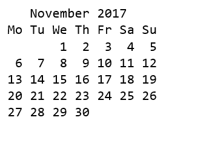
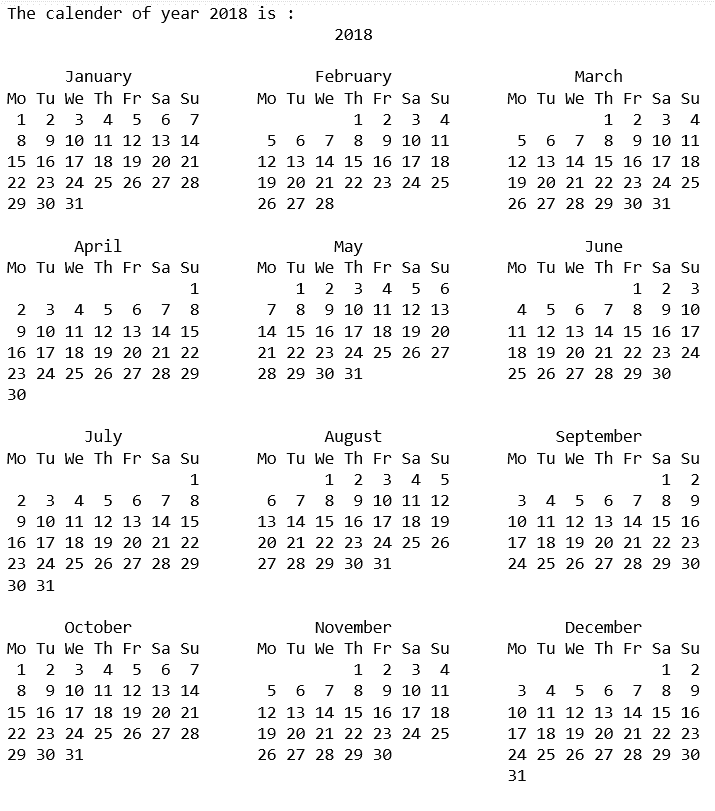

# Python |日历模块

> 原文:[https://www.geeksforgeeks.org/python-calendar-module/](https://www.geeksforgeeks.org/python-calendar-module/)

Python 定义了一个内置模块`calendar`，处理与日历相关的操作。
`calendar`模块允许像程序一样输出日历，并提供与日历相关的附加有用功能。`Calendar`模块中定义的函数和类使用理想化的日历，当前的公历在两个方向上无限延长。默认情况下，这些日历将周一作为一周的第一天，周日作为最后一天(欧洲惯例)。

## 示例#1: 显示给定月份的日历

### Python 3

```py
# Python program to display calendar of
# given month of the year

# import module
import calendar

yy = 2017
mm = 11

# display the calendar
print(calendar.month(yy, mm))
```

**输出:**



## 示例#2: 显示给定年份的日历

### Python 3

```py
# Python code to demonstrate the working of
# calendar() function to print calendar

# importing calendar module
# for calendar operations
import calendar

# using calendar to print calendar of year
# prints calendar of 2018
print ("The calendar of year 2018 is : ")
print (calendar.calendar(2018, 2, 1, 6))
```

**输出:**



## calendar.Calendar

`Calendar`类创建一个日历对象。日历对象提供了几种方法，可用于准备日历数据进行格式化。这个类本身不做任何格式化。这是子类的工作。`Calendar`类允许根据日期、月份和年份计算各种任务。`Calendar`类提供了以下方法:

| 功能 | 描述 |
| --- | --- |
| [`iterweekdays()`](https://www.geeksforgeeks.org/python-calendar-module-iterweekdays-method/) | 返回将在一周内使用的星期几的迭代器 |
| [`itermonthdates()`](https://www.geeksforgeeks.org/python-calendar-module-itermonthdates-method/) | 返回一年中月份(1-12)的迭代器 |
| [`itermonthdays()`](https://www.geeksforgeeks.org/python-calendar-module-itermonthdays-method/) | 返回指定月份和年份的迭代器 |
| [`itermonthdays2()`](https://www.geeksforgeeks.org/python-calendar-module-itermonthdays2-method/) | 方法用于获取一年中该月的迭代器，类似于`itermonthdates()`。返回的天数将是由月号中的一天和星期几组成的元组。 |
| `itermonthdays3()` | 返回一年中月份的迭代器，类似于`itermonthdates()`，但不受`datetime.date`范围的限制。返回的天数将是由年、月和月中的一天组成的元组。 |
| `itermonthdays4()` | 返回一年中月份的迭代器，类似于`itermonthdates()`，但不受`datetime.date`范围的限制。返回的天数将是由年、月、月中的一天和周中的一天组成的元组。 |
| [`monthdatescalendar()`](https://www.geeksforgeeks.org/python-calendar-module-monthdatescalendar-method/) | 用于将一年中某个月的周列表作为完整周 |
| [`monthdays2calendar()`](https://www.geeksforgeeks.org/python-calendar-module-monthdays2calendar-method/) | 用于将一年中某个月的周列表作为完整周 |
| [`monthdayscalendar()`](https://www.geeksforgeeks.org/python-calendar-module-monthdayscalendar-method/) | 用于将一年中某个月的周列表作为完整周 |
| [`yeardatescalendar()`](https://www.geeksforgeeks.org/python-calendar-module-yeardatescalendar-method/) | 用于将一年中某个月的周列表作为完整周 |
| [`yeardays2calendar()`](https://www.geeksforgeeks.org/python-calendar-module-yeardays2calendar-method/) | 用于获取指定年份的数据。周列表中的条目是天数和工作日数的元组 |
| [`yeardayscalendar()`](https://www.geeksforgeeks.org/python-calendar-module-yeardayscalendar-method/) | 用于获取指定年份的数据。周列表中的条目是日数 |

## calendar.TextCalendar

`TextCalendar`类可以用来生成纯文本日历。Python 中的`TextCalendar`类允许您编辑日历，并根据您的要求使用它。

| 功能 | 描述 |
| --- | --- |
| `formatmonth()` | 方法用于获取多行字符串中的月份日历 |
| [`prmonth()`](https://www.geeksforgeeks.org/python-calendar-module-prmonth-method/) | 方法用于打印由`formatmonth()`返回的月份日历 |
| [`formatyear()`](https://www.geeksforgeeks.org/python-calendar-module-formatyear-method/) | 方法用于以多行字符串的形式获取整年的 m 列日历 |
| [`pryear()`](https://www.geeksforgeeks.org/python-calendar-module-pryear-method/) | 方法用于打印`formatmonth()`返回的全年日历 |

## calendar.HTMLCalendar

`HTMLCalendar`类可以用来生成 HTML 日历。Python 中的`HTMLCalendar`类允许您编辑日历，并按照您的要求使用。

| 功能 | 描述 |
| --- | --- |
| `formatmonth()` | 方法用于获取作为 HTML 表的月份日历 |
| [`formatyear()`](https://www.geeksforgeeks.org/python-calendar-module-htmlcalendar-formatyear-method/) | 方法用于获取作为 HTML 表的日历。 |
| [`formatyearpage()`](https://www.geeksforgeeks.org/python-calendar-module-htmlcalendar-formatyearpage-method/) | 方法用于获取完整的网页形式的日历 |

## 简单文本日历类

对于简单文本日历`calendar`模块提供了以下功能:

| 功能 | 描述 |
| --- | --- |
| [`setfirstweekday()`](https://www.geeksforgeeks.org/python-calendar-module-setfirstweekday-method/) | 函数设置一周的开始天数 |
| [`firstweekday()`](https://www.geeksforgeeks.org/python-calendar-module-firstweekday-method/) | 函数返回第一个星期几。默认为 0(星期一) |
| [`isleap()`](https://www.geeksforgeeks.org/python-calendar-module-isleap-method/) | 函数检查参数中提到的年份是否是闰年 |
| [`leapdays()`](https://www.geeksforgeeks.org/python-calendar-module-leapdays-method/) | 函数返回参数中指定年份之间的闰日数 |
| `weekday()` | 函数返回参数中指定日期的星期几(0 是星期一) |
| `weekheader()` | 返回包含缩写工作日名称的标题 |
| `monthrange()` | 函数返回两个整数，第一，一周的起始天数(0 表示星期一)，第二，一个月中的天数 |
| `monthcalendar()` | 返回表示月份日历的矩阵。每行代表一周；月外的日子用零表示 |
| `prmonth()` | 函数也打印特定年份的月份，但不需要“打印”操作来执行 |
| `month()` | 函数打印参数中提到的特定年份的月份 |
| `prcal()` | 函数还打印特定年份的日历，但不需要“打印”操作来执行 |
| `calendar()` | 函数显示年份、字符宽度、每周行数和分栏数。 |