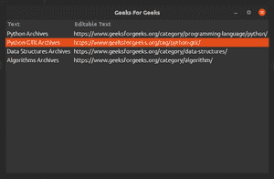

# Python – CellRendererText in GTK+ 3

> 哎哎哎:# t0]https://www . geeksforgeeks . org/python-cellrenderer text-in-GTK-3/

`Gtk.CellRendererText` 小部件用于显示小部件中的信息，例如 `Gtk.TreeView` 或 `Gtk.ComboBox`。以下是七款 `Gtk.CellRenderer` 用于不同目的的小部件。

*   `Gtk.CellRendererText`
*   `Gtk.CellRendererPixbuf`
*   `Gtk.CellRendererCombo`
*   `Gtk.CellRendererProgress`
*   `Gtk.CellRendererSpinner`
*   `Gtk.CellRendererToggle`
*   `Gtk.CellRendererAccel`

在本教程中，我们将讨论 `Gtk.CellRendererText`。一个 `Gtk.CellRendererText` 使用其属性提供的字体、颜色和样式信息，在其单元格中呈现给定的文本。

`Gtk.CellRendererText` 小部件中的文本可以通过以下方式进行编辑：

```py
cell.set_property("editable", True)
```

## Python 3 示例

```py
from gi.repository import Gtk
import gi

gi.require_version("Gtk", "3.0")

class CellRendererTextWindow(Gtk.Window):
    def __init__(self):
        Gtk.Window.__init__(self, title="Geeks For Geeks")

        self.set_default_size(400, 400)

        self.liststore = Gtk.ListStore(str, str)
        self.liststore.append(
            ["Python Archives", "https://www.geeksforgeeks.org/category/programming-language/python/"])
        self.liststore.append(
            ["Python-GTK Archives", "https://www.geeksforgeeks.org/tag/python-gtk/"])
        self.liststore.append(
            ["Data Structures Archives", "https://www.geeksforgeeks.org/category/data-structures/"])
        self.liststore.append(
            ["Algorithms Archives", "https://www.geeksforgeeks.org/category/algorithm/"])

        treeview = Gtk.TreeView(model=self.liststore)

        renderer_text = Gtk.CellRendererText()
        column_text = Gtk.TreeViewColumn("Text", renderer_text, text=0)
        treeview.append_column(column_text)

        renderer_editabletext = Gtk.CellRendererText()
        renderer_editabletext.set_property("editable", True)

        column_editabletext = Gtk.TreeViewColumn(
            "Editable Text", renderer_editabletext, text=1)

        treeview.append_column(column_editabletext)

        renderer_editabletext.connect("edited", self.text_edited)

        self.add(treeview)

    def text_edited(self, widget, path, text):
        self.liststore[path][1] = text

win = CellRendererTextWindow()
win.connect("destroy", Gtk.main_quit)
win.show_all()
Gtk.main()
```

**输出:**



CellRendererText 示例