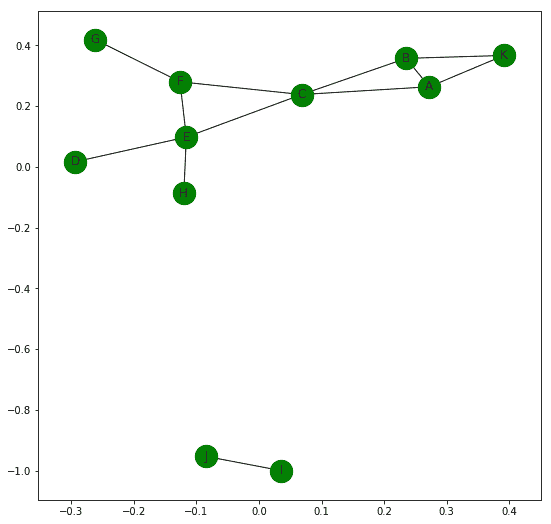
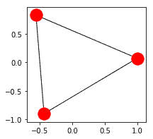
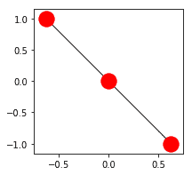
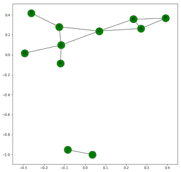
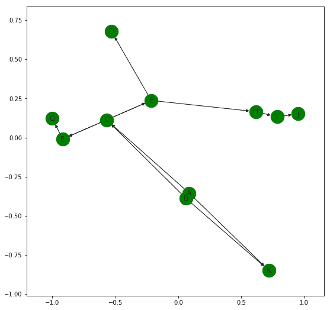
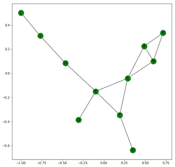

# Python | 使用 NetworkX 的聚类、连接和其他图形属性

> 原文: [https://www.geeksforgeeks.org/python-clustering-connectivity-and-other-graph-properties-using-networkx/](https://www.geeksforgeeks.org/python-clustering-connectivity-and-other-graph-properties-using-networkx/)

**图的三元闭包**是具有公共邻居的节点之间有边的趋势。如果在图形中添加了更多的边，这些边往往会形成。例如，在下图中:



接下来最有可能形成的边是`(B, F)`，`(C, D)`，`(F, H)`和`(D, H)`，因为这些对共享一个公共邻居。

**图中一个节点的局部聚类系数**是该节点相邻节点对的分数。例如，上图的节点`C`有四个相邻的节点，`A`、`B`、`E`和`F`。

> 使用这4个节点可以形成的可能对的数量是`4*(4-1)/2 = 6`。
> 彼此相邻的实际配对数量= `2`。这些是`(A, B)`和`(E, F)`。
> 因此给定图中节点`C`的局部聚类系数= `2/6 = 0.667`

NetworkX 帮助我们轻松获得聚类值。

```python
import networkx as nx

G = nx.Graph()

G.add_edges_from([('A', 'B'), ('A', 'K'), ('B', 'K'), ('A', 'C'),
                  ('B', 'C'), ('C', 'F'), ('F', 'G'), ('C', 'E'),
                  ('E', 'F'), ('E', 'D'), ('E', 'H'), ('I', 'J')])

# returns a Dictionary with clustering value of each node
print(nx.clustering(G))

# This returns clustering value of specified node
print(nx.clustering(G, 'C'))
```

```python
Output:
{'A': 0.6666666666666666,
 'B': 0.6666666666666666,
 'C': 0.3333333333333333,
 'D': 0,
 'E': 0.16666666666666666,
 'F': 0.3333333333333333,
 'G': 0,
 'H': 0,
 'I': 0,
 'J': 0,
 'K': 1.0}
0.3333333333333333
```

## 如何得到整个图的聚类值？

有两种不同的方法可以找到答案:

1.  我们可以对所有单个节点的局部聚类系数进行平均，即所有节点的局部聚类系数之和除以节点总数。`nx.average_clustering(G)`是找出答案的代码。在上面给出的图表中，这返回了一个值`0.287878787878785`。
2.  我们可以测量图的传递性。

> 图的传递性= `3 * 图中三角形的数量 / 图中连通三元组的数量`。

换句话说，它是封闭三元组数量与开放三元组数量之比的三倍。



这是一个封闭的三元组



这是一个开放的三元组。

`nx.transitivity(G)`是获取传递性的代码。在上面给出的图表中，它返回`0.4090909090909091`的值。

现在，我们知道上面给出的图是不连通的。NetworkX 提供了许多内置功能来检查图形的各种连接特性。它们在下面的代码中有更好的说明:

```python
import networkx as nx

G = nx.Graph()

G.add_edges_from([('A', 'B'), ('A', 'K'), ('B', 'K'), ('A', 'C'),
                  ('B', 'C'), ('C', 'F'), ('F', 'G'), ('C', 'E'),
                  ('E', 'F'), ('E', 'D'), ('E', 'H'), ('I', 'J')])

nx.draw_networkx(G, with_labels = True, node_color ='green')

# returns True or False whether Graph is connected
print(nx.is_connected(G))

# returns number of different connected components
print(nx.number_connected_components(G))

# returns list of nodes in different connected components
print(list(nx.connected_components(G)))

# returns list of nodes of component containing given node
print(nx.node_connected_component(G, 'I'))

# returns number of nodes to be removed
# so that Graph becomes disconnected
print(nx.node_connectivity(G))

# returns number of edges to be removed
# so that Graph becomes disconnected
print(nx.edge_connectivity(G))
```

**输出:**



```python
False
2
[{'B', 'H', 'C', 'A', 'K', 'E', 'F', 'D', 'G'}, {'J', 'I'}]
{'J', 'I'}
1
1
```

### 有向图的连通性–

有向图是**强连通的**如果每对节点`u`和`v`都有一条从`u`到`v`和`v`到`u`的有向路径。则是**弱连通的**如果用无向边替换有向图的所有边将产生一个无向连通图。它们可以通过以下代码进行检查:

```python
nx.is_strongly_connected(G)
nx.is_weakly_connected(G)
```



给定的有向图是弱连通的，不是强连通的。

NetworkX 使我们能够在图形中轻松找到节点之间的路径。让我们仔细检查下面的图表:

```python
import networkx as nx
import matplotlib.pyplot as plt

G = nx.Graph()
G.add_edges_from([('A', 'B'), ('A', 'K'), ('B', 'K'), ('A', 'C'),
                  ('B', 'C'), ('C', 'F'), ('F', 'G'), ('C', 'E'),
                  ('E', 'F'), ('E', 'D'), ('E', 'H'), ('H', 'I'), ('I', 'J')])

plt.figure(figsize =(9, 9))
nx.draw_networkx(G, with_labels = True, node_color ='green')

print(nx.shortest_path(G, 'A'))
# returns dictionary of shortest paths from A to all other nodes

print(nx.shortest_path_length(G, 'A'))
# returns dictionary of shortest path length from A to all other nodes

print(nx.shortest_path(G, 'A', 'G'))
# returns a shortest path from node A to G

print(nx.shortest_path_length(G, 'A', 'G'))
# returns length of shortest path from node A to G

print(list(nx.all_simple_paths(G, 'A', 'J')))
# returns list of all paths from node A to J

print(nx.average_shortest_path_length(G))
# returns average of shortest paths between all possible pairs of nodes
```

**输出:**



> {'A': ['A'], 'B': ['A', 'B'], 'C': ['A', 'C'], 'D': ['A', 'C', 'E', 'D'], 'E': ['A', 'C', 'E'], 'F': ['A', 'C', 'F'], 'G': ['A', 'C', 'F', 'G'], 'H': ['A', 'C', 'E', 'H'], 'I': ['A', 'C', 'E', 'H', 'I'], 'J': ['A', 'C', 'E', 'H', 'I', 'J'], 'K': ['A', 'K']}
> {'A': 0, 'B': 1, 'C': 1, 'D': 3, 'E': 2, 'F': 2, 'G': 3, 'H': 3, 'I': 4, 'J': 5, 'K': 1}
> ['A', 'C', 'F', 'G']
> 3
> [['A', 'C', 'E', 'H', 'I', 'J'], ['A', 'K', 'B', 'C', 'E', 'H', 'I', 'J'], ['A', 'B', 'C', 'E', 'H', 'I', 'J'], ['A', 'C', 'F', 'E', 'H', 'I', 'J']]
> 2.2545454545454544

## 图表的几个重要特征–

*   **偏心率:** 对于图`G`中的一个节点`n`，`n`的偏心率是`n`与所有其他节点之间最大可能的最短路径距离。
*   **直径:** 图`G`中一对节点之间的最大最短距离就是它的直径。它是节点最大可能的偏心值。
*   **半径:** 是节点的最小偏心值。
*   **外围:** 是偏心率等于直径的节点集。
*   **中心:** 图的中心是偏心率等于图的半径的一组节点。

NetworkX 提供了计算所有这些属性的内置功能。

```python
import networkx as nx
import matplotlib.pyplot as plt

G = nx.Graph()
G.add_edges_from([('A', 'B'), ('A', 'K'), ('B', 'K'), ('A', 'C'),
                  ('B', 'C'), ('C', 'F'), ('F', 'G'), ('C', 'E'),
                  ('E', 'F'), ('E', 'D'), ('E', 'H'), ('H', 'I'), ('I', 'J')])

plt.figure(figsize =(9, 9))
nx.draw_networkx(G, with_labels = True, node_color ='green')

print("Eccentricity: ", nx.eccentricity(G))
print("Diameter: ", nx.diameter(G))
print("Radius: ", nx.radius(G))
print("Preiphery: ", list(nx.periphery(G)))
print("Center: ", list(nx.center(G)))
```

**输出:**


> 偏心率: {'A': 5, 'K': 6, 'B': 5, 'H': 4, 'J': 6, 'E': 3, 'C': 4, 'I': 5, 'F': 4, 'D': 4, 'G': 5}
> 直径: 6
> 半径: 3
> 外围: ['K', 'J']
> 中心: ['E']

**参考:** [https://networkx.github.io/documentation](https://networkx.github.io/documentation/stable/index.html)。