# Python GUI – Tkinter

> 哎哎哎:# t0]https://www . geeksforgeeks . org/python-GUI-tkinter/

Python 为开发图形用户界面提供了多个选项。在所有的 GUI 方法中，`tkinter` 是最常用的方法。它是 Python 附带的 Tk 图形用户界面工具包的标准 Python 接口。Python 和 `tkinter` 是创建图形用户界面应用程序最快最简单的方法。使用 `tkinter` 创建图形用户界面是一项简单的任务。

## 创建 tkinter 应用程序

1.  导入模块–`tkinter`
2.  创建主窗口(容器)
3.  向主窗口添加任意数量的小部件
4.  在小部件上应用事件触发器。

导入 `tkinter` 与导入 Python 代码中的任何其他模块相同。请注意，Python 2.x 中的模块名称是 `tkinter`，Python 3.x 中的模块名称是 `Tkinter`。

```python
import tkinter
```

在使用图形用户界面创建 Python 应用程序时，用户需要记住两种主要方法。

1.  `Tk(screenName=None, baseName=None, className='Tk', useTk=1)`: 为了创建主窗口，`tkinter` 提供了一个方法 `Tk(screenName=None, baseName=None, className='Tk', useTk=1)`。要更改窗口的名称，可以将类名更改为所需的名称。用于创建应用程序主窗口的基本代码是:

    ```python
    m = tkinter.Tk()  # where m is the name of the main window object
    ```

2.  `mainloop()`: 当您的应用程序准备运行时，会使用一个名为 `mainloop()` 的方法。`mainloop()` 是一个无限循环，用于运行应用程序，等待事件发生，并在窗口未关闭时处理事件。

    ```python
    m.mainloop()
    ```

    ```python
    import tkinter
    m = tkinter.Tk()
    '''
    widgets are added here
    '''
    m.mainloop()
    ```

`tkinter` 还提供了对小部件几何配置的访问，可以在父窗口中组织小部件。几何管理器类主要有三类。

1.  `pack()` 方法: 它将小部件组织成块，然后放入父小部件中。
2.  `grid()` 方法: 它将小部件组织成网格(类似表格的结构)，然后放入父小部件中。
3.  `place()` 方法: 它通过将小部件放置在程序员指导的特定位置来组织它们。

## 小部件

有许多小部件可以放在 `tkinter` 应用程序中。下面解释了一些主要的小部件:

1.  **Button**: 要在应用程序中添加按钮，使用此小部件。
    一般语法是:

    ```python
    w = Button(master, option=value)
    ```

    `master` 是用于表示父窗口的参数。
    有许多选项用于改变按钮的格式。选项的数量可以作为参数传递，用逗号分隔。下面列出了其中的一些。

    *   `activebackground`: 设置按钮在光标下时的背景颜色。
    *   `activeforeground`: 设置按钮在光标下时的前景色。
    *   `bg`: 设置正常背景色。
    *   `command`: 调用函数。
    *   `font`: 设置按钮标签上的字体。
    *   `image`: 设置按钮上的图像。
    *   `width`: 设置按钮的宽度。
    *   `height`: 设置按钮的高度。

    ```python
    import tkinter as tk
    r = tk.Tk()
    r.title('Counting Seconds')
    button = tk.Button(r, text='Stop', width=25, command=r.destroy)
    button.pack()
    r.mainloop()
    ```

    输出:
    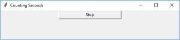

2.  **Canvas**: 它用于绘制图片和其他复杂的布局，如图形、文本和小部件。
    一般语法是:

    ```python
    w = Canvas(master, option=value)
    # master is the parameter used to represent the parent window.
    ```

    有许多选项可用于更改小部件的格式。选项的数量可以作为参数传递，用逗号分隔。下面列出了其中的一些。

    *   `bd`: 以像素为单位设置边框宽度。
    *   `bg`: 设置正常背景颜色。
    *   `cursor`: 设置画布中使用的光标。
    *   `highlightcolor`: 设置焦点高亮显示的颜色。
    *   `width`: 设置小部件的宽度。
    *   `height`: 设置小部件的高度。

    ```python
    from tkinter import *
    master = Tk()
    w = Canvas(master, width=40, height=60)
    w.pack()
    canvas_height = 20
    canvas_width = 200
    y = int(canvas_height / 2)
    w.create_line(0, y, canvas_width, y)
    mainloop()
    ```

    输出:
    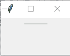

3.  **CheckButton**: 通过向用户显示多个切换按钮来选择任意数量的选项。一般语法是:

    ```python
    w = CheckButton(master, option=value)
    ```

    有许多选项可用于更改此小部件的格式。选项的数量可以作为参数传递，用逗号分隔。下面列出了其中的一些。

    *   `text`: 设置小部件的标题。
    *   `activebackground`: 设置小部件在光标下时的背景颜色。
    *   `activeforeground`: 设置微件在光标下时的前景色。
    *   `bg`: 设置正常背景颜色。
    *   `command`: 调用函数。
    *   `font`: 设置按钮标签上的字体。
    *   `image`: 设置小部件上的图像。

    ```python
    from tkinter import *
    master = Tk()
    var1 = IntVar()
    Checkbutton(master, text='male', variable=var1).grid(row=0, sticky=W)
    var2 = IntVar()
    Checkbutton(master, text='female', variable=var2).grid(row=1, sticky=W)
    mainloop()
    ```

    输出:
    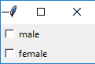

4.  **Entry**: 它用于从用户输入单行文本条目。对于多行文本输入，使用 `Text` 小部件。
    一般语法是:

    ```python
    w = Entry(master, option=value)
    ```

    `master` 是用于表示父窗口的参数。
    有许多选项用于更改小部件的格式。选项的数量可以作为参数传递，用逗号分隔。下面列出了其中的一些。

    *   `bd`: 以像素为单位设置边框宽度。
    *   `bg`: 设置正常背景颜色。
    *   `cursor`: 设置使用的光标。
    *   `command`: 调用函数。
    *   `highlightcolor`: 设置焦点高亮显示的颜色。
    *   `width`: 设置按钮的宽度。
    *   `height`: 设置按钮的高度。

    ```python
    from tkinter import *
    master = Tk()
    Label(master, text='First Name').grid(row=0)
    Label(master, text='Last Name').grid(row=1)
    e1 = Entry(master)
    e2 = Entry(master)
    e1.grid(row=0, column=1)
    e2.grid(row=1, column=1)
    mainloop()
    ```

    输出:
    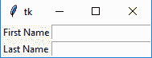

5.  **Frame**: 它充当容器来容纳小部件。它用于对小部件进行分组和组织。一般语法是:

    ```python
    w = Frame(master, option=value)
    # master is the parameter used to represent the parent window.
    ```

    有许多选项可用于更改小部件的格式。选项的数量可以作为参数传递，用逗号分隔。下面列出了其中的一些。

    *   `highlightcolor`: 设置小部件需要对焦时的对焦高亮颜色。
    *   `bd`: 以像素为单位设置边框宽度。
    *   `bg`: 设置正常背景颜色。
    *   `cursor`: 设置使用的光标。
    *   `width`: 设置小部件的宽度。
    *   `height`: 设置小部件的高度。

    ```python
    from tkinter import *
    root = Tk()
    frame = Frame(root)
    frame.pack()
    bottomframe = Frame(root)
    bottomframe.pack(side=BOTTOM)
    redbutton = Button(frame, text='Red', fg='red')
    redbutton.pack(side=LEFT)
    greenbutton = Button(frame, text='Brown', fg='brown')
    greenbutton.pack(side=LEFT)
    bluebutton = Button(frame, text='Blue', fg='blue')
    bluebutton.pack(side=LEFT)
    blackbutton = Button(bottomframe, text='Black', fg='black')
    blackbutton.pack(side=BOTTOM)
    root.mainloop()
    ```

    输出:
    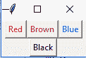

6.  **Label**: 它指的是显示框，您可以在其中放置任何文本或图像，这些内容可以根据代码随时更新。
    一般语法是:

    ```python
    w = Label(master, option=value)
    # master is the parameter used to represent the parent window.
    ```

    有许多选项可用于更改小部件的格式。选项的数量可以作为参数传递，用逗号分隔。下面列出了其中的一些。

    *   `bg`: 设置正常背景色。
    *   `command`: 调用函数。
    *   `font`: 设置按钮标签上的字体。
    *   `image`: 设置按钮上的图像。
    *   `width`: 设置按钮的宽度。
    *   `height`: 设置按钮的高度。

    ```python
    from tkinter import *
    root = Tk()
    w = Label(root, text='GeeksForGeeks.org!')
    w.pack()
    root.mainloop()
    ```

    输出:
    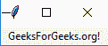

7.  **Listbox**: 它向用户提供一个列表，用户可以从中接受任意数量的选项。
    一般语法是:

    ```python
    w = Listbox(master, option=value)
    # master is the parameter used to represent the parent window.
    ```

    有许多选项可用于更改小部件的格式。选项的数量可以作为参数传递，用逗号分隔。下面列出了其中的一些。

    *   `highlightcolor`: 设置小部件需要对焦时的对焦高亮颜色。
    *   `bg`: 设置正常背景色。
    *   `bd`: 以像素为单位设置边框宽度。
    *   `font`: 设置按钮标签上的字体。
    *   `image`: 设置小部件上的图像。
    *   `width`: 设置小部件的宽度。
    *   `height`: 设置小部件的高度。

    ```python
    from tkinter import *
    top = Tk()
    Lb = Listbox(top)
    Lb.insert(1, 'Python')
    Lb.insert(2, 'Java')
    Lb.insert(3, 'C++')
    Lb.insert(4, 'Any other')
    Lb.pack()
    top.mainloop()
    ```

    输出:
    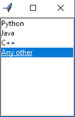

8.  **MenuButton**: 它是始终停留在窗口上的下拉菜单的一部分。每个菜单按钮都有自己的功能。一般语法是:

    ```python
    w = MenuButton(master, option=value)
    # master is the parameter used to represent the parent window.
    ```

    有许多选项可用于更改小部件的格式。选项的数量可以作为参数传递，用逗号分隔。下面列出了其中的一些。

    *   `activebackground`: 设置鼠标在小部件上时的背景。
    *   `activeforeground`: 设置鼠标在小部件上时的前台。
    *   `bg`: 设置正常背景色。
    *   `bd`: 设置指示器周围边框的大小。
    *   `cursor`: 鼠标悬停在菜单按钮上时出现光标。
    *   `image`: 设置小部件上的图像。
    *   `width`: 设置小部件的宽度。
    *   `height`: 设置小部件的高度。
    *   `highlightcolor`: 设置小部件需要对焦时的对焦高亮颜色。

    ```python
    from tkinter import *
    top = Tk()
    mb = Menubutton(top, text="GfG")
    mb.grid()
    mb.menu = Menu(mb, tearoff=0)
    mb["menu"] = mb.menu
    cVar = IntVar()
    aVar = IntVar()
    mb.menu.add_checkbutton(label='Contact', variable=cVar)
    mb.menu.add_checkbutton(label='About', variable=aVar)
    mb.pack()
    top.mainloop()
    ```

    输出:
    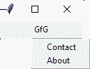

9.  **Menu**: 用于创建应用使用的各种菜单。
    一般句法是:

# Tkinter 小部件参考

```py
w = Menu(master, option=value)
master is the parameter used to represent the parent window.
```

有许多选项可用于更改此小部件的格式。选项的数量可以作为参数传递，用逗号分隔。下面列出了其中的一些。

*   **标题**:设置小部件的标题。
*   **活动背景**:设置小部件在光标下时的背景颜色。
*   **活动前景**:设置微件在光标下时的前景色。
*   `bg` :设置正常背景色。
*   **命令**:调用函数。
*   **字体**:设置按钮标签上的字体。
*   **图像**:设置小部件上的图像。

```py
from tkinter import *

root = Tk()
menu = Menu(root)
root.config(menu=menu)
filemenu = Menu(menu)
menu.add_cascade(label='File', menu=filemenu)
filemenu.add_command(label='New')
filemenu.add_command(label='Open...')
filemenu.add_separator()
filemenu.add_command(label='Exit', command=root.quit)
helpmenu = Menu(menu)
menu.add_cascade(label='Help', menu=helpmenu)
helpmenu.add_command(label='About')
mainloop()
```

输出:
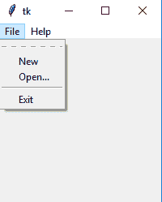

## Message

**Message** 指的是多行且不可编辑的文本。其功能与 `Label` 相同。
通用语法是：

```py
w = Message(master, option=value)
master is the parameter used to represent the parent window.
```

有许多选项可用于更改小部件的格式。选项的数量可以作为参数传递，用逗号分隔。下面列出了其中的一些。

*   `bd` :设置指示器周围的边框。
*   `bg` :设置正常背景色。
*   **字体**:设置按钮标签上的字体。
*   **图像**:设置小部件上的图像。
*   **宽度**:设置小部件的宽度。
*   **高度**:设置小部件的高度。

```py
from tkinter import *
main = Tk()
ourMessage ='This is our Message'
messageVar = Message(main, text = ourMessage)
messageVar.config(bg='lightgreen')
messageVar.pack( )
main.mainloop( )
```

输出:
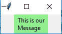

## RadioButton

**RadioButton** 用于向用户提供多选选项。它提供了多个选项，用户必须选择其中一个。
通用语法是：

```py
w = RadioButton(master, option=value)
```

有许多选项可用于更改此小部件的格式。选项的数量可以作为参数传递，用逗号分隔。下面列出了其中的一些。

*   **活动背景**:设置小部件在光标下时的背景颜色。
*   **活动前景**:设置微件在光标下时的前景色。
*   `bg` :设置正常背景色。
*   **命令**:调用函数。
*   **字体**:设置按钮标签上的字体。
*   **图像**:设置小部件上的图像。
*   **宽度**:以字符为单位设置标签的宽度。
*   **高度**:以字符为单位设置标签的高度。

```py
from tkinter import *
root = Tk()
v = IntVar()
Radiobutton(root, text='GfG', variable=v, value=1).pack(anchor=W)
Radiobutton(root, text='MIT', variable=v, value=2).pack(anchor=W)
mainloop()
```

输出:
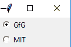

## Scale

**Scale** 用于提供一个图形滑块，允许从该刻度中选择任何值。通用语法是：

```py
w = Scale(master, option=value)
master is the parameter used to represent the parent window.
```

有许多选项可用于更改小部件的格式。选项的数量可以作为参数传递，用逗号分隔。下面列出了其中的一些。

*   **光标**:当鼠标在小部件上时，改变光标模式。
*   **活动背景**:设置鼠标在小部件上时小部件的背景。
*   `bg` :设置正常背景色。
*   **定向**:根据需要设置为水平或垂直。
*   **从 _** :设置刻度范围一端的值。
*   **至**:设置刻度范围另一端的值。
*   **图像**:设置小部件上的图像。
*   **宽度**:设置小部件的宽度。

```py
from tkinter import *
master = Tk()
w = Scale(master, from_=0, to=42)
w.pack()
w = Scale(master, from_=0, to=200, orient=HORIZONTAL)
w.pack()
mainloop()
```

输出:
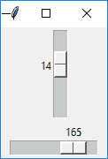

## Scrollbar

**Scrollbar** 指的是将用于实现列表小部件的滑动控制器。
通用语法是：

```py
w = Scrollbar(master, option=value)
master is the parameter used to represent the parent window.
```

有许多选项可用于更改小部件的格式。选项的数量可以作为参数传递，用逗号分隔。下面列出了其中的一些。

*   **宽度**:设置小部件的宽度。
*   **活动背景**:设置鼠标在小部件上时的背景。
*   `bg` :设置正常背景色。
*   `bd` :设置指示器周围边框的大小。
*   **光标**:鼠标悬停在菜单按钮上时出现光标。

```py
from tkinter import *
root = Tk()
scrollbar = Scrollbar(root)
scrollbar.pack( side = RIGHT, fill = Y )
mylist = Listbox(root, yscrollcommand = scrollbar.set )
for line in range(100):
   mylist.insert(END, 'This is line number' + str(line))
mylist.pack( side = LEFT, fill = BOTH )
scrollbar.config( command = mylist.yview )
mainloop()
```

输出:
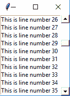

## Text

**Text** 用于编辑多行文本并设置其显示格式。
通用语法是：

```py
w  =Text(master, option=value)
```

有许多选项可用于更改文本格式。选项的数量可以作为参数传递，用逗号分隔。下面列出了其中的一些。

*   `highlightcolor` :设置小部件需要对焦时的对焦高亮颜色。
*   **插入背景**:设置小部件的背景。
*   `bg` :设置正常背景色。
*   **字体**:设置按钮标签上的字体。
*   **图像**:设置小部件上的图像。
*   **宽度**:设置小部件的宽度。
*   **高度**:设置小部件的高度。

```py
from tkinter import *
root = Tk()
T = Text(root, height=2, width=30)
T.pack()
T.insert(END, 'GeeksforGeeks\nBEST WEBSITE\n')
mainloop()
```

输出:
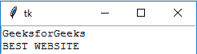

## TopLevel

此小部件由窗口管理器直接控制。它不需要任何父窗口即可工作。通用语法是：

```py
w = TopLevel(master, option=value)
```

有许多选项可用于更改小部件的格式。选项的数量可以作为参数传递，用逗号分隔。下面列出了其中的一些。

*   `bg` :设置正常背景色。
*   `bd` :设置指示器周围边框的大小。
*   **光标**:鼠标悬停在菜单按钮上时出现光标。
*   **宽度**:设置小部件的宽度。
*   **高度**:设置小部件的高度。

```py
from tkinter import *
root = Tk()
root.title('GfG')
top = Toplevel()
top.title('Python')
top.mainloop()
```

输出:
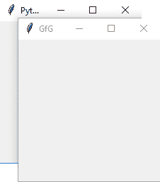

## SpinBox

它是 `Entry` 小部件的一种。在这里，可以通过选择数字的固定值来输入值。通用语法是：

```py
w = SpinBox(master, option=value)
```

有许多选项可用于更改小部件的格式。选项的数量可以作为参数传递，用逗号分隔。下面列出了其中的一些。

*   `bg` :设置正常背景色。
*   `bd` :设置指示器周围边框的大小。
*   **光标**:鼠标悬停在菜单按钮上时出现光标。
*   **命令**:调用函数。
*   **宽度**:设置小部件的宽度。
*   **活动背景**:设置鼠标在小部件上时的背景。
*   **禁用背景**:当鼠标在小部件上时禁用背景。
*   `from_` :设置范围一端的值。
*   **至**:设置范围另一端的值。

```py
from tkinter import *
master = Tk()
w = Spinbox(master, from_ = 0, to = 10)
w.pack()
mainloop()
```

输出:
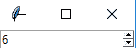

## PannedWindow

它是一个容器小部件，用于处理排列在其中的多个窗格。通用语法是：

```py
w = PannedWindow(master, option=value)
```

`master` 是用于表示父窗口的参数。
有许多选项用于更改小部件的格式。选项的数量可以作为参数传递，用逗号分隔。下面列出了其中的一些。

*   `bg` :设置正常背景色。
*   `bd` :设置指示器周围边框的大小。
*   **光标**:鼠标悬停在菜单按钮上时出现光标。
*   **宽度**:设置小部件的宽度。
*   **高度**:设置小部件的高度。

```py
from tkinter import *
m1 = PanedWindow()
m1.pack(fill = BOTH, expand = 1)
left = Entry(m1, bd = 5)
m1.add(left)
m2 = PanedWindow(m1, orient = VERTICAL)
m1.add(m2)
top = Scale( m2, orient = HORIZONTAL)
m2.add(top)
mainloop()
```

输出:
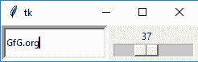

本文由 **[里沙布·班萨尔](https://www.linkedin.com/in/rishabh-bansal-9b4b71108/)** 供稿。如果你喜欢 GeeksforGeeks 并想投稿，你也可以使用[contribute.geeksforgeeks.org](http://www.contribute.geeksforgeeks.org)写一篇文章或者把你的文章邮寄到 contribute@geeksforgeeks.org。看到你的文章出现在极客博客主页上，帮助其他极客。

如果你发现任何不正确的地方，或者你想分享更多关于上面讨论的话题的信息，请写评论。