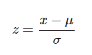

# Python | 如何以及在哪里应用特征缩放？

> 原文: [https://www.geeksforgeeks.org/python-how-and-where-to-apply-feature-scaling/](https://www.geeksforgeeks.org/python-how-and-where-to-apply-feature-scaling/)

**特征缩放或标准化**：是数据预处理的一个步骤，应用于数据的自变量或特征。它基本上有助于在特定范围内规范化数据。有时，它也有助于加速算法中的计算。

**使用的包：**

```py
sklearn.preprocessing
```

**导入：**

```py
from sklearn.preprocessing import StandardScaler
```

**后端**
标准化中使用的公式将这些值替换为它们的 Z 分数。



大多数情况下，`fit`方法用于特征缩放。

```py
fit(X, y=None)
Computes the mean and std to be used for later scaling.
```

## 代码示例

```py
import pandas as pd
from sklearn.preprocessing import StandardScaler

# Read Data from CSV
data = read_csv('Geeksforgeeks.csv')
data.head()

# Initialise the Scaler
scaler = StandardScaler()

# To scale data
scaler.fit(data)
```

## 为什么以及在哪里应用特征缩放？

真实数据集包含幅度、单位和范围差异很大的特征。当一个特征的尺度不相关或具有误导性时，应进行标准化，当尺度有意义时，不应进行标准化。

使用欧几里得距离度量的算法对量值敏感。这里，特征缩放有助于平等地权衡所有特征。

从形式上来说，如果数据集中的某个特征与其他要素相比规模较大，那么在测量欧几里得距离的算法中，这个规模较大的特征将占据主导地位，需要进行归一化。

**特征缩放很重要的算法示例**
1. `K-Means` 在这里使用欧几里得距离度量特征比例关系。
2. `K近邻` 也需要特征缩放。
3. `主成分分析`：试图得到方差最大的特征，这里也需要特征缩放。
4. `梯度下降`：特征缩放后，随着`θ`计算变快，计算速度增加。

**注意：** 朴素贝叶斯、线性判别分析和基于树的模型不受特征缩放的影响。
简而言之，任何基于**不是**距离的算法都是受到特征缩放影响的**不是**。