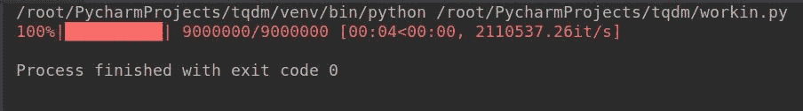
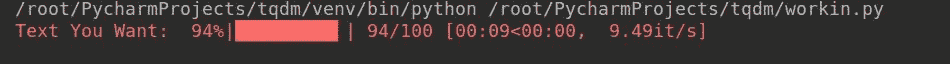
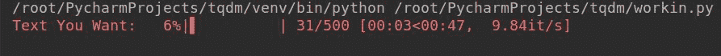
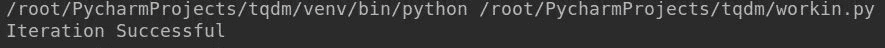
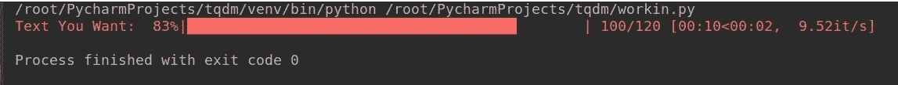
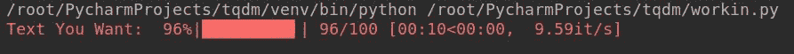
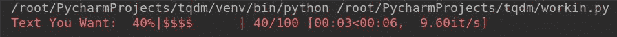
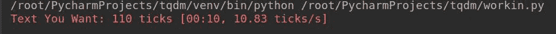
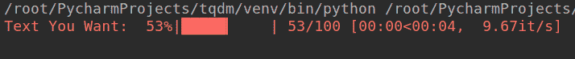

# Python | 如何使用 tqdm 制作终端进度条

> 原文: [https://www.geeksforgeeks.org/python-how-to-make-a-terminal-progress-bar-using-tqdm/](https://www.geeksforgeeks.org/python-how-to-make-a-terminal-progress-bar-using-tqdm/)

无论您是安装软件、加载页面还是进行事务处理，每当您看到小进度条让您估计完成或呈现该过程需要多长时间时，它总是会让您感到轻松。如果您的脚本或代码中有一个简单的进度条，它看起来非常赏心悦目，并且每当用户执行代码时都会给用户适当的反馈。您可以使用 Python 外部库 `tqdm`，创建简单的&无障碍进度条，您可以将其添加到代码中，使其看起来生动活泼！

## 装置

打开命令提示符或终端，键入:

```py
pip install tqdm
```

如果您正在使用 Python3，请键入:

```py
pip3 install tqdm
```

此命令将在您的计算机上成功安装库，现在可以使用了。

## 使用

使用 `tqdm` 很简单，只需要在代码中导入库后，在 `tqdm()` 之间添加代码即可。您需要确保放在 `tqdm()` 函数之间的代码必须是可迭代的，否则它根本无法工作。

让我们看看下面的例子，它将帮助您更好地理解:

**示例:**

```py
from tqdm import tqdm

for i in tqdm(range(int(9e6))):
    pass
```

**输出:**



现在我们知道如何实现 `tqdm`，让我们看看它提供的一些重要参数，以及如何使用它来调整进度条。

*   **`desc`**: 您可以使用此参数指定进度条的描述，如下所示:

**语法:**

```py
tqdm(self, iterable, desc="Text You want")
```

**示例:**

```py
from tqdm import tqdm
from time import sleep

for i in tqdm(range(0, 100), desc="Text You Want"):
    sleep(.1)
```

**输出:**



*   **`total`**: 如果未指定或需要修改，此参数用于指定预期的迭代总数。

**语法:**

```py
tqdm(self, iterable, total=500)
```

**示例:**

```py
from tqdm import tqdm
from time import sleep

for i in tqdm(range(0, 100), total=500,
              desc="Text You Want"):
    sleep(.1)
```

**输出:**



*   **`disable`**: 如果您想完全禁用进度条，可以使用此参数。

**语法:**

```py
tqdm(self, iterable, disable=True)
```

**示例:**

```py
from tqdm import tqdm
from time import sleep

for i in tqdm(range(0, 100), disable=True,
              desc="Text You Want"):
    sleep(.1)

print("Iteration Successful")
```

**输出:**



*   **`ncols`**: 此参数用于指定输出消息的整个宽度。如果未指定，它将保持动态以适应窗口大小。这可以通过 `ncols` 参数来固定。

**语法:**

```py
tqdm(self, iterable, ncols=100)
```

**示例:**

```py
from tqdm import tqdm
from time import sleep

for i in tqdm(range(0, 100), ncols=100,
              desc="Text You Want"):
    sleep(.1)
```

**输出:**



*   **`mininterval`**: 您可以使用此选项轻松更改最小进度显示更新间隔。默认值为 0.1 秒。

**语法:**

```py
tqdm(self, iterable, mininterval=3)
```

**示例:**

```py
from tqdm import tqdm
from time import sleep

for i in tqdm(range(0, 100), mininterval=3,
              desc="Text You Want"):
    sleep(.1)
```

**输出:**



*   **`ascii`**: 您可以使用 ASCII 字符根据自己的喜好填充进度条。

**语法:**

```py
tqdm(self, iterable, ascii="123456789{content}#- x201", desc="你想要的文字")
```

**示例:**

```py
from tqdm import tqdm
from time import sleep

for i in tqdm(range(0, 100),
              ascii="123456789{content}quot;):
    sleep(.1)
```

**输出:**



*   **`unit`**: 时间的默认单位是“it”，可以使用此参数更改为您的首选单位。

**语法:**

```py
tqdm(self, iterable, unit=" ticks")
```

**示例:**

```py
from tqdm import tqdm
from time import sleep

for i in tqdm(range(0, 100), unit=" ticks",
              desc="Text You Want"):
    sleep(.1)
```

**输出:**



*   **`initial`**: 进度条的初始值从 0 开始。如果您希望更改此值，可以使用此参数从您希望的值开始初始化进度条。

**语法:**

```py
tqdm(self, iterable, initial=50)
```

**示例:**

```py
from tqdm import tqdm
from time import sleep

for i in tqdm(range(0, 100), initial=50,
              desc="Text You Want"):
    sleep(.1)
```

**输出:**



计数器将从 50 开始，进度条将在到达最终计数器后消失。循环将继续运行，直到迭代完成。