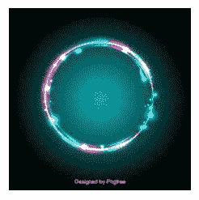
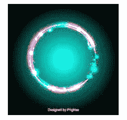

# Python ImageOps.autocontrast() 方法

> 原文链接: https://www.geeksforgeeks.org/python-imageops-self-contracting-method/

PIL 是 Python Imaging Library，它为 Python 解释器提供了图像编辑功能。`ImageOps` 模块包含许多“现成的”图像处理操作。该模块有些实验性，大多数操作符仅适用于 L 和 RGB 图像。`ImageOps.autocontrast()` 方法用于最大化（归一化）图像对比度。此函数计算输入图像的直方图，从直方图中移除最亮和最暗像素的截止百分比，然后重新映射图像，使最暗的像素变为黑色（0），最亮的像素变为白色（255）。

## 语法
`PIL.ImageOps.autocontrast(image, cutoff=0, ignore=None)`

## 参数
- `image`: 要处理的图像。
- `cutoff`: 从直方图中移除的百分比。
- `ignore`: 背景像素值（无背景时使用 `None`）。

## 返回值
一个图像对象。

所用图像:


```py
# Importing Image and ImageOps module from PIL package
from PIL import Image, ImageOps

# creating a image1 object
im1 = Image.open(r"C:\Users\sadow984\Desktop\download2.JPg")

# applying autocontrast method
im2 = ImageOps.autocontrast(im1, cutoff = 2, ignore = 2)

im2.show()
```

**输出:**


```py
# Importing Image and ImageOps module from PIL package
from PIL import Image, ImageOps

# creating a image1 object
im1 = Image.open(r"C:\Users\sadow984\Desktop\download2.JPg")

# applying autocontrast method
im2 = ImageOps.autocontrast(im1, cutoff = 5, ignore = 5)

im2.show()
```

**输出:**
