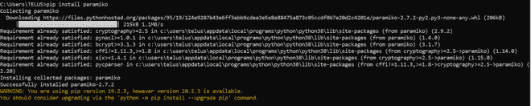
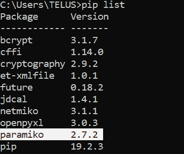
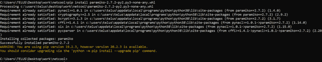
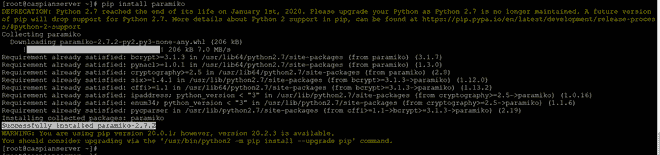

# Python–在 Windows 和 Linux 上安装 Paramiko

> 原文: [https://www.geeksforgeeks.org/python-install-paramiko-on-windows-and-linux/](https://www.geeksforgeeks.org/python-install-paramiko-on-windows-and-linux/)

高级 python API 从创建安全连接对象开始。拥有更直接的控制，并通过套接字传输来启动远程访问。作为客户端，它使用用户凭据或私钥进行身份验证，并检查服务器的主机密钥。

`Paramiko` 是一个 Python 库，通过 SSH 与远程设备进行连接。Paramiko 正在使用 SSH2 代替 SSL，在两台设备之间建立安全连接。它还支持 SFTP 客户端和服务器模型。

## 安装

### 在 Windows 上

使用 `cmd` 上的 `pip` 运行以下命令，在 Windows 上安装 `Paramiko`。

```py
pip install paramiko
```

**输出:**



要检查已安装的 `paramiko`，运行以下程序:

```py
pip list
```

**输出:**



使用 `pip` 安装 `paramiko`。从 `.whl` 文件安装。下载地址：`https://pypi.org/project/paramiko/#files`

```py
pip install paramiko-2.7.2-py2.py3-none-any.whl
```

**输出:**



### 在 Linux 上

Python `paramiko` 可以多种方式安装在 Linux 上，使用 `pip` 就是其中之一。

```py
pip install paramiko
```

**输出:**



检查已安装的 `paramiko`:

```py
pip list --format=json
```

**输出:**

