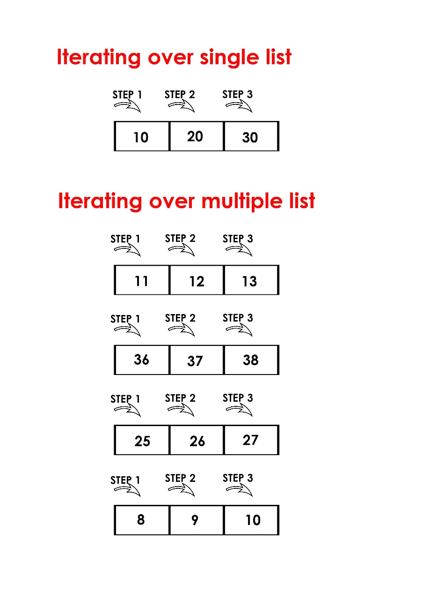

# Python | 同时迭代多个列表

> 原文: [https://www.geeksforgeeks.org/python-iterate-multiple-lists-simultaneously/](https://www.geeksforgeeks.org/python-iterate-multiple-lists-simultaneously/)

对单个列表进行迭代，是指在特定步骤对单个列表的单个元素进行迭代时使用 **[循环](https://www.geeksforgeeks.org/loops-in-python/)**，而在同时对多个列表进行迭代时，是指在特定步骤对多个列表的单个元素进行迭代时使用**循环**。



**一次迭代多个列表**

为了更好地理解多个列表的迭代，我们一次迭代 3 个列表。

*我们可以通过以下方式同时迭代列表:*

1.  **zip()**: 在 Python 3 中，`zip()` 返回一个迭代器。`zip()` 函数在任意一个列表耗尽时停止。简单来说，它运行到所有列表中最短的那个结束为止。

下面是 `zip()` 函数和 `itertools.izip()` 的实现，它遍历 3 个列表:

## Python 3

```py
# Python program to iterate
# over 3 lists using zip function

import itertools

num = [1, 2, 3]
color = ['red', 'while', 'black']
value = [255, 256]

# iterates over 3 lists and executes
# 2 times as len(value)= 2 which is the
# minimum among all the three
for (a, b, c) in zip(num, color, value):
    print (a, b, c)
```

**Output:**

```py
1 red 255
2 while 256
```

2.  **itertools.zip_longest()**: `zip_longest()` 在所有列表都耗尽时停止。当较短的迭代器耗尽时，`zip_longest()` 会生成一个包含 `None` 值的元组。

下面是迭代 3 个列表的 `itertools.zip_longest()` 的实现:

## Python 3

```py
# Python program to iterate
# over 3 lists using itertools.zip_longest

import itertools

num = [1, 2, 3]
color = ['red', 'while', 'black']
value = [255, 256]

# iterates over 3 lists and till all are exhausted
for (a, b, c) in itertools.zip_longest(num, color, value):
    print (a, b, c)
```

**Output:**

```py
1 red 255
2 while 256
3 black None
```

我们还可以在 `zip_longest()` 中指定一个默认值，而不是 `None`。

## Python 3

```py
# Python program to iterate
# over 3 lists using itertools.zip_longest

import itertools

num = [1, 2, 3]
color = ['red', 'while', 'black']
value = [255, 256]

# Specifying default value as -1
for (a, b, c) in itertools.zip_longest(num, color, value, fillvalue=-1):
    print (a, b, c)
```

**Output:**

```py
1 red 255
2 while 256
3 black -1
```

**注意:** Python 2.x 有两个额外的函数 `izip()` 和 `izip_longest()`。在 Python 2.x 中，`zip()` 和 `zip_longest()` 用于返回列表，`izip()` 和 `izip_longest()` 用于返回迭代器。在 Python 3.x 中，`izip()` 和 `izip_longest()` 不再存在，因为 `zip()` 和 `zip_longest()` 已经返回迭代器。