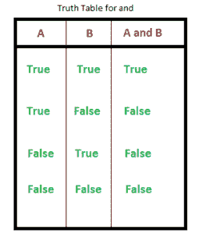
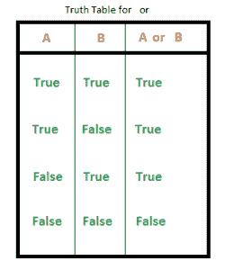

# Python 关键词

> 原文: [https://www.geeksforgeeks.org/python-keywords/](https://www.geeksforgeeks.org/python-keywords/)

**Python 关键词:** [简介](https://www.geeksforgeeks.org/check-string-valid-keyword-python/)

**Python 中的关键字**是保留字，不能用作变量名、函数名或任何其他标识符。

## Python 中所有关键字的列表

| and | as | [assert](https://www.geeksforgeeks.org/python-assert-keyword/) | [break](https://www.geeksforgeeks.org/python-break-statement/) |
| [class](https://www.geeksforgeeks.org/python-classes-and-objects/) | [continue](https://www.geeksforgeeks.org/python-continue-statement/) | def | del |
| elif | else | [except](https://www.geeksforgeeks.org/python-try-except/) | False |
| [finally](https://www.geeksforgeeks.org/finally-keyword-in-python/) | [for](https://www.geeksforgeeks.org/python-for-loops/) | from | [global](https://www.geeksforgeeks.org/global-keyword-in-python/) |
| if | [import](https://www.geeksforgeeks.org/import-module-python/) | in | is |
| [lambda](https://www.geeksforgeeks.org/python-lambda/) | None | nonlocal | not |
| or | [pass](https://www.geeksforgeeks.org/python-pass-statement/) | raise | [return](https://www.geeksforgeeks.org/python-return-statement/) |
| True | [try](https://www.geeksforgeeks.org/python-try-except/) | [while](https://www.geeksforgeeks.org/python-while-loop/) | [with](https://www.geeksforgeeks.org/with-statement-in-python/) |
| [yield](https://www.geeksforgeeks.org/python-yield-keyword/) | | | |

我们还可以使用下面的代码获得所有的关键字名称。

### 示例: Python 关键字列表

```py
# Python code to demonstrate working of iskeyword()

# importing "keyword" for keyword operations
import keyword

# printing all keywords at once using "kwlist()"
print("The list of keywords is : ")
print(keyword.kwlist)
```

**输出:**

> 关键词列表为:
> ['False'，'None'，'True'，'and'，'as'，'assert'，'async'，'await'，'break'，'class'，'continue'，'def'，'del'，'elif'，'else'，'except'，'finally'，'for'，'from'，'global'，'if'，'import'，'in'，'is'，'lambda'，'nonlocal'，'not'，'or'，'pass'，'raise'，'return'，'True'，'try'，'while'，'with'，'yield']

让我们借助好的例子详细讨论每个关键词。

## True、False、None

*   `True`: 这个关键字用来表示布尔 True。如果陈述为真，则打印“真”。
*   `False`: 这个关键字用来表示一个布尔 False。如果声明为假，则打印“假”。
*   `None`: 这是一个特殊的常数，用来表示空值或空值。重要的是要记住，0，任何空容器(例如空列表)都不会计算为 `None`。
    它是其数据类型的对象——非类型。不可能创建多个 `None` 对象，并且可以将它们分配给变量。

### 示例: True、False 和 None 关键字

```py
print(False == 0)
print(True == 1)

print(True + True + True)
print(True + False + False)

print(None == 0)
print(None == [])
```

**Output**

```py
True
True
3
1
False
False
```

## and、or、not、in、is

*   `and`: 这是 python 中的逻辑运算符。"返回第一个假值。如果没有找到返回最后"。`and` 的真值表如下所示。



`3 and 0` 返回 `0`

`3 and 10` 返回 `10`

`10 or 20 or 30 or 10 or 70` 返回 `10`

对于来自像 **C** 这样的语言的程序员来说，上面的语句可能有点令人困惑，在这种语言中，逻辑运算符总是返回布尔值(0 或 1)。以下几行直接来自解释这一点的 [python 文档](https://docs.python.org/3/reference/expressions.html#boolean-operations):

> 表达式 `x and y` 首先计算 `x`；如果 `x` 为 false，则返回其值；否则，计算 `y` 并返回结果值。
> 表达式 `x or y` 首先计算 `x`；如果 `x` 为真，则返回其值；否则，计算 `y` 并返回结果值。

**注意** 无论是 `and` 还是 `or` 都不会限制它们返回的值和类型为 `False` 和 `True`，而是返回最后一个求值的参数。这有时很有用，例如，如果 `s` 是一个字符串，如果它为空，则应该用默认值替换，则表达式 `s or "foo"` 会产生所需的值。因为 `not` 必须创建一个新值，所以它返回一个布尔值，而不管它的参数的类型是什么(例如，`not 'foo'` 产生 `False` 而不是 `"foo"`)。

*   `or`: 这是 python 中的逻辑运算符。`or` "返回第一个真值。如果没有找到，返回最后一个。" `or` 的真值表如下所示。



`3 or 0` 返回 `3`

`3 or 10` 返回 `3`

`0 or 0 or 3 or 10 or 0` 返回 `3`

*   `not`: 这个逻辑运算符反转真值。`not` 的真值表如下。
*   `in`: 此关键字用于检查容器是否包含值。这个关键字也用于在容器中循环。
*   `is`: 此关键字用于测试对象身份，即检查两个对象是否取相同的内存位置。

### 示例: and、or、not、in、is 关键字

```py
# showing logical operation
# or (returns True)
print(True or False)

# showing logical operation
# and (returns False)
print(False and True)

# showing logical operation
# not (returns False)
print(not True)

# using "in" to check
if 's' in 'geeksforgeeks':
    print("s is part of geeksforgeeks")
else:
    print("s is not part of geeksforgeeks")

# using "in" to loop through
for i in 'geeksforgeeks':
    print(i, end=" ")

print("\r")

# using is to check object identity
# string is immutable( cannot be changed once allocated)
# hence occupy same memory location
print(' ' is ' ')

# using is to check object identity
# dictionary is mutable( can be changed once allocated)
# hence occupy different memory location
print({} is {})
```

**输出:**

```py
True
False
False
s is part of geeksforgeeks
g e e k s f o r g e e k s
True
False
```

## 迭代关键字 – for、while、break、continue

*   [`for`](https://www.geeksforgeeks.org/python-for-loops/): 此关键字用于控制流量和循环。
*   [`while`](https://www.geeksforgeeks.org/python-while-loop/): 有一个类似于 `for` 的工作方式，用于控制流程和 for 循环。
*   [`break`](https://www.geeksforgeeks.org/python-break-statement/): `break` 是用来控制环路的流量。语句用于脱离循环，并将控制权传递给紧接在循环之后的语句。
*   [`continue`](https://www.geeksforgeeks.org/python-continue-statement/): `continue` 也是用来控制代码的流向。关键字跳过循环的当前迭代，但不结束循环。

### 示例: for、while、break、continue 关键字

```py
# Using for loop
for i in range(10):

    print(i, end = " ")

    # break the loop as soon it sees 6
    if i == 6:
        break

print()

# loop from 1 to 10
i = 0
while i <10:

    # If i is equals to 6,
    # continue to next iteration
    # without printing
    if i == 6:
        i+= 1
        continue
    else:
        # otherwise print the value
        # of i
        print(i, end = " ")

    i += 1
```

**Output**

```py
0 1 2 3 4 5 6
0 1 2 3 4 5 7 8 9
```

## 条件关键字 – if、else、elif

*   `if`: 是决策的控制语句。真理表达迫使控制进入 `if` 语句块。
*   `else`: 是决策的控制语句。虚假表达迫使控制进入 `else` 语句块。
*   `elif`: 是决策的控制语句。它是 `else if` 的简称。

### 示例: if、else 和 elif 关键字

```py
# Python program to illustrate if-elif-else ladder
#!/usr/bin/python

i = 20
if (i == 10):
    print ("i is 10")
elif (i == 20):
    print ("i is 20")
else:
    print ("i is not present")
```

**Output**

```py
i is 20
```

**注意:** 更多信息，请参考 [Python if else 教程](https://www.geeksforgeeks.org/python-if-else/)。

## def

`def` 关键字用于声明用户定义的函数。

### 示例: def 关键字

```py
# def keyword
def fun():
    print("Inside Function")

fun()
```

**Output**

```py
Inside Function
```

## 返回关键词 – return、yield

*   [`return`](https://www.geeksforgeeks.org/python-return-statement/): 这个关键字是用来从函数返回的。
*   [`yield`](https://www.geeksforgeeks.org/python-yield-keyword/): 这个关键字和 `return` 语句一样使用，但是用来返回一个生成器。

### 示例: return 和 yield 关键字

```py
# Return keyword
def fun():
    S = 0

    for i in range(10):
        S += i
    return S

print(fun())

# Yield Keyword
def fun():
    S = 0

    for i in range(10):
        S += i
        yield S

for i in fun():
    print(i)
```

**Output**

```py
45
0
1
3
6
10
15
21
28
36
45
```

## class

[`class`](https://www.geeksforgeeks.org/python-classes-and-objects/) 关键字用于声明用户定义的类。

### 示例: class 关键字

# 蟒蛇 3

```py
# Python3 program to
# demonstrate instantiating
# a class

class Dog:

    # A simple class
    # attribute
    attr1 = "mammal"
    attr2 = "dog"

    # A sample method
    def fun(self):
        print("I'm a", self.attr1)
        print("I'm a", self.attr2)

# Driver code
# Object instantiation
Rodger = Dog()

# Accessing class attributes
# and method through objects
print(Rodger.attr1)
Rodger.fun()
```

**Output**

```py
mammal
I'm a mammal
I'm a dog
```

**注意:**更多信息请参考我们的 [Python 类和对象教程](https://www.geeksforgeeks.org/python-classes-and-objects/)。

# 随着

`with`关键字用于将代码块的执行包装在上下文管理器定义的方法中。这个关键词在日常编程中使用不多。

## 示例:带关键字

# 蟒蛇 3

```py
# using with statement
with open('file_path', 'w') as file:
    file.write('hello world !')
```

# 如同

`as`关键字用于为导入的模块创建别名。即给导入的模块起一个新的名字。将数学作为我的数学导入。

## 示例:作为关键字

# 蟒蛇 3

```py
import math as gfg

print(gfg.factorial(5))
```

**Output**

```py

```

# 及格

[`pass`](https://www.geeksforgeeks.org/python-pass-statement/) 是 python 中的 null 语句。遇到这种情况时，什么也不会发生。这用于防止缩进错误，并用作占位符。

## 示例:传递关键字

# 蟒蛇 3

```py
n = 10
for i in range(n):

# pass can be used as placeholder
# when code is to added later
pass
```

# 希腊字母的第 11 个

[`Lambda`](https://www.geeksforgeeks.org/python-lambda/)关键字用于进行内部不允许语句的内联返回函数。

## 示例:Lambda 关键字

# 蟒蛇 3

```py
# Lambda keyword
g = lambda x: x*x*x

print(g(7))
```

**Output**

```py

```

# 导入，自

*   [`import`](https://www.geeksforgeeks.org/import-module-python/) : 此语句用于将特定模块包含到当前程序中。
*   `from` : 一般用于导入，from 用于从导入的模块导入特定功能。

## 示例:导入，来自关键字

# 蟒蛇 3

```py
# import keyword
import math
print(math.factorial(10))

# from keyword
from math import factorial
print(factorial(10))
```

**Output**

```py

```

# 异常处理关键字–尝试，除，引发，最后，断言

*   [`try`](https://www.geeksforgeeks.org/python-try-except/) : 这个关键字用于异常处理，用于捕捉代码中使用关键字除外的错误。“尝试”块中的代码被检查，如果有任何类型的错误，除了块被执行。
*   [`except`](https://www.geeksforgeeks.org/python-try-except/) : 如上所述，这与“尝试”一起工作来捕捉异常。
*   [`finally`](https://www.geeksforgeeks.org/python-finally-keyword-in-python/) : 无论“尝试”块的结果是什么，被称为“最终”的块总是被执行。
*   `raise` : 我们可以使用 raise 关键字显式引发异常
*   [`assert`](https://www.geeksforgeeks.org/python-assert-keyword/) : 该功能用于**调试目的**。通常用于检查代码的正确性。如果一条语句被评估为真，则不会发生任何事情，但是当它为假时，会引发`AssertionError`。也可以**打印错误信息，用逗号**隔开。

## 示例:尝试，除，引发，最后，断言关键字

# 蟒蛇 3

```py
# initializing number
a = 4
b = 0

# No exception Exception raised in try block
try:
    k = a//b # raises divide by zero exception.
    print(k)

# handles zerodivision exception
except ZeroDivisionError:
    print("Can't divide by zero")

finally:
    # this block is always executed
    # regardless of exception generation.
    print('This is always executed')

# assert Keyword   
# using assert to check for 0
print ("The value of a / b is : ")
assert b != 0, "Divide by 0 error"
print (a / b)
```

**输出**

```py
Can't divide by zero
This is always executed
The value of a / b is :
AssertionError: Divide by 0 error
```

**注意:**更多信息请参考我们的教程[Python 异常处理教程。](https://www.geeksforgeeks.org/python-exception-handling/)

# 的

[`del`](https://www.geeksforgeeks.org/python-del-to-delete-objects/) 用于删除对对象的引用。使用 del 可以删除任何变量或列表值。

## 示例:删除关键字

# 蟒蛇 3

```py
my_variable1 = 20
my_variable2 = "GeeksForGeeks"

# check if my_variable1 and my_variable2 exists
print(my_variable1)
print(my_variable2)

# delete both the variables
del my_variable1
del my_variable2

# check if my_variable1 and my_variable2 exists
print(my_variable1)
print(my_variable2)
```

**输出**

```py
20
GeeksForGeeks
NameError: name 'my_variable1' is not defined
```

# 全球，非本地

*   [`global`](https://www.geeksforgeeks.org/global-keyword-in-python/) : 这个关键字用来定义函数内部的一个变量是全局范围的。
*   `nonlocal` : 这个关键字的工作方式类似于全局，但不是全局，这个关键字声明一个变量指向外部封闭函数的变量，如果是嵌套函数。

## 示例:全局和非本地关键字

# 蟒蛇 3

```py
# global variable
a = 15
b = 10

# function to perform addition
def add():
    c = a + b
    print(c)

# calling a function
add()

# nonlocal keyword
def fun():
    var1 = 10

    def gun():
        # tell python explicitly that it
        # has to access var1 initialized
        # in fun on line 2
        # using the keyword nonlocal
        nonlocal var1

        var1 = var1 + 10
        print(var1)

    gun()
fun()
```

**Output**

```py

```

**注意:**更多信息请参考我们 Python 中的[全局和局部变量教程。](https://www.geeksforgeeks.org/global-local-variables-python/)

本文由 [**曼吉特·辛格(S. Nandini)**](https://www.facebook.com/manjeet.04.singh) 供稿。如果你喜欢 GeeksforGeeks 并想投稿，你也可以使用[write.geeksforgeeks.org](https://write.geeksforgeeks.org)写一篇文章或者把你的文章邮寄到 review-team@geeksforgeeks.org。看到你的文章出现在极客博客主页上，帮助其他极客。
如果发现有不正确的地方，或者想分享更多关于上述话题的信息，请写评论。