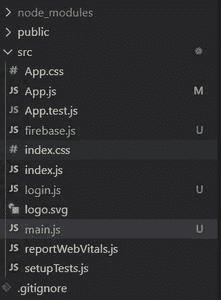
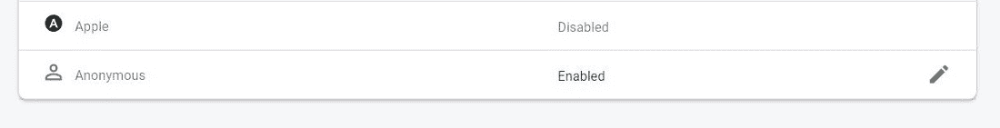
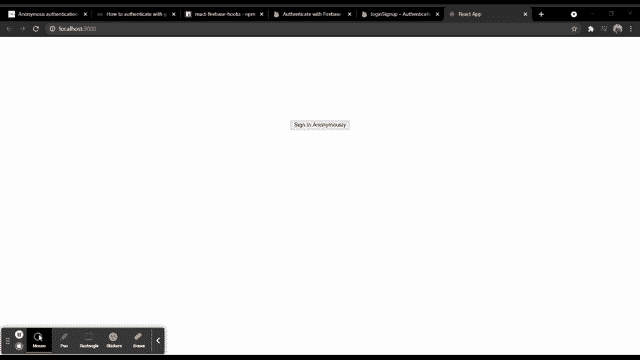

# 在 Firebase 中使用 ReactJS 进行匿名身份验证

> 原文: [https://www.geeksforgeeks.org/anonymous-authentication-in-firebase-using-reactjs/](https://www.geeksforgeeks.org/anonymous-authentication-in-firebase-using-reactjs/)

下面的方法介绍了如何在 React 中使用 Firebase 进行匿名身份验证。这种类型的身份验证用于创建和使用临时匿名帐户向 Firebase 进行身份验证。我们已经使用 `firebase` 模块实现了这一点。

## 创建反应应用程序并安装模块

### 步骤 1: 创建一个反应应用
使用以下命令创建一个反应应用:
```jsx
npx create-react-app myapp
```

### 步骤 2: 移动到项目文件夹
创建项目文件夹(即 `myapp`)后，使用以下命令移动到该文件夹:
```jsx
cd myapp
```

### 项目结构
我们的项目结构会是这样的。



### 步骤 3: 安装 Firebase 模块
创建 ReactJS 应用程序后，使用以下命令安装 `firebase` 模块:
```jsx
npm install firebase@8.3.1 --save
```

### 步骤 4: 获取 Firebase 凭证
转到你的 Firebase 仪表盘，创建一个新项目并复制你的凭证。
```jsx
const firebaseConfig = {
      apiKey: "your api key",
      authDomain: "your credentials",
      projectId: "your credentials",
      storageBucket: "your credentials",
      messagingSenderId: "your credentials",
      appId: "your credentials"
};
```

### 步骤 5: 初始化 Firebase
通过用下面的代码创建 `firebase.js` 文件，将 Firebase 初始化到您的项目中。

#### firebase.js
```jsx
import firebase from 'firebase';

const firebaseConfig = {
    // Your Credentials
};

firebase.initializeApp(firebaseConfig);
var auth = firebase.auth();
export default auth;
```

### 步骤 6: 启用匿名登录
进入你的 Firebase 仪表盘，启用如下图所示的匿名登录方式。



### 步骤 7: 安装 react-firebase-hooks
现在使用以下命令安装 `npm` 包，即 `react-firebase-hooks`。
```jsx
npm i react-firebase-hooks
```
这个包帮助我们倾听用户的当前状态。

### 步骤 8: 创建登录和主页面组件
创建两个文件，即 `login.js` 和 `main.js`，代码如下。

#### login.js
```jsx
import React from 'react';
import auth from './firebase.js';

const Login = () => {

    // Sign in Anonymously
    const signin = () => {
        auth.signInAnonymously().catch(alert);
    }

    return (
        <div>
            <center>
                <button style={{"marginTop" : "200px"}}
                onClick={signin}>Sign In Anonymously</button>
            </center>
        </div>
    );
}

export default Login;
```

#### main.js
```jsx
import React from 'react';
import auth from './firebase';

const Main = () => {

    // Signout function
    const logout = () => {
        auth.signOut();
    }

    return (
        <div style={{"marginTop" : "200px"}}>
            <center>
            Anonymous Login Success
            <button style={{"marginLeft" : "20px"}}
            onClick={logout}>
                Logout
            </button>
            </center>
        </div>
    );
}

export default Main;
```

### 步骤 9: 在 App.js 中整合组件
最后导入 `App.js` 文件中所有需要的文件，如下图所示。

#### App.js
```jsx
import React from 'react';
import auth from './firebase';
import {useAuthState} from 'react-firebase-hooks/auth';
import Login from './login';
import Main from './main';

function App() {
  const [user] = useAuthState(auth);
  return (
    user ? <Main/> : <Login/>
  );
}

export default App;
```

### 运行应用程序的步骤
从项目的根目录使用以下命令运行应用程序:
```jsx
npm start
```

### 输出
现在打开浏览器，转到 `http://localhost:3000/`，会看到如下输出:

