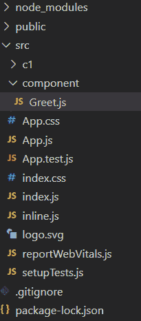

# React中Props的解构

> 原文：[https://www.geeksforgeeks.org/destructuring-of-props-in-reactjs/](https://www.geeksforgeeks.org/destructuring-of-props-in-reactjs/)

**解构**是一个简单的特性，用于让代码更加清晰可读，尤其是在React中传递props的时候。

## 什么是解构？

*   解构是JavaScript的一个特点，它用于从数组或对象中取出数据段，我们可以将它们分配给开发者创建的新变量。
*   在解构中，它不会改变原数组或对象，它通过在新变量中赋值来复制所需的对象或数组元素，稍后我们可以在React（类或函数）组件中使用这个新变量。
*   它使代码更加清晰。当我们使用`this`关键字访问props时，我们必须在整个程序中使用`this.props`，但是通过使用解构，我们可以通过在新变量中分配它们来丢弃`this.props`。
*   在复杂的应用程序中，直接监控`props`很困难，所以通过在新变量中分配这些props，我们可以使代码更具可读性。

## 解构的优势

*   通过分配自己的变量，这使得开发人员的工作变得更容易。
*   嵌套数据更复杂，访问需要时间，但是通过使用解构，我们可以更快地访问嵌套数据。
*   它提高了代码的**可持续性**和**可读性**。
*   它有助于减少应用程序中使用的代码量。
*   它可以减少访问数据属性的步骤数。
*   它为组件提供精确的数据属性。
*   多次迭代对象数组可以节省时间。
*   在ReactJS中，我们在`render`函数内部多次使用三元运算符，不进行解构看起来很复杂，很难访问，但是通过使用解构，我们可以提高三元运算符的可读性。

## 如何使用解构？

我们可以在ReactJS中使用以下方法进行解构：

### 1. 使用this.props方法

在这个例子中，我们将简单地使用解构和不使用解构来显示一些单词。

#### 项目结构

如下图所示。



**解构**以更易读的格式提供使用props的权限，并免去了每个属性都需要`this.props`的需求。

#### App.js

现在在`App.js`文件中写下以下代码。在这里，`App`是我们的默认组件，我们将在这里渲染我们的组件代码。

```jsx
import React from "react"
import Greet from './component/Greet'

class App extends React.component{
   render(){
     return(
       <div className = "App">
                 <Greet active="KAPIL GARG"  activeStatus = "CSE"/>
       </div>
    );
  }
}
export default App;
```