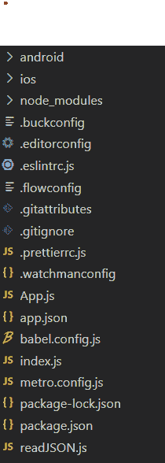
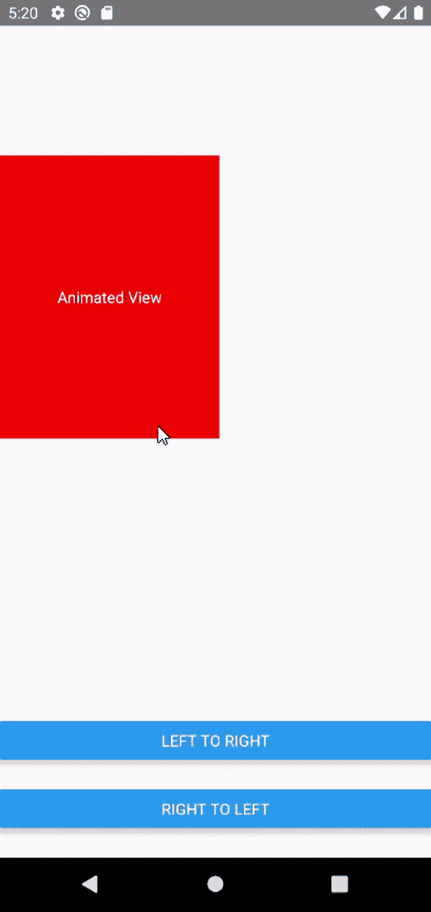

# 解释 React Native 中的动画

> 原文：[https://www.geeksforgeeks.org/explain-animations-in-react-native/](https://www.geeksforgeeks.org/explain-animations-in-react-native/)

**React Native 中的动画：** React Native 有一个动画 API，可以处理应用中的动画。它有各种功能来创建大多数类型的动画（例如，褪色，颜色变化，宽度和高度变化，位置变化）。我们将主要使用 `Animated`、`Animated.parallel`、`Animated.timing`、`Animated.Value` 和 `Animated.View`。请看此示例。

**实现：** 现在让我们从实现开始：

*   **步骤 1：** 打开终端，通过以下命令安装 `expo-cli`。

```jsx
npm install -g expo-cli
```

*   **步骤 2：** 现在通过以下命令创建一个项目。

```jsx
expo init animationDemo
```

*   **第三步：** 现在进入你的项目文件夹，即 `animationDemo`。

```jsx
cd animationDemo
```

**项目结构：** 如下图。



目录结构

**创建动画的步骤：**

1.  **定义状态：** 我们将从 `react-native` 导入 `Animated`。然后我们将声明我们的状态，稍后将由动画功能更改。在这里，我们使用 `right` 来移动 `<Animated.View>`，反之亦然。和 `radius` 状态，这将在动画期间改变视图的 `borderRadius`。
2.  **定义动画功能：** 我们将定义两个功能 `leftToRight` 和 `rightToLeft`，它们将在调用时激活视图。在这里，我们使用 `Animated.parallel()` 功能，该功能用于同时运行多个动画。以及以状态、动画持续时间、最终值为参数的 `Animated.timing()` 功能。开始动画的 `start()`。
3.  **创建视图：** 现在我们将使用 `<Animated.View>` 创建视图并在样式中传递动画状态。

**注意：** 使用 `<Animated.View>` 用于创建基于动画状态的动画视图。正常 `<View>` 会抛出堆栈限制超出错误。

## App.js

```jsx
import React, { Component } from 'react';
import { Text, View, Animated, Dimensions, Button } from 'react-native';

class App extends Component {
  constructor(props) {
    super(props);
    this.state = {
      right: new Animated.Value(
        Dimensions.get('window').width - 200),
      radius: new Animated.Value(0),
    };
  }

leftToRight = () => {
    Animated.parallel([
      Animated.timing(this.state.radius, {
        toValue: 200,
        duration: 1000,
        useNativeDriver: false,
      }),
      Animated.timing(this.state.right, {
        toValue: 0,
        duration: 1000,
        useNativeDriver: false,
      }),
    ]).start();
  };

rightToLeft = () => {
    Animated.parallel([
      Animated.timing(this.state.radius, {
        toValue: 0,
        duration: 1000,
        useNativeDriver: false,
      }),
      Animated.timing(this.state.right, {
        toValue: Dimensions.get('window').width - 200,
        duration: 1000,
        useNativeDriver: false,
      }),
    ]).start();
  };

render() {
    return (
      <View style={{ flex: 1 }}>
        <Animated.View
          style={{
            marginTop: '30%',
            backgroundColor: 'red',
            height: 200,
            width: 200,
            right: this.state.right,
            position: 'absolute',
            justifyContent: 'center',
            borderRadius: this.state.radius,
          }}>
          <Text
            style={{
              textAlign: 'center',
              color: 'white',
            }}>
            Animated View
          </Text>
        </Animated.View>
        <View
          style={{
            position: 'absolute',
            bottom: 0,
            width: '100%',
            height: '20%',
            justifyContent: 'space-evenly',
          }}>
          <Button title="Left to right" 
            onPress={() => this.leftToRight()} />
          <Button title="right to left" 
            onPress={() => this.rightToLeft()} />
        </View>
      </View>
    );
  }
}

export default App;
```

使用以下命令启动服务器。

```jsx
npm run android
```

**输出：**



输出

**插值：** 假设我们想用 `%` 代替一个数字来定义我们 `right` 的样式属性。如果我们通过 `%` 如 `<Animated.View>` 并尝试在我们的 `Animated.timing()` 功能中更改它，我们会得到一个错误。这就是插值有帮助的地方。它将输入范围映射到输出范围（例如，0-100 到 0%-100%）。我们只需要在 `<Animated.View>` 正确的风格道具和剩下的代码会一样。

## App.js

```jsx
<Animated.View
  style={{
    marginTop: '30%',
    backgroundColor: 'red',
    height: 200,
    width: 200,
    right: this.state.right.interpolate({
      inputRange: [0, 100],
      outputRange: ['0%', '100%'],
    }),
    position: 'absolute',
    justifyContent: 'center',
    borderRadius: this.state.radius,
  }}>
  <Text
    style={{
      textAlign: 'center',
      color: 'white',
    }}>
    Animated View
  </Text>
</Animated.View>
```

**参考：** [https://reactnative.dev/docs/animations](https://reactnative.dev/docs/animations)