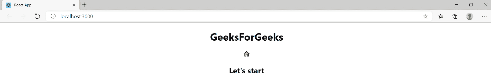
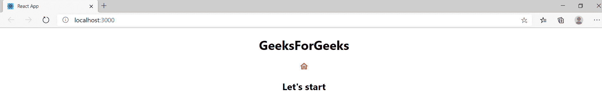

# 如何在 ReactJS 中使用 Material-UI 改变图标的颜色？

> 原文：[https://www.geeksforgeeks.org/how-to-change-the-color-of-icons-using-material-ui-in-reactjs/](https://www.geeksforgeeks.org/how-to-change-the-color-of-icons-using-material-ui-in-reactjs/)

`Material-UI`图标是一个基于`React`的模块。`Material-UI`库为用户提供了最高效、有效和用户友好的界面。`React`提供的不仅仅是 **1000** 个`Material-UI`图标。它是最受欢迎和最受欢迎的框架之一。为了在`React`中使用`Material-UI`，我们需要安装`Material-UI`和`Material-UI Icons`。此外，对于自定义样式，您可以随时参考`Material-UI`中的`SVGIcon`组件的应用编程接口。

**先决条件：**

*   基础知识`ReactJS`
*   [已创建`ReactJS`应用程序](https://www.geeksforgeeks.org/reactjs-setting-development-environment/)

下面按顺序描述了为图标添加颜色的所有步骤。

**安装：**

*   **第一步**：在进一步移动之前，首先我们要安装`Material-UI`模块，通过在你的项目目录中运行下面的命令，借助你的`src`文件夹中的终端，或者你也可以在你的项目文件夹中的`Visual Studio Code`的终端中运行这个命令。

```bash
npm install @material-ui/core
```

*   **步骤 2：** 安装完`Material-UI`模块后，现在通过在项目目录中运行以下命令，在`src`文件夹中的终端的帮助下安装`Material-UI Icons`，或者您也可以在项目文件夹中的`Visual Studio Code`的终端中运行该命令。

```bash
npm install @material-ui/icons
```

*   **第三步**：安装完模块之后，现在打开你的`App.js`文件，它在你的项目目录里面，在`src`文件夹下面，并且删除它里面的代码。
*   **第四步**：现在安装完成后，我们可以使用图标组件的`color`道具来改变图标的颜色。我们也可以使用相同的`style`道具。
*   **第五步**：现在导入`React`、`@material-ui/core/colors`、`@material-ui/icons`模块。
*   **第六步**：在你的`app.js`文件中，添加这个代码片段导入`React`、`Material-UI`核心颜色、`Material-UI`图标模块。

```jsx
import React from 'react';
import green from "@material-ui/core/colors/green";
import MailIcon from "@material-ui/icons/Mail";
```

下面是一个示例程序来说明`color`道具的使用：

**例 1：** 将图标颜色改为绿色。

*   **app.js：**

```jsx
import React from 'react';

// Importing the color of your choice from Material-UI 
import green from "@material-ui/core/colors/green";

// Importing Home icon from Material-UI . You can refer to the 
// API of this SVG icon component in Material-UI
import HomeIcon from "@material-ui/icons/HomeTwoTone";

export default function App() {
  return (
    <div className="App">
      <h1><center>GeeksForGeeks</center></h1>
      {/* We provide inline css to make the color of the home 
          icon as green. We use style prop for the same. */}
      <center><HomeIcon style={{ color: "green" }} /></center>
      <h2><center>Let's start</center></h2>
    </div>
  );
}
```

*   **输出**



**例 2：** 将图标颜色改为红色。

*   **app.js：**

```jsx
import React from 'react';

// Importing the color of your choice from Material-UI 
import red from "@material-ui/core/colors/red";

// Importing Home icon from Material-UI . You can refer to 
// the API of this SVG icon component in Material-UI
import HomeIcon from "@material-ui/icons/HomeTwoTone";

export default function App() {
  return (
    <div className="App">
      <h1><center>GeeksForGeeks</center></h1>
      {/* We provide inline css to make the color of the
          home icon as green. We use style prop for the same. */}
      <center><HomeIcon style={{ color: "red" }} /></center>
      <h2><center>Let's start</center></h2>
    </div>
  );
}
```

*   **输出**



因此，使用上述步骤，我们可以使用`Material-UI`来导入和更改`React`图标的颜色。