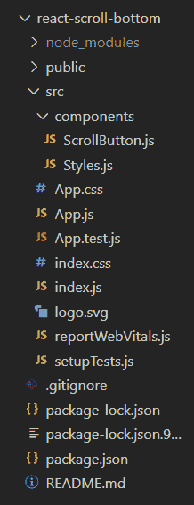
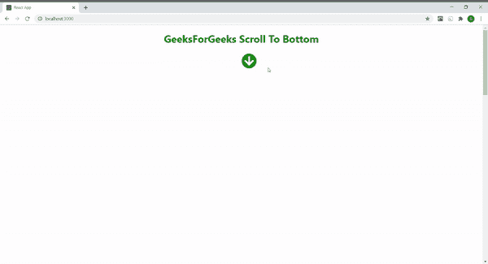
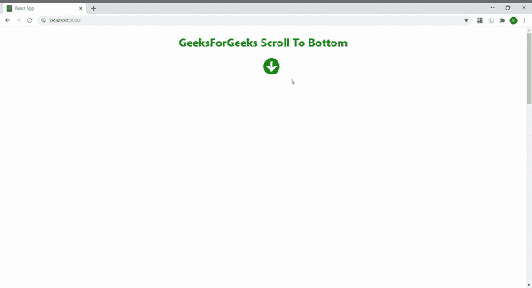

# 如何在 ReactJS 中创建滚动到底按钮？

> 原文: [https://www.geeksforgeeks.org/how-to-create-a-scroll-to-bottom-button-in-reactjs/](https://www.geeksforgeeks.org/how-to-create-a-scroll-to-bottom-button-in-reactjs/)

你会看到，有很多聊天应用，比如 WhatsApp、Telegram 等，都在使用一个有用的功能，比如如果你在聊天窗口中间，你想去页面底部，那么你可以用这个按钮像[一样自动向下滚动，跳到内容](https://www.geeksforgeeks.org/how-to-scroll-to-a-particular-element-or-skip-to-content-in-reactjs/)。以下示例介绍了如何使用 [`useState()`](https://www.geeksforgeeks.org/what-is-usestate-in-react/) 钩子在 React JS 中创建滚动到底部按钮。

## 先决条件

*   npm 和 `create-react-app` 命令的基本知识。
*   样式组件的基本知识。
*   [基础知识 `useState()` React 钩子](https://www.geeksforgeeks.org/what-is-usestate-in-react/)。

## 基本设置

你将使用 [`create-react-app`](https://www.geeksforgeeks.org/reactjs-setting-development-environment/) 开始一个新项目，所以打开你的终端并输入。

```jsx
npx create-react-app react-scroll-bottom
```

现在，通过在终端中键入给定的命令，转到您的 `react-scroll-bottom` 文件夹。

```jsx
cd react-scroll-bottom
```

## 所需模块

通过在终端中键入给定的命令，安装本项目所需的依赖项。

```jsx
npm install --save styled-components
npm install --save react-icons
```

现在在 `src` 中创建 `components` 文件夹，然后转到组件文件夹，创建两个文件 `ScrollButton.js` 和 `Styles.js`。

## 项目结构

项目中的文件结构会是这样的。



## 示例

在本例中，我们将设计一个带有“滚动到底部”按钮的网页，为此，我们需要操作 `App.js` 文件和其他创建的组件文件。

我们创建一个状态，第一个元素作为初始状态可见，其值为真，第二个元素作为函数 `setVisible()` 来更新状态。然后创建一个名为 `toggleVisible` 的函数，当我们向下滚动页面时，该函数将状态值设置为假。否则，状态值设置为真。

然后创建一个名为 `scrollToBottom` 的函数，其中我们使用 [`scrollTo` 方法](https://www.geeksforgeeks.org/how-to-scroll-to-a-particular-element-or-skip-to-content-in-reactjs/) 将页面滚动到底部。现在我们的状态用于向用户显示/隐藏“滚动到底部”图标。当用户点击该图标时，功能 `scrollToBottom` 被触发为 [`onClick()` 事件](https://www.geeksforgeeks.org/javascript-events/)，将我们的页面平滑滚动至底部。也可以用 `'auto'` 行为代替 `'smooth'`。向下滚动页面时，函数 `toggleVisible` 也会通过 [`window.addEventListener` 属性](https://www.geeksforgeeks.org/javascript-addeventlistener-with-examples/) 作为事件被触发，将 `Visible` 状态设置为 `false`，从而隐藏我们的图标。当我们自己向上滚动回到页面顶部时，状态值更新为 `true`，图标再次开始显示。

### ScrollButton.js

```jsx
import React, {useState} from 'react'; 
import {FaArrowCircleDown} from 'react-icons/fa'; 
import { Button } from './Styles';

const ScrollButton = () =>{

const [visible, setVisible] = useState(true)

const toggleVisible = () => { 
    const scrolled = document.documentElement.scrollTop; 
    if (scrolled > 0){ 
      setVisible(false) 
    }   
    else if (scrolled <= 0){ 
      setVisible(true) 
    } 
  };

const scrollToBottom = () =>{ 
    window.scrollTo({ 
      top: document.documentElement.scrollHeight, 
      behavior: 'auto'
      /* you can also use 'auto' behaviour 
         in place of 'smooth' */
    }); 
  };

window.addEventListener('scroll', toggleVisible);

return ( 
    <Button> 
     <FaArrowCircleDown onClick={scrollToBottom}  
     style={{display: visible ? 'inline' : 'none'}} /> 
    </Button> 
  ); 
}

export default ScrollButton;
```

### Styles.js

```jsx
import styled from 'styled-components';

export const Header = styled.h1` 
   text-align: center; 
   left: 50%;
   color: green; 
`;

export const Content = styled.div` 
   overflowY: scroll; 
   height: 2500px; 
`;

export const Button = styled.div` 
   position: fixed;  
   width: 100%; 
   left: 50%; 
   height: 20px; 
   font-size: 3rem; 
   z-index: 1; 
   cursor: pointer; 
   color: green; 
`
```

### App.js

```jsx
import { Fragment } from 'react'; 
import ScrollButton from './components/ScrollButton'; 
import { Content, Header } from './components/Styles';

function App() { 
  return ( 
    <Fragment> 
      <Header>GeeksForGeeks Scroll To Bottom</Header> 
      <ScrollButton /> 
      <Content /> 
      <Header>Thanks for visiting</Header> 
    </Fragment> 
  ); 
}

export default App;
```

## 运行应用程序的步骤

从项目的根目录使用以下命令运行应用程序:

```jsx
npm start
```

## 输出

现在打开浏览器，转到 `http://localhost:3000/`，会看到如下输出。

*   **使用默认行为(`auto`):** 看它如何直接跳到底部。



*   **使用平滑行为:** 看它是如何平滑到底的。

