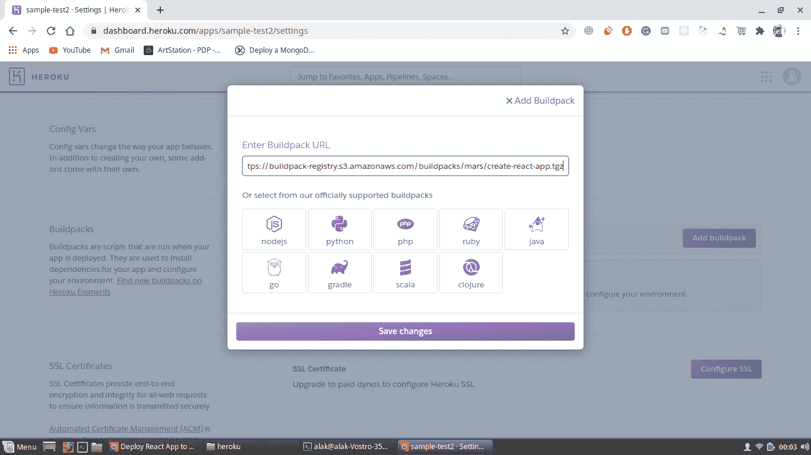

# 如何将 React app 部署到 Heroku？

> 原文：[https://www.geeksforgeeks.org/how-to-deploy-react-app-to-heroku/](https://www.geeksforgeeks.org/how-to-deploy-react-app-to-heroku/)

[`React`](https://www.geeksforgeeks.org/react-js-introduction-working/) 是一个非常流行且广泛使用的构建用户界面的库。所以如果你正在考虑将你的 React 应用部署到云平台，有各种各样的选择，比如 [`AWS EC2`](https://www.geeksforgeeks.org/aws-ec2-tutorial/) 或者 [`Heroku`](https://www.heroku.com/)。但是为了测试你的 React 应用，`Heroku` 将是最好的选择，因为它是免费的，并且非常容易上手。

## 先决条件

1.  已安装 [`Node.js`](https://nodejs.org/) 和 [`npm`](https://www.npmjs.com/)。
    *   [在 Windows 上安装 `Node.js`](https://www.geeksforgeeks.org/installation-of-node-js-on-windows/)
    *   [在 Linux 上安装 `Node.js`](https://www.geeksforgeeks.org/installation-of-node-js-on-linux/)
2.  关于 [`GitHub`](https://github.com/) 的知识。
3.  关于 [`Heroku`](https://www.heroku.com/) 的基础知识。
4.  [已经创建了一个 React 应用。](https://www.geeksforgeeks.org/reactjs-setting-development-environment/)

**注意：** 确保下面显示的所有命令只能在项目文件夹中运行。

## 步骤 1：安装 Heroku CLI

通过运行以下命令，在系统中安装 [`Heroku`](https://devcenter.heroku.com/articles/heroku-cli) CLI。它会将更新版本的 `heroku` 命令行界面安装到您的系统中。

```bash
curl https://cli-assets.heroku.com/install-ubuntu.sh | sh
```

要检查版本，您可以运行命令。

```bash
heroku -v
```

## 步骤 2：注册并创建应用

现在，前往 [https://www.heroku.com/](https://www.heroku.com/) 注册。完成注册后，转到仪表板，创建一个名为 `myherokupapp` 或您选择的名称的新应用程序。

## 步骤 3：登录 Heroku

运行以下命令，它会提示你输入任意键继续，它会在你的浏览器中打开一个新的标签，要求你登录你的 `Heroku` 账户。在您输入所需的凭据并登录到站点后，它将在您的终端中显示“已登录”。

```bash
heroku login
```

## 步骤 4：初始化 Git 仓库

通过运行以下命令初始化 `Git` 存储库。确保您位于项目目录的顶层。

```bash
git init
```

## 步骤 5：添加 Heroku 远程仓库

现在，只需运行命令即可添加 `Heroku` 遥控器，该命令可在您的 **Heroku 仪表板 -> myherokupapp 或您的应用名称 -> 部署部分**中找到。

或者

只需运行以下命令。部署方法应该选择 `GitHub`。

```bash
heroku git:remote -a myherokupapp
```

## 步骤 6：添加 Buildpack

现在最重要的部分也就是 `Heroku` 为基于 `Python`、`Node.js` 的应用提供了 `buildpack`，但是没有为 React 应用提供 `buildpack`。所以我们必须在你的 `Heroku` 应用的设置部分增加一个额外的 `buildpack`。

> https://buildpack-registry.s3.amazonaws.com/buildpacks/mars/create-react-app.tgz

[](https://media.geeksforgeeks.org/wp-content/uploads/20200719000910/buildpack.png)

## 步骤 7：推送项目到 Heroku

现在运行以下命令，将您的项目推送到存储库。

```bash
git add .
git commit -m "First Commit"
git push heroku master
```

## 步骤 8：查看部署的应用

成功将你的 React 应用推送到 `Heroku` 存储库。现在，要查看您部署的应用程序，请运行以下命令。

```bash
heroku open
```

最后，网络应用将部署在 [https://myherokuapp.herokuapp.com/](https://myherokuapp.herokuapp.com/) 上。

**注意：** 它会将你部署的应用打开到你的浏览器中。如果有任何问题，比如您的 React 应用程序没有显示，那么您可以运行以下命令来检查日志中出现了什么问题。考虑一件事，在部署之前，尝试从您的应用程序中删除所有警告，因为 `heroku` 认为所有警告都是错误。

```bash
heroku logs --tail
```