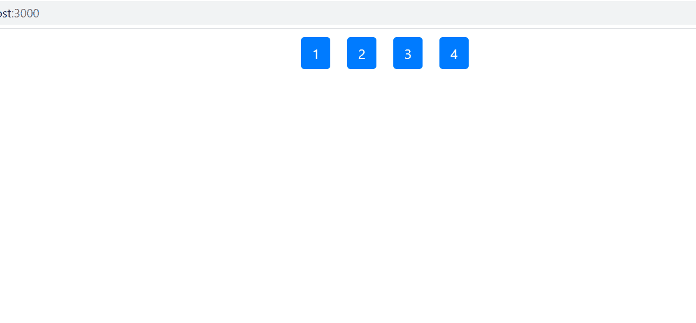

# 如何使用 ReactJS 从数组中获取前 N 个元素？

> 原文: [https://www.geeksforgeeks.org/how-to-get-first-n-number-of-elements-from-an-array-using-reactjs/](https://www.geeksforgeeks.org/how-to-get-first-n-number-of-elements-from-an-array-using-reactjs/)

我们可以使用 `slice()` 方法从数组中获取前 N 个元素。

## 语法:

```jsx
array.slice(0, n);
```

## 示例:

```jsx
var num = [1, 2, 3, 4, 5];
var myBest = num.slice(0, 3);
```

## 输出:

```jsx
[1,2,3]
```

## 注意:

数组上的 `slice` 函数返回数组的浅拷贝，不修改原数组。如果 `N` 大于数组的大小，那么它不会通过任何错误返回整个数组本身。

## 创建反应应用程序:

### 步骤 1:

使用以下命令创建一个反应应用程序:

```jsx
npx create-react-app foldername
```

### 步骤 2:

创建项目文件夹(即文件夹名)后，使用以下命令移动到该文件夹:

```jsx
cd foldername
```

## 项目结构:

如下图。


项目结构

## App.js:

现在在 `App.js` 文件中写下以下代码。在这里，`App` 是我们编写代码的默认组件。

## java 描述语言

```jsx
import { React, Component } from "react";
class App extends Component {

render() {
    // Numbers list
    const list = [1, 2, 3, 4, 5, 6, 7]

    // Defining our N
    var n = 4;

    // Slice function call
    var items = list.slice(0, n).map(i => {
      return <button style={{ margin: 10 }}
        type="button" class="btn btn-primary">{i}</button>
    })

    return (
      <div>{items}</div>
    )
  }
}

export default App
```

## 注意:

可以将自己的造型应用到应用中。这里我们已经使用了 bootstrap CSS，要将其包含在您的项目中，只需将下面的 `<link>` 添加到我们的 `index.html` 文件中即可。

> <link rel="stylesheet" href="https://maxcdn.bootstrapcdn.com/bootstrap/4.5.0/css/bootstrap.min.css"
> integrity="sha384-9aIt2nRpC12Uk9gS9baDl411NQApFmC26EwAOH8WgZl5MFCxF6MKCjyXf4kjCi"
> crossorigin="anonymous">

## 运行应用程序的步骤:

从项目的根目录使用以下命令运行应用程序:

```jsx
npm start
```

## 输出:

由于 `n` 的值为 4，因此将创建四按钮。如果增加 `n` 的值，按钮的数量将增加，反之亦然。

