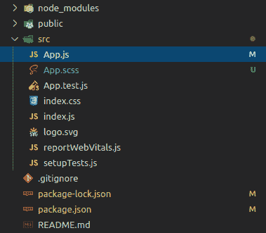

# 如何安装 node-sass 到 React 项目？

> 原文: [https://www.geeksforgeeks.org/how-to-install-node-sass-to-react-project/](https://www.geeksforgeeks.org/how-to-install-node-sass-to-react-project/)

Sass 是一种脚本语言，被编译成[级联样式表(CSS)](https://www.geeksforgeeks.org/types-of-css-cascading-style-sheet/)。它是一种预处理器语言。它最初由汉普顿·卡特林设计，然后由娜塔莉·韦森鲍姆开发。在最初的版本之后，威岑鲍姆和克里斯·爱普斯坦继续用 SassScript 扩展 SASS。它支持四种数据类型，它们是数字、字符串、颜色和布尔值。嵌套也适用于这种语言。

## 先决条件:

*   [基础知识 ReactJS](https://www.geeksforgeeks.org/react-js-introduction-working/)

## 安装过程:

*   **使用 npm 添加 sass:**

```bash
npm install node-sass --save
```

*   **使用 yarn 添加 sass:**

```bash
yarn add node-sass
```

## 注意:
现在可以将 `App.css` 重命名为 `app.scss`，将 `App.js` 更新为导入 `app.scss`，如果以扩展名导入，这个文件和其他任何文件都会自动编译。`.scss` 或 `.sass`。



## 示例:
一旦您按照上述步骤操作，则意味着您已经成功安装了 sass，并且可以开始使用它。

### app.scss:
在 sass 文件的代码中可以观察到，我们可以使用变量或在 sass 文件中执行算术运算。这是使用 sass 的优势。

```scss
$bg: rgb(88, 235, 88);
$border-color: black;

.main-block {
  background-color: $bg;
  height: 4px / 100px * 100%;
  border: 1px solid $border-color;
  text-align: center;
}
```

### app.js:

```jsx
import logo from './logo.svg';
import './App.scss';

function App() {
  return (
    <div className="App">
      <header className="App-header">
        
        <p>
          Edit <code>src/App.js</code> and save to reload.
        </p>
        <a
          className="App-link"
          href="https://reactjs.org"
          target="_blank"
          rel="noopener noreferrer"
        >
          Learn React
        </a>
      </header>
    </div>
  );
}

export default App;
```

### 输出: