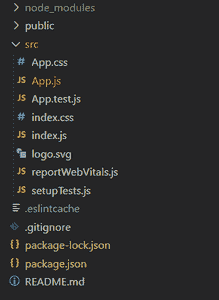
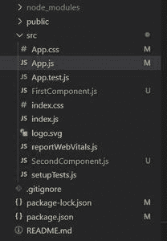
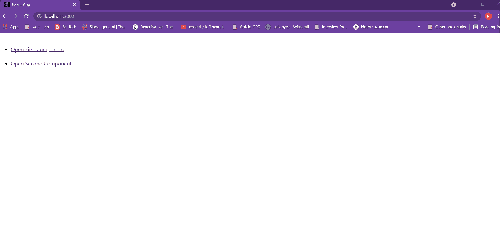

# 如何在 ReactJS 中的新选项卡中打开组件？

> 原文: [https://www.geeksforgeeks.org/how-to-open-a-component-in-a-new-tab-in-reactjs/](https://www.geeksforgeeks.org/how-to-open-a-component-in-a-new-tab-in-reactjs/)

React Router 是 React 中路由的标准库。它支持在一个 React 应用程序的不同组件的视图之间导航，允许改变浏览器的网址，并保持用户界面与网址同步。在本教程中，您将了解如何在主应用程序中打开另一个选项卡中的新组件。为了演示，我们将创建两个组件：`FirstComponent` 和 `SecondComponent`。我们将使用 `Switch`、`react-router`、`Link` 在新的选项卡中打开这两个组件。

**方法：** 我们将创建两个简单的组件，命名为 `FirstComponent` 和 `SecondComponent`。在我们的主要组件，即 `App.js` 中，我们将提供两个带有链接的按钮来打开 `FirstComponent` 和 `SecondComponent`。然后，我们将应用该逻辑在具有不同路由的新选项卡中打开 `FirstComponent` 和 `SecondComponent`。

## 创建 React 应用程序和安装模块

**步骤 1：** 使用以下命令创建一个 React 应用程序：

```jsx
npx create-react-app foldername
```

**步骤 2：** 创建项目文件夹（即 `foldername`）后，使用以下命令移动到该文件夹：

```jsx
cd foldername
```

**步骤 3：** 安装软件包。React Router 可以通过 npm 安装在您的 React 应用程序中。要安装 React Router，请使用以下命令：

```jsx
npm install react-router-dom
```

**项目结构：** 默认文件结构如下：



安装 `react-router-dom` 后，将其组件添加到您的 React 应用程序中。要了解更多关于 React Router 的信息，请参考本文：[https://www.geeksforgeeks.org/reactjs-router/](https://www.geeksforgeeks.org/reactjs-router/)

**更改项目结构：** 在您的项目目录中，在 `src` 文件夹中创建两个名为 `FirstComponent.js` 和 `SecondComponent.js` 的文件。现在，您的新项目结构将如下所示：



**示例：** 我们通过示例来了解一下实现。

### `FirstComponent.js`

这是我们将用于在新选项卡中显示的组件。当用户试图点击打开 `FirstComponent` 时，我们将尝试打开这个组件。该组件包含一个应用了一些 CSS 样式的标题。

```jsx
import React from "react";

// First simple component with heading tag
function FirstComponent() {
  return (
    <div>
      <h1
        style={{ // Applying some styles to the heading
          display: "flex",
          justifyContent: "center",
          padding: "15px",
          border: "13px solid #b4f0b4",
          color: "rgb(11, 167, 11)",
        }}
      >
        Geeks For Geeks First Component in New Tab
      </h1>
    </div>
  );
}
export default FirstComponent;
```

### `SecondComponent.js`

这是我们将用于在新选项卡中显示的第二个组件。当用户试图点击打开 `SecondComponent` 时，我们将尝试打开这个组件。该组件包含一个应用了一些 CSS 样式的标题。

```jsx
import React from "react";

// Second simple component with heading tag
function SecondComponent() {
  return (
    <div>
      <h1
        style={{ // Applying some styles to the heading
          display: "flex",
          justifyContent: "center",
          padding: "15px",
          border: "13px solid #6A0DAD",
          color: "#7F00FF",
        }}
      >
        Geeks For Geeks Second Component in New Tab
      </h1>
    </div>
  );
}
export default SecondComponent;
```

### `App.js`

`Route` 组件将帮助我们建立组件的 UI 和 URL 之间的链接。要包含应用程序的路由，请将下面给出的代码添加到您的 `App.js` 中。

`App.js` 是我们的默认组件，其中已经编写了一些默认代码。现在在 `App.js` 文件中导入我们的新组件。在应用程序中包含 React Router 组件。当用户点击“打开 `FirstComponent`”按钮时，我们将尝试打开 `FirstComponent`。为此，我们提供了打开 `FirstComponent` 路径的链接，即 `/geeks/first`。因此，`FirstComponent` 将在 `http://localhost:3000/geeks/first` 位置的新选项卡中打开。同样，当用户单击“打开 `SecondComponent`”按钮时，我们将尝试打开 `SecondComponent`。为此，我们提供了打开 `SecondComponent` 路径的链接，即 `/geeks/second`。因此，`SecondComponent` 将在 `http://localhost:3000/geeks/second` 位置的新选项卡中打开。

```jsx
import React from "react";
import { BrowserRouter as Router, Route, Link, Switch } 
       from "react-router-dom";

// Importing newly created components
import SecondComponent from "./SecondComponent";
import FirstComponent from "./FirstComponent";

function App() {
  return (

    // BrowserRouter to wrap all
    // the other components
    <Router>

      {/*switch used to render only the first
       route that matches the location rather 
       than rendering all matching routes. */}
      <Switch>
        <Route exact path="/geeks/second" 
            component={SecondComponent}>
        </Route>
        <Route exact path="/geeks/first" 
            component={FirstComponent}>
        </Route>
        <ul>
          <br />
          <li>

            {/* Link component uses the to prop 
            to describe the location where the 
            links should navigate to. */}
            <Link to="/geeks/first" target="_blank">
              Open First Component
            </Link>
          </li>
          <br />
          <li>
            <Link to="/geeks/second" target="_blank">
              Open Second Component
            </Link>
          </li>
        </ul>
      </Switch>
    </Router>
  );
}
export default App;
```

**运行应用程序的步骤：** 从项目的根目录使用以下命令运行应用程序：

```jsx
npm start
```

**输出：** 您的 Web 应用将在 `http://localhost:3000` 上直播。现在，点击你创建的链接。



**说明：** 您会注意到两个组件都将在一个新的选项卡中打开，其中包含它们特定的路由。您的 `FirstComponent` 将在 `http://localhost:3000/geeks/first` 位置的新选项卡中打开。您的 `SecondComponent` 将在 `http://localhost:3000/geeks/second` 位置的新选项卡中打开。