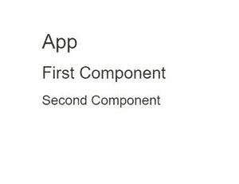

# 如何将一个React组件传递到另一个组件中，以包含第一个组件的内容？

> 原文: [https://www.geeksforgeeks.org/how-to-pass-a-react-component-into-another-to-transclude-the-first-components-content/](https://www.geeksforgeeks.org/how-to-pass-a-react-component-into-another-to-transclude-the-first-components-content/)

有两种方法可以将一个React组件传递给另一个组件。

## 创建React应用程序
在继续该方法之前，您必须创建一个React应用程序。

**步骤 1:** 使用以下命令创建一个React应用程序:
```bash
npx create-react-app foldername
```

**步骤 2:** 创建项目文件夹(即 `foldername`)后，使用以下命令移动到该文件夹:
```bash
cd foldername
```

**项目结构:** 如下图。


### 1. 使用 `this.props.children`
```jsx
<First>
  <Second></Second>
</First>
```
这样，第一个组件可以使用 `this.props.children` 属性访问第二个组件。

**第一种方法: `App.js`**
从 `src` 文件夹打开 `App.js` 文件，编辑为:
```jsx
import React from "react";

class App extends React.Component {
  render() {
    return (
      <div className="App">
        <h1>App</h1>
        <First>
          <Second/>
        </First>
      </div>
    );
  }
}
export default App

class First extends React.Component {
  render() {
    return <div>
      <h2> First Component</h2>
      {this.props.children}
    </div>;
  }
}

class Second extends React.Component {
  render() {
    return <div>
      <h3> Second Component</h3>
    </div>;
  }
}
```

### 2. 作为props传递给另一个组件
```jsx
<First secondcomp={<Second/>}>
```
因此第一个组件可以使用 `this.props.secondcomp` 属性访问组件。

**第二种方法: `App.js`**
从 `src` 文件夹打开 `App.js` 文件，编辑为:
```jsx
import React from "react";

class App extends React.Component {
  render() {
    return (
      <div className="App">
        <h1>App</h1>
        <First secondcomp={<Second/>}>
        </First>
      </div>
    );
  }
}
export default App

class First extends React.Component {
  render() {
    return <div>
      <h2> First Component</h2>
      {this.props.secondcomp}
    </div>;
  }
}

class Second extends React.Component {
  render() {
    return <div>
      <h3> Second Component</h3>
    </div>;
  }
}
```

**输出:** 两种方法将给出相同的输出。

