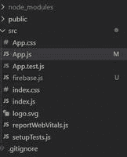
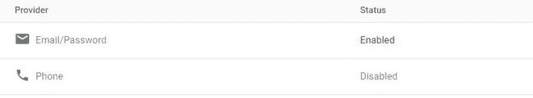

# 如何使用 ReactJS 发送带有 Firebase 的邮件验证链接？

> 原文：[https://www.geeksforgeeks.org/how-to-send-email-verification-link-with-firebase-using-reactjs/](https://www.geeksforgeeks.org/how-to-send-email-verification-link-with-firebase-using-reactjs/)

在本文中，我们将看到如何使用 `React.js` 发送带有 `Firebase` 的电子邮件验证链接。

为你的 `React` 项目设置一个 `Firebase`。

## 创建 React 应用程序并安装模块

*   **步骤 1：** 使用以下命令创建一个 `React` 应用 `myapp`。

```jsx
npx create-react-app myapp
```

*   **步骤 2：** 创建项目文件夹（即 `myapp`）后，使用以下命令移动到该文件夹。

```jsx
cd myapp
```

**项目结构：** 项目结构会是这样的。



*   **步骤 3：** 创建 `ReactJS` 应用程序后，使用以下命令安装 `firebase` 模块。

```jsx
npm install firebase@8.3.1 --save
```

*   **步骤 4：** 转到你的 `Firebase` 仪表盘，创建一个新项目并复制你的凭证。

```jsx
const firebaseConfig = {
      apiKey: "your api key",
      authDomain: "your credentials",
      projectId: "your credentials",
      storageBucket: "your credentials",
      messagingSenderId: "your credentials",
      appId: "your credentials"
};
```

*   **步骤 5：** 现在使用你的登录方法中的电子邮件和密码启用登录。



**示例：** 通过使用以下代码创建 `firebase.js` 文件，将 `Firebase` 初始化到你的项目中。

## firebase.js

```jsx
import firebase from 'firebase';

const firebaseConfig = {
    // Your credentials
};

firebase.initializeApp(firebaseConfig);
var auth = firebase.auth();
export default auth;
```