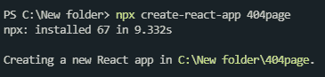
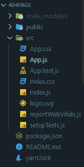
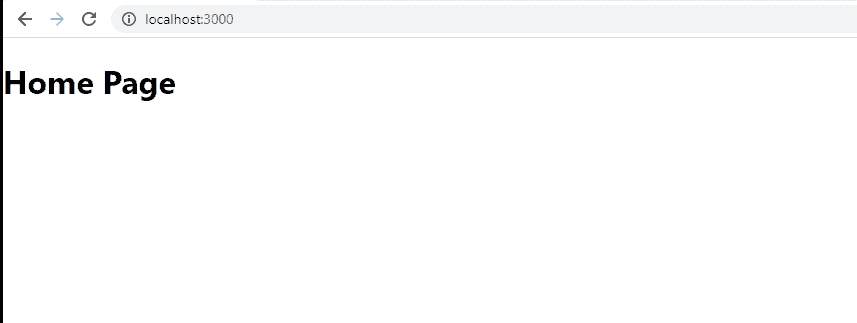

# 如何在 React 路由中设置 404 页？

> 原文：[https://www.geeksforgeeks.org/how-to-setup-404-page-in-react-routing/](https://www.geeksforgeeks.org/how-to-setup-404-page-in-react-routing/)

每个网站都需要一个 404 页，如果网址不存在或网址可能已被更改。要在 React 路由中设置 404 页面，我们必须首先创建一个组件，以便在发生 404 错误时显示。在下面的方法中，我们将创建一个名为 `PageNotFound` 的简单 React 组件。

### 创建 React 应用程序并安装模块

### 步骤 1：使用以下命令创建一个 React 应用程序

```jsx
npx create-react-app 404page
```

注意：如果您之前已经通过 npm 全局安装了 `create-react-app`，请直接使用下面的命令：



您的开发环境已经准备好了。现在让我们在应用程序中安装 React Router。

### 步骤 2：创建项目文件夹后，移动到相同的文件夹

```jsx
cd styled
```

### 步骤 3：安装 `react-router-dom`

`react-router-dom` 可以在你的 React 应用中通过 npm 安装。要安装 `react-router-dom`，请使用以下命令：

```jsx
npm install --save react-router-dom
```

### 项目结构

如下图。



### 步骤 4：现在在 `App.js` 文件中写下以下代码

在这里，`App` 是我们编写代码的默认组件。

**App.js**

```jsx
import React from "react";
import { Route, Switch, BrowserRouter } from 'react-router-dom';
import Home from './Home';
import PageNotFound from './404Page';

function App() {
  return (
    <BrowserRouter>
      <Switch>
        <Route exact path='/' component={Home} />
        <Route path="*" component={PageNotFound} />
      </Switch>
    </BrowserRouter>
  );
}

export default App;
```

**Home.js**

```jsx
import React from 'react';

const Home = () => {
    return (
        <div>
            <h1>Home Page</h1>
        </div>
    );
}

export default Home;
```

**PageNotFound.js**

```jsx
import React from 'react';

const PageNotFound = () => {
    return (
        <div>
            <h1>404 Error</h1>
            <h1>Page Not Found</h1>
        </div>
    );
}

export default PageNotFound;
```

**说明：** 此处 `PageNotFound` 的路由在 `Switch` 内部提供。这里，除了提供的路由之外的任何路径都由这个页面处理，我们的 HTML 模板显示在浏览器中。所以现在，如果有人试图向路由数组中不存在的任何页面发送请求，那么该用户会自动导航到这个页面。

### 运行应用程序的步骤

运行以下命令启动应用程序：

```jsx
npm start
```

### 输出

现在打开浏览器，转到 `http://localhost:3000`，一切正常。现在转到 `http://localhost:3000/any`，我们会得到如下所示的 404 错误。

