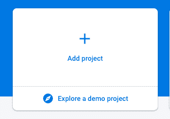
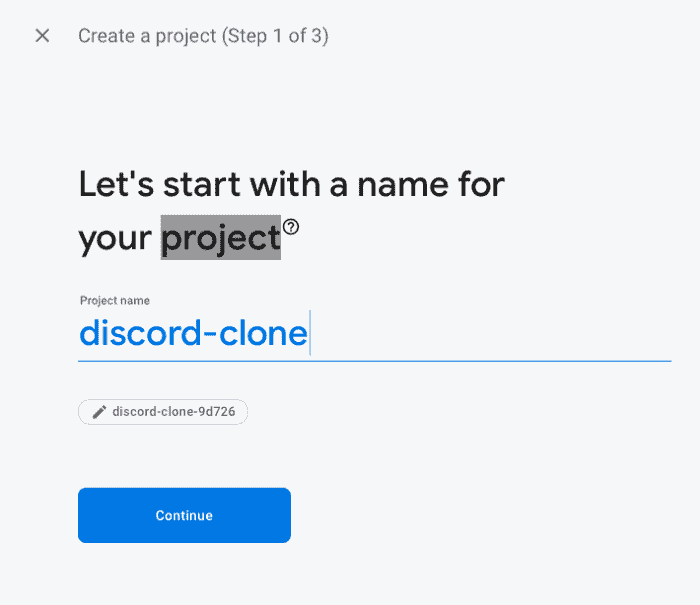
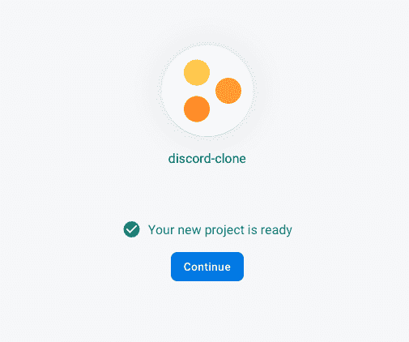
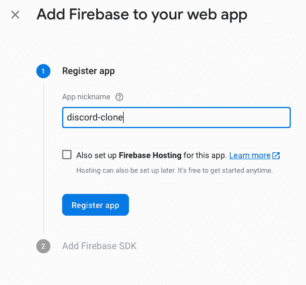
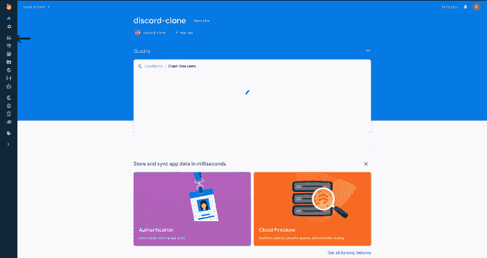

# 如何为你的React项目设置一个Firebase？

> 原文：[https://www.geeksforgeeks.org/how-to-setup-a-firebase-for-your-react-project/](https://www.geeksforgeeks.org/how-to-setup-a-firebase-for-your-react-project/)

为了为您的项目设置一个Firebase，只需遵循以下简单的步骤：

## 步骤1：前往Firebase控制台
前往[`console.firebase.google.com`](console.firebase.google.com.)。

## 步骤2：创建新项目
点击**添加项目**按钮，如果你是新用户，可能会说**新建项目**之类的。现有用户的情况如下所示：

## 步骤3：输入项目名称
点击后，输入`disclone`作为项目名称。

## 步骤4：配置Google Analytics（可选）
对于下一步，如果您愿意，您可以启用Google Analytics，但是这不是必需的。

## 步骤5：等待项目创建
之后，你已经选择了你的选择，Firebase将开始为你创建项目。一旦完成，它应该如下所示：

## 步骤6：进入项目并添加Web应用
一旦你得到这个，你可以点击**继续**。Firebase将带您返回到项目屏幕，然后单击下图中指向的按钮（`</>`）：

## 步骤7：注册Web应用
你会被要求为网络应用程序命名，你可以放任何你喜欢的东西。然而，我们在这个例子中使用了`disclone`。输入名称后，单击**注册应用程序**按钮。

## 步骤8：添加Firebase SDK
它会要求你添加你的Firebase SDK，但现在你只需点击蓝色按钮，然后继续。

## 步骤9：设置身份验证
转到边栏上的身份验证选项卡并点击它。

## 步骤10：启用Google登录
然后点击**登录方式**选项卡，选择**Google**，然后切换**启用**。完成后，点击**保存**按钮。

## 步骤11：创建Firestore数据库
现在您已经设置了身份验证，单击身份验证徽标下方的**Firestore**徽标。完成后，点击**创建数据库**按钮。然后选择**在测试模式下启动**选项，然后点击**下一步**，之后点击**启用**按钮。

完成以上步骤后，就可以为您的项目设置Firebase了。