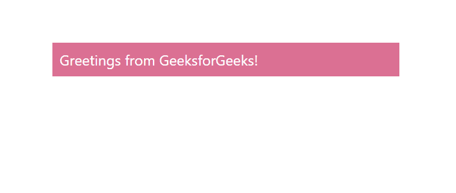

# 如何在 ReactJS 中使用 Box 组件？

> 原文：[https://www.geeksforgeeks.org/how-to-use-box-component-in-reactjs/](https://www.geeksforgeeks.org/how-to-use-box-component-in-reactjs/)

Box 组件充当了大多数 CSS 实用程序需求的包装器组件。React 的 Material UI 有这个组件可供我们使用，非常容易集成。我们可以使用以下方法在 ReactJS 中使用 Box 组件。

## 创建 React 应用程序并安装模块

**步骤 1：** 使用以下命令创建一个 React 应用程序：

```bash
npx create-react-app foldername
```

**步骤 2：** 在创建项目文件夹（即 `foldername`）后，使用以下命令移动到该文件夹：

```bash
cd foldername
```

**步骤 3：** 创建 ReactJS 应用程序后，使用以下命令安装 `material-ui` 模块：

```bash
npm install @material-ui/core
```

**项目结构：** 如下图。


**App.js：** 现在在 `App.js` 文件中写下以下代码。在这里，`App` 是我们编写代码的默认组件。

## JavaScript

```jsx
import React from 'react'
import Box from '@material-ui/core/Box';

const App = () => {

return (
    <div style={{ marginLeft: '40%', marginTop: '60px', width: '30%' }}>
    <Box color="white" bgcolor="palevioletred" p={1}>
      Greetings from GeeksforGeeks!
    </Box>
    </div>
  );
}

export default App
```

**运行应用程序的步骤：** 从项目的根目录使用以下命令运行应用程序：

```bash
npm start
```

**输出：** 现在打开浏览器，转到 `http://localhost:3000/`，会看到如下输出：

